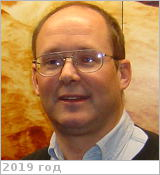

# Baines, Kevin
> 2019.07.17 ┊ **🚀 [despace](index.md)** → **[Contact](contact.md)**

|*[Org.](contact.md)*|*[JPL](03_jpl.md), US. Planetary Science. Planetary & Exoplanetary Atmospheres. Principal Scientist (2003)*|
|:--|:--|
|i18n| <mark>TBD</mark> |
|Tel|*раб.:* +1(818)879-35-02, fax: +1(818)393-46-05; *моб.:* <mark>нетмобильного</mark> |
|E‑mail| <kbaines@jpl.nasa.gov> |
|B‑day, addr.| 1954.02.11 / … |
||  <mark>нетподписи</mark> |

   - **[Education](edu.md):** PhD, Physics, Washington Univ., 1982. MA, Physics, Washington Univ., 1978. BA, Physics, Astronomy (with honors, summa cum laude), Amherst College, 1976.
   - **Exp.:** …
   - …
   - **SC/Equip.:** 1997 [Cassini Huygens](cassini_huygens.md), New Horizons, 2005 [Venus Express](venus_express.md)
   - **Conferences:** 2019 [VD Workshop 2019](vdws2019.md)
   - Git: …
   - Facebook: <https://www.facebook.com/kevin.baines.56>
   - Instagram: <mark>нетинсты</mark>
   - LinkedIn: <https://www.linkedin.com/in/kevin-baines-b568b313>
   - Twitter: <mark>неттви</mark>
   - <https://science.jpl.nasa.gov/people/Baines/>
   - <https://scholar.google.com/citations?user=l4HEIR8AAAAJ&hl=en>
   - **As a person:**
      1. …
