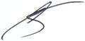

# Буров, Алексей Анатольевич
> 2019.04.01 ┊ **🚀 [despace](index.md)** → **[Contact](contact.md)**

|*[Org.](contact.md)*|*[НПО Лавочкина](03_lav.md), RU. 9/301. 512 «Проектно-конструкторский отдел». Ведущий инженер-конструктор*|
|:--|:--|
|i18n| <mark>TBD</mark> |
|Tel| *раб.:* 64-08; *моб.:* +7(926)833-55-86, +7(495)793-91-68 — домашний стационарный |
|E‑mail| <burov@laspace.ru> |
|B‑day, addr.| 1992.04.22, на НПОЛ с 2015 / Химки |
||   |

   - **[Education](edu.md):** …
   - **Exp.:** …
   - С.блок 108060. ┊ Учился в институте в одной группе с [Дробинко](02_дробинко1.md) Е.О., Заикиным А.В.
   - **SC/Equip.:** …
   - **Conferences:** …
   - Git: …
   - Facebook: <mark>нетфб</mark>
   - Instagram: <https://instagram.com/mavelianko>
   - LinkedIn: <mark>нетин</mark>
   - Twitter: <mark>неттви</mark>
   - <https://vk.com/mavelian>
   - **As a person:**
      1. …
