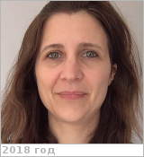

# Dumoulin, Caroline
> 2019.10.20 ┊ **🚀 [despace](index.md)** → **[Contact](contact.md)**

|*[Org.](contact.md)*|*LPG, Université de Nantes, EU (FR). Enseignant-chercheur*|
|:--|:--|
|i18n| <mark>TBD</mark> |
|Tel| *раб.:* +33(0)251-125-480; *моб.:* <mark>нетмобильного</mark> |
|E‑mail| <caroline.dumoulin@univ-nantes.fr> |
|B‑day, addr.| <mark>нетдаты</mark> 1972 ?, FR / … |
||  <mark>нетподписи</mark>  |

   - **[Education](edu.md):** PhD, Convection mantellique et structure de la lithosphère, Sciences de la Terre, 2000.
   - **Exp.:** …
   - …
   - **SC/Equip.:** … [EnVision](envision.md)
   - **Conferences:** …
   - Git: …
   - Facebook: <mark>нетфб</mark>
   - Instagram: <mark>нетинсты</mark>
   - LinkedIn: <https://www.linkedin.com/in/caroline-dumoulin-12b95537/>
   - Twitter: <mark>неттви</mark>
   - <https://lpg-umr6112.fr/index.php?option=com_content&view=article&id=599&lang=en>
   - **As a person:**
      1. …
