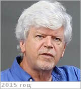

# Gorevan, Stephen Paul
> 2019.10.15 ┊ **🚀 [despace](index.md)** → **[Contact](contact.md)**

|*[Org.](contact.md)*|*Honeybee, US. Founder, chairman*|
|:--|:--|
|i18n| <mark>TBD</mark> |
|Tel| *раб.:* <mark>нетрабочего</mark>; *моб.:* <mark>нетмобильного</mark> |
|E‑mail| <gorevan@honeybeerobotics.com> |
|B‑day, addr.| 1955.06.07 Rockville Centre, New York, US / … |
||  <mark>нетподписи</mark>  |

   - **[Education](edu.md):** BS, Music, New York Univ., 1978. BS, Science in Mechanical Engineering, City College of New York, 1983.
   - **Exp.:** Stephen Gorevan co‑founded Honeybee Robotics in 1983 & currently serves as the company’s Chairman. He is principally responsible for guiding the company’s direction toward the application of advanced robotic & automation techniques to new applications in the aerospace sector. His responsibilities include new technology development, company & engineering management, design & systems engineering. Mr. Gorevan has over 25 years of experience in leading advanced robotics & automation design, development, & implementation efforts for NASA, defense & industry. He currently serves as a Co‑Investigator on the science teams for the Mars Exploration Rovers (MER) & the Mars Science Laboratory (MSL) SAM instrument & is a member of the Venus Science Definition Team.
   - …
   - **SC/Equip.:** 2007 [Venus Flagship Mission](venus_flagship_mission.md)
   - **Conferences:** …
   - Git: …
   - Facebook: <https://www.facebook.com/stephen.gorevan>
   - Instagram: <mark>нетинсты</mark>
   - LinkedIn: <https://www.linkedin.com/in/stephen-gorevan-042a8620/>
   - Twitter: <mark>неттви</mark>
   - <https://honeybeerobotics.com/about-us/history/>
   - <https://prabook.com/web/stephen_paul.gorevan/826918>
   - **As a person:**
      1. …
