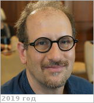

# Grinspoon, David
> 2019.07.09 ┊ **🚀 [despace](index.md)** → **[Contact](contact.md)**

|*[Org.](contact.md)*|*[PSI](03_psi.md), US.*|
|:--|:--|
|i18n| <mark>TBD</mark> |
|Tel|*раб.:* <mark>нетрабочего</mark>; *моб.:* <mark>нетмобильного</mark> |
|E‑mail| <david@funkyscience.net> |
|B‑day, addr.| <mark>нетдаты</mark> 1959.. / … |
||  <mark>нетподписи</mark> |

   - **[Education](edu.md):** PhD in Arizona Univ. B.A & BS in Brown University.
   - **Exp.:** Astrobiologist, award-winning science communicator, & prize-winning author. His research focuses on climate evolution on Earth-like planets & potential conditions for life elsewhere in the universe. He is involved with several interplanetary spacecraft missions for NASA, the European Space Agency & the Japanese Space Agency.
   - …
   - **SC/Equip.:** 2007 [Venus Flagship Mission](venus_flagship_mission.md)
   - **Conferences:** 2019 [VD Workshop 2019](vdws2019.md), 2019 [IVC](ivc_2019.md)
   - Git: …
   - Facebook: <https://www.facebook.com/david.grinspoon>
   - Instagram: <mark>нетинсты</mark>
   - LinkedIn: <https://www.linkedin.com/in/david-grinspoon-2880b57/>
   - Twitter: <https://twitter.com/drfunkyspoon>
   - <https://en.wikipedia.org/wiki/David_Grinspoon>
   - <http://funkyscience.net/>
   - **As a person:**
      1. …
