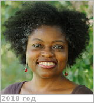

# Jessup, Kandis Lea
> 2019.04.01 ┊ **🚀 [despace](index.md)** → **[Contact](contact.md)**

|*[Org.](contact.md)*|*[SWRI](03_swri.md), US. Senior Research Scientist.*|
|:--|:--|
|i18n| <mark>TBD</mark> |
|Tel|*раб.:* +1(720)240-01-18, fax: +1(303)546-96-70; *моб.:* <mark>нетмобильного</mark> |
|E‑mail| <kandislea.jessup@swri.org>, <knasaven@gmail.com> |
|B‑day, addr.| 1970.11.23 (США, штат Мэриленд) / … |
||  <mark>нетподписи</mark> |

   - **[Education](edu.md):** …
   - **Exp.:** Astrophysics.
   - **[Паспорт](f/contact/j/jessup_001_passport.jpg):** 538751833, истекает 2025.12.01, гражданство США.
   - Чем‑то болеет: ест по часам и почти всегда только свою еду, спит по часам, предъявляет повышенные требования к чистоте помещений.
   - **SC/Equip.:** …
   - **Conferences:** 2019 [VD Workshop 2019](vdws2019.md)
   - Git: …
   - Facebook: <mark>нетфб</mark>
   - Instagram: <mark>нетинсты</mark>
   - LinkedIn: <mark>нетин</mark>
   - Twitter: <mark>неттви</mark>
   - <http://www.swri.org/iProfiles/ViewiProfile.asp?k=8k8fy01aj15137m>
   - <https://www.lpi.usra.edu/vexag/interview_series/>
   - **As a person:**
      1. …
