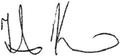

# Kremic, Tibor
> 2019.04.01 ┊ **🚀 [despace](index.md)** → **[Contact](contact.md)**

|*[Org.](contact.md)*|*[GRC](03_grc.md), US. Space Science Project Office. Chief*|
|:--|:--|
|i18n| <mark>TBD</mark> |
|Tel|*раб.:* +1(216)433-50-03, fax: +1(216)433-21-41; *моб.:* +1(216)337-51-55 |
|E‑mail| <tibor.kremic@nasa.gov> |
|B‑day, addr.| 1963.10.13 (Сербия) / … |
||   |

   - **[Education](edu.md):** …
   - **Exp.:** …
   - **[Паспорт](f/contact/k/kremic_tibor-nasa-passport.png)** 821049993, истекает 2022.01.09, гражданство: США.
   - **SC/Equip.:** 2007 [Venus Flagship Mission](venus_flagship_mission.md), 2019 [Venus Observing System](venus_observing_system.md)
   - **Conferences:** 2019 [VD Workshop 2019](vdws2019.md), 2019 [IVC](ivc_2019.md)
   - Git: …
   - Facebook: <mark>нетфб</mark>
   - Instagram: <mark>нетинсты</mark>
   - LinkedIn: <mark>нетин</mark>
   - Twitter: <mark>неттви</mark>
   - <https://spaceflightsystems.grc.nasa.gov/PlanetaryScience/Bios/kremic.htm>
   - **As a person:**
      1. …
