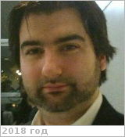

# Marcq, Emmanuel
> 2019.07.08 ┊ **🚀 [despace](index.md)** → **[Contact](contact.md)**

|*[Org.](contact.md)*|*[LATMOS](03_latmos.md)/[UVSQ](uvsq.md), EU. Associate Professor in Planetary Science.*|
|:--|:--|
|i18n| <mark>TBD</mark> |
|Tel|*раб.:* +33(0)180-28-52-83; *моб.:* <mark>нетмобильного</mark> |
|E‑mail| <emmanuel.marcq@latmos.ipsl.fr> |
|B‑day, addr.| <mark>нетдаты</mark> 1980.. / … |
||  <mark>нетподписи</mark> |

   - **[Education](edu.md):** Diplome d'Études Approfondies, Astrophysique, Observatoire de Paris, 2002‑2003. Magistère, Physique, Ecole normale supérieure, 1999‑2003.
   - **Exp.:** My research domain deals with atmospheric science in telluric atmospheres. I have mostly worked on the Venus’ atmosphere in order to constrain its chemistry, dynamics & volcanic activity. I mostly used spectroscopic remote-sensing (UV, IR) from both ground-based facilities & Venus Express (2006‑2014) ESA orbiter, & have been involved in related instrumental development for future missions towards Venus. I also have experience in atmospheric modeling, having used the LMD‑IPSL general circulation model of both early Mars & present day Venus, as well as developed a 1D radiative‑convective model for hot & dense H₂O‑CO₂ atmospheres around young magma ocean planets. I teach general physics, thermodynamics, radiative transfer & planetary atmospheric science for undergraduate & graduate students.
   - …
   - **SC/Equip.:** … [EnVision](envision.md) (VeSUV, VenSpec-U)
   - **Conferences:** 2019 [IVC](ivc_2019.md)
   - Git: …
   - Facebook: <mark>нетфб</mark>
   - Instagram: <mark>нетинсты</mark>
   - LinkedIn: <https://www.linkedin.com/in/emmanuel-marcq-7b400b5b/>
   - Twitter: <https://twitter.com/marcqplanets>
   - <https://www.researchgate.net/profile/Emmanuel_Marcq>
   - <https://scholar.google.com/citations?user=Cf1oPYsAAAAJ&hl=fr>
   - <http://marcq.page.latmos.ipsl.fr/>
   - <http://sesp.esep.pro/fr/pages_auteurs/marcq.html>
   - <https://www.latmos.ipsl.fr/index.php/fr/annuaire/43-pages-perso-officielles/3744-Emmanuel-Marcq-ici-latmos-ipsl-fr>
   - **As a person:**
      1. …
