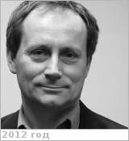

# Svedhem, Håkan
> 2019.10.15 ┊ **🚀 [despace](index.md)** → **[Contact](contact.md)**

|*[Org.](contact.md)*|*[ESTEC](03_estec.md), EU. Project scientist*|
|:--|:--|
|B‑day, addr.| 1958.04.09 Göteborg, Sweden / … |
|E‑mail| <hakan.svedhem@esa.int> |
|i18n| <mark>TBD</mark> |
|Tel| *раб.:* +31(71)565-33-70; *моб.:* <mark>нетмобильного</mark> |
||  <mark>нетподписи</mark>  |

   - **[Education](edu.md):** Joined ESA in 1984 to work in the Microwave Instrumentation section. In 1986 he transferred to the Space Science Department to work on instrumentation for planetary science.
   - **Exp.:** His research interests are interplanetary dust & planetary atmospheres & surfaces. He has been co‑investigator on nine experiments on Russian, Japanese & ESA planetary missions, is Team Leader for the Titan Radar Altimetry team on the Huygens probe & has been involved in several additional space projects. He has authored or co‑authored over 60 scientific papers on subjects ranging from the flux of interstellar & interplanetary dust, to acoustic sounding in planetary atmospheres & space instrumentation design.
   - **Хокан Сведхем**
   - **SC/Equip.:** 2018 [BepiColombo](bepicolombo.md), 2016 [ЭкзоМарс‑2016](экзомарс_2016.md), 2005 [Venus Express](venus_express.md), 1997 [Huygens](cassini_huygens.md), Rosetta
   - **Conferences:** 2019 [EGU](egu_2019.md), 2019 [MSSS 10](msss_10.md), 2018 EPSC
   - Git: …
   - Facebook: <mark>нетфб</mark>
   - Instagram: <mark>нетинсты</mark>
   - LinkedIn: <mark>нетин</mark>
   - Twitter: <mark>неттви</mark>
   - <https://www.esa.int/Science_Exploration/Space_Science/Venus_Express/Project_Scientist_An_interview_with_Haakan_Svedhem>
   - <https://scholar.google.com/citations?user=qE0NsUMAAAAJ&hl=en>
   - **As a person:**
      1. …
