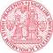

# CUNI
> 2019.08.05 ┊ **🚀 [despace](index.md)** → **[Contact](contact.md)**

||*…*|
|:--|:--|
|E‑mail| <mark>нетпочты</mark> |
|Link| <http://www.cuni.cz/>  <https://en.wikipedia.org/wiki/Charles_University>  <https://ru.wikipedia.org/wiki/Карлов_университет>  |
|Tel| <mark>нетрабочего</mark>, fax: … |
|Etc| … |

**Ка́рлов университе́т** в Праге (чеш. **Univerzita Karlova v Praze**, междунар. **Charles University in Prague (CUNI)** — главный университет Чехии, старейший университет Центральной Европы и один из старейших университетов мира.  
Был основан императором Карлом IV в 1348 году.

**Опыт кооперации.**  
…

 

## CUNI, comments

…
