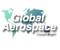

# Global Aerospace Corporation
> 2019.01.18 ┊ **🚀 [despace](index.md)** → **[Contact](contact.md)**

||*12981 Ramona Blvd, Suite E, Irwindale, CA 91706-3750, US.*|
|:--|:--|
|E‑mail| <info@gaerospace.com> |
|Link| <http://www.gaerospace.com/>  <https://www.linkedin.com/company/global-aerospace-corp/>  <https://www.facebook.com/pages/Global-Aerospace-Corporation/1649147128674779>  <https://twitter.com/gaerospacecorp>  <https://www.youtube.com/channel/UCqxMfdkNuUQLkvvE1cvkVRw> |
|Tel| +1(626)960-83-00, fax: +1(626)960-83-37 |
|Etc| … |

**Global Aerospace Corporation (GAC)** is a small, innovative aerospace research & development company with its main corporate office in Irwindale, CA (near the foothills northeast of Los Angeles). Global Aerospace Corporation does cutting edge aerospace R&D in the areas of space, undersea, lighter‑than‑air, re‑entry, defense, & power technologies; new concepts development; & software.

**Опыт кооперации.**  
…

 

## Global Aerospace Corporation, comments

**Core Competencies:**

   - Solutions for harsh/extreme environments w/ emphasis on buoyant & hypersonic systems
   - Modeling & simulation of complex systems

**Mission:**

   - We're made up of creative engineers/scientists that have a passion for aerospace research
   - We enjoy circumventing challenges that most people treat as insurmountable
   - We produce honest, data‑driven research & engineering analysis for Government & commercial customers

**Areas of Expertise:**

   - Aeroelasticity
   - Aerothermodynamics
   - Buoyancy
   - Mechanical design & engineering
   - Orbital mechanics
   - Systems engineering & modeling
