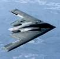

# Northrop Grumman
> 2019.08.05 ┊ **🚀 [despace](index.md)** → **[Contact](contact.md)**

||*2980 Fairview Park Drive, West Falls Church, Virginia, United States*|
|:--|:--|
|E‑mail| <mark>нетпочты</mark> |
|Link| <http://www.northropgrumman.com/>  <https://ru.wikipedia.org/wiki/Northrop_Grumman_Corporation>  <https://en.wikipedia.org/wiki/Northrop_Grumman>  <https://en.wikipedia.org/wiki/Grumman_LLV>  |
|Tel| <mark>нетрабочего</mark>, fax: +1(703)280-29-00  |
|Etc| … |

**Northrop Grumman Corporation** — американская военно‑промышленная компания, работающая в области электроники и информационных технологий, авиакосмической отрасли, судостроении. Образована в 1994 году в результате слияния компаний «Northrop Corporation» и «Grumman Corporation». Деятельность компании сведена в основные группы:

   1. Information & Services, с производственными секторами:
      - Информационные технологии
      - Mission Systems
      - Technical Services
   1. Электроника
   1. Авиация и космос
   1. Судостроение

**Опыт кооперации.**  
…

 

## Northrop Grumman, comments

…

|||
|:--|:--|
|  |  |
| Northrop Grumman manufactured  the B-2 Spirit strategic bomber. | Grumman Long Life Vehicle (LLV) |
