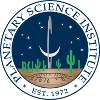

# PSI
> 2019.08.09 ┊ **🚀 [despace](index.md)** → **[Contact](contact.md)**

||*1700 East Fort Lowell, Suite 106, Tucson, AZ 85719-2395, USA*|
|:--|:--|
|E‑mail| <mark>нетпочты</mark> |
|Link| <https://www.psi.edu/>  <https://en.wikipedia.org/wiki/Planetary_Science_Institute>  <https://ru.wikipedia.org/wiki/Планетологический_институт_США> |
|Tel| +1(520)622-63-00, fax: +1(520)622-80-60 |
|Etc| … |

**Планетологический институт США (англ. Planetary Science Institute (PSI))** — научно‑исследовательский институт, основанный в Тусоне, штат Аризона. C момента его создания ориентирован на планетологию.

Основанный в 1972 году на некоммерческой основе институт участвует во многих миссиях [НАСА](03_nasa.md), исследовании Марса, астероидов, комет, межпланетной пыли, формирования Солнечной системы, экзопланет, возникновения жизни и других научных тем.

**Опыт кооперации.**  
…

 

## PSI, comments

The **Planetary Science Institute** is a private, [nonprofit 501(c)(3) corporation](nonprof_org.md) dedicated to Solar System exploration. It is headquartered in Tucson, AZ, where it was founded in 1972. In 2016 PSI established a second office in Lakewood, CO (near Denver).

PSI scientists & educators are involved in numerous NASA & international missions, the study of Mars, Earth, & other planets, the Moon, asteroids, comets, interplanetary dust, impact physics, the origin of the solar system, extra-solar planet formation, dynamics, the rise of life, & other areas of research. They conduct fieldwork on all continents of the Earth to understand our planet & others. They are also actively involved around the world in science education & public outreach though school programs, children's books, popular science books, podcasts, & art.

PSI is the largest non-governmental employer of planetary scientists in the world.  PSI scientists & educators are based in 28 states & the District of Columbia, as well as Australia, Canada, France, Germany, Ireland, Israel, Latvia, New Zealand, Russia, Serbia, & the United Kingdom. As of 2018, 43 percent of PSI [Principal Investigators](principal_investigator.md) are women.

In 2014, PSI was ranked 20th in the nation for workplace efficiency & flexibility among US corporations by the Families & Work Institute & the Society for Human Resource Management.
