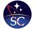

# Space Concordia
> 2019.08.15 ┊ **🚀 [despace](index.md)** → **[Contact](contact.md)**

||*H 1029-7, 1455 De Maisonneuve West, Montreal, Quebec, H3G 1M8, Canada*|
|:--|:--|
|E‑mail| <mark>нетпочты</mark> |
|Link| <https://spaceconcordia.github.io/>  |
|Tel| <mark>нетрабочего</mark>, fax: … |
|Etc| … |

**Space Concordia** is a student society at Concordia University that throws its members at challenging space & aerospace projects, to yield awesome results. We win awards at national & international competitions, we showcase our school, but most importantly: Space Concordia teaches & trains excellent young scientists & engineers through hands-on work & an attitude of persistence & collaboration.

**Опыт кооперации.**  
…

 

## Space Concordia, comments

   - **Spacecraft.** We build satellites: CONSAT-1 (2010-2012), Aleksandr (2012-2018), CSA CCP (2018-2021).
   - **Rocketry.** We do rocket science: Arcturus (2015), Aurelius (2016), Maurice (2017), Supersonice (2018).
   - **Robotics.** We build robots: SCAAR (2013-2014), Asimov Robotic Manipulator (2017-2018), ASTRo (2018-2019).
   - **Special Projects.** We love space: Icarus High Altitude Balloon (2015-2019), XENOS Initiative Solar Ecosystem (2018).

