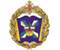

# ВКА Можайского
> 2019.08.07 ┊ **🚀 [despace](index.md)** → **[Contact](contact.md)**

||*Россия, 197198, Санкт‑Петербург, Ждановская ул., 13*|
|:--|:--|
|E‑mail| <vka@mil.ru> |
|Link| <http://vka.mil.ru/>  <https://ru.wikipedia.org/wiki/Военно‑космическая_академия_имени_А._Ф._Можайского>  |
|Tel| +7(812)347-97-70; +7(812)347-96-46, fax: +7(812)237-12-49  |
|Etc| … |

**Федеральное государственное казённое военное образовательное учреждение высшего профессионального образования «Военно‑космическая Краснознамённая академия имени А.Ф. Можайского» Министерства обороны Российской Федерации** — высшее военное учебное заведение, расположенное в Санкт‑Петербурге. Готовит офицеров для Космических войск ВКС Минобороны России.

Основано 16 января 1712 года. Названо в честь А.Ф. Можайского. (9 [21] марта 1825, Роченсальм, Выборгская губерния — 20 марта [1 апреля] 1890) — русский военный деятель — контр‑адмирал, изобретатель — пионер авиации. Спроектировал и построил первый в России и один из первых в мире натурных (полномасштабный, предназначавшийся для подъёма человека) самолётов.

**Опыт кооперации.**  
…

 

## ВКА Можайского, comments

…
