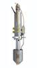

# 1NMHT
> 2019.05.12 [🚀](../index/index.md) [despace](index.md) → [PS](ps.md)

[TOC]

---

**1NMHT** — 1‑component [engine](ps.md) by [OPC LAM](zz_opc_lam.md). Designed in 1996.

|*Characteristics*|*[Value](si.md)  (1NMHT)*|
|:--|:--|
|Composition| |
|Consumption, W| |
|Dimensions, ㎜| |
|[Interfaces](interface.md)| |
|[Lifetime](lifetime.md)/Resource, h(y)|… / …|
|Mass, ㎏|0.29|
|[Overload](vibration.md), Grms| |
|[Rad.resist](ion_rad.md), ㏉ (㎭)| |
|[Reliability](qm.md) per [lifetime](lifetime.md)| |
|[Thermal range](tcs.md), ℃| |
|[TRL](trl.md)|9|
|[Voltage](voltage.md), V| |
|**【Specific】**|• • •|
|[Fuel](fuel.md)|[Hydrazine](гидразин.md)|
|Fuel — combustion products| |
|Fuel — consumption, ㎏/s, ≤|0.44 (0.142 ‑ 0.447)|
|Fuel — mass ratio of components|—|
|Mach number / [Adiabatic exponent](heat_cr.md)| |
|Press. — comb. chamber, ㎫ (kgf/㎝²)| |
|Press. — engine entrance, ㎫ (kgf/㎝²)|0.56 ‑ 2.24 (5.5 ‑ 22)|
|Press. — nozzle cut, ㎫ (kgf/㎝²)| |
|Res. — fuel, ㎏, ≥|67|
|Res. — number of thrusts, ≥|59 000|
|Res. — total impulse, N·s (kgf·s), ≥| |
|Res. — total thrust, N (kgf), ≥|135 000 (13 760)|
|Res. — total thrust duration, s, ≥|180 000|
|Temp. — comb. chamber, К (℃)| |
|Temp. — nozzle cut, К (℃)| |
|Thrust, N (kgf)|1 (0.1)|
|Thrust — deviation, N (kgf)|0.32 ‑ 1.1 (0.032 ‑ 1.12)|
|Thrust — [Isp](isp.md), N·s/㎏ (s), ≥|1 962 ‑ 2 190 (200 ‑ 223)|
|Thrust — max duration of 1 thrust, s|43 200|
|Thrust — max switching frequency, ㎐| |
|Thrust — [res.impulse](ing.md), N·s (kgf·s), ≤| |
|Thrust — torch angle, °| |
|[Turbopump](turbopump.md) speed, rpm|—|
| ||

**Notes:**

   1. Specs’re for vacuum & nominal continuous thrust starting from the 2nd second after energizing the solenoid valves.
   1. **Applicability:** CSO-3 (…)・ CSO-2 (…)・ CSO-1 (2016)・ Sentinel 2B (2016)・ Sentinel 5P (2016)・ SEOSAT (Ingenio) (2015)・ Sentinel 2A (2015)・ SEOSAR (Paz) (2015)・ Taranis (2015)・ AstroTerra 2 (2014)・ KRS (2014)・ Jason-3 (2013)・ Vietnam-1 (2013)・ AstroTerra 1 (2012)・ Pleiades HR2 (2012)・ Elisa-1 (2011)・ Elisa-2 (2011)・ Elisa-3 (2011)・ Elisa-4 (2011)・ Pleiades HR1 (2011)・ SSOT (2011)・ Alsat 2A (2010)・ Alsat 2B (2010)・ CosmoSkymed-4 (2010)・ TANDEM-X (2010)

 

## Docs & links
|Navigation|
|:--|
|**[FAQ](faq.md)**【**[SCS](scs.md)**·КК, **[SC (OE+SGM)](sc.md)**·КА】**[CON](contact.md)·[Pers](person.md)**·Контакт, **[Ctrl](control.md)**·Упр., **[Doc](doc.md)**·Док., **[EF](ef.md)**·ВВФ, **[Error](error.md)**·Ошибки, **[Event](event.md)**·События, **[FS](fs.md)**·ТЭО, **[HF&E](hfe.md)**·Эрго., **[KT](kt.md)**·КТ, **[Model](model.md)**·Модель, **[N&B](nnb.md)**·БНО, **[Patent](патент.md)**·Пат., **[Project](project.md)**·Проект, **[QM](qm.md)**·БКНР, **[R&D](rnd.md)**·НИОКР, **[SI](si.md)**·СИ, **[Test](test.md)**·ЭО, **[TRL](trl.md)**·УГТ, **[Way](way.md)**·Пути|
|*Sections & pages*|
|**`Двигательная установка (ДУ):`**  [HTAE](htae.md)・ [TALOS](talos.md)・ [Баки топливные](fuel_tank.md)・ [Варп‑двигатель](warp_drive.md)・ [Газовый двигатель](cgt.md)・ [Гибридный двигатель](гбрд.md)・ [Двигатель Бассарда](bussard_ramjet.md)・ [ЖРД](lpr.md)・ [ИПТ](ing.md)・ [Ионный двигатель](иод.md)・ [Как считать топливо?](si.md)・ [КЗУ](cinu.md)・ [КХГ](cgs.md)・ [Номинал](nominal.md)・ [Мятый газ](exhsteam.md)・ [РДТТ](spr.md)・ [Сильфон](сильфон.md)・ [СОЗ](соз.md)・ [СОИС](соис.md)・ [Солнечный парус](солнечный_парус.md)・ [ТНА](turbopump.md)・ [Топливные мембраны](топливные_мембраны.md)・ [Топливные мешки](топливные_мешки.md)・ [Топливо](fuel.md)・ [Тяговооружённость](ttwr.md)・ [ТЯРД](тярд.md)・ [УИ](isp.md)・ [Фотонный двигатель](фотонный_двигатель.md)・ [ЭРД](epsp.md)・ [Эффект Оберта](oberth_eff.md)・ [ЯРД](ntr.md)|

   1. Docs:
      - [Products brochures ❐](f/con/o/opc_lam_brochures.7z)
   1. Notable interwikies — …
   1. <http://www.space-propulsion.com/spacecraft-propulsion/hydrazine-thrusters/1n-hydrazine-thruster.html> — [archive ❐](f/ps/1nmht_site.pdf) of 2019.02.21)