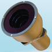

# 348К
> 2019.05.12 [🚀](../index/index.md) [despace](index.md) → **[ЗД](sensor.md)**

[TOC]

---

**348К** — звёздный датчик для определения и выдачи в [GNC](gnc.md) информации о положении и угловых скоростях системы координат (СК) изделия относительно геоцентрической СК.  
Разработчик [Геофизика‑Космос](zz_geofizika_s.md), RU. Разработано в <mark>TBD</mark> году. Активное использование.

|*Characteristics*|*[Value](si.md)  (348К)*|
|:--|:--|
|Composition| |
|Consumption, W|16 — штатное; 30 в течении 30 s — максимальное|
|Dimensions, ㎜|⌀140×209 (БО без бленды); 190 × 130 × 45 (БЭ)|
|[Interfaces](interface.md)| |
|[Lifetime](lifetime.md)/Resource, h(y)|… / …|
|Mass, ㎏|1.25 — БО; 0.95 — БЭ;  **Итого:** 4×1.25 + 0.95 = **5.95** или 2×1.25 + 0.95 = **3.45**|
|[Overload](vibration.md), Grms| |
|[Rad.resist](ion_rad.md), ㏉ (㎭)| |
|[Reliability](qm.md) per [lifetime](lifetime.md)|0.9969 за 3 года|
|[Thermal range](tcs.md), ℃| |
|[TRL](trl.md)|9|
|[Voltage](voltage.md), V|27 (25 ‑ 28)|
|**【Specific】**|• • •|
|Время опознавания, с|2 ‑ 120|
|Вых. информация| |
|Допуст. угл. скор., °/с| |
|Запаздывание, с, ≤|… (от середины интервала экспонирования до момента начала считывания БКУ)|
|Исполнение|4 блока оптических (БО) 348К/01 и блока электронного (БЭ) 348К/02,   устанавливаемых снаружи КА и функционирующих в условиях космического пространства. БЭ состоит из 2 идентичных функционально независимых каналов. Один канал БЭ при штатной эксплуатации изделия находится в холодном резерве. Выбор рабочих БО и их количество определяется функциональными алгоритмами изделия.|
|Объектив|Попадание в угловое поле одного любого из БО Солнца, Луны, Земли не влияет на заданные характеристики обнаружения и точности и не приводит к отказу и ухудшению характеристик|
|Поле зрения, °|(18°55´ ± 0.3°) × (18°55´ ± 0.3°)|
|Режим готовности|60 с от подачи питания|
|Точность|14″ — по углам вокруг осей Хи, Yи, Zи при постоянной угловой скорости ω движения звёзд в полях зрения БО до 5 угл. мин./с;  15″ — по углам вокруг осей Хи, Yи, Zи при постоянной угловой скорости ω движения звёзд в полях зрения БО до 0.2 угл. град./с;  при этом максимальные (3σ) случайные составляющие погрешностей Δφ, Δθ, Δψ определения ориентации для указанных условий по углам вокруг осей Хи, Yи, Zи не превышают 11″ при ω до 5 угл. мин./с, 12″ при ω до 0.2 угл. град./с.|
|Частота обновл., Гц|5 (обеспечивается программно)|
|Яркость фона, ㏅/m²|…  для света с солнечным спектром|
| ||

**Примечания:**

   1. …
   1. **Применяемость:**
      - КА [Луна‑26](луна_26.md)

 

## Docs & links (TRANSLATEME ALREADY)
|Navigation|
|:--|
|**[FAQ](faq.md)**, **[Cable](cable.md)**·БКС, **[Camera](cam.md)**·Камера, **[Comms](comms.md)**·Радио, **[CON](contact.md)·[Pers](person.md)**·Контакт, **[Control](control.md)**·Упр., **[Doc](doc.md)**·Док., **[Doppler](doppler.md)**·ИСР, **[DS](ds.md)**·ЗУ, **[EB](eb.md)**·ХИТ, **[ECO](ecology.md)**·Экол., **[EF](ef.md)**·ВВФ, **[ElC](elc.md)**·ЭКБ, **[EMC](emc.md)**·ЭМС, **[Error](error.md)**·Ошибки, **[Event](event.md)**·События, **[FS](fs.md)**·ТЭО, **[Fuel](fuel.md)**·Топливо, **[GNC](gnc.md)**·БКУ, **[GS](scs.md)**·НС, **[HF&E](hfe.md)**·Эрго., **[IU](iu.md)**·Гиро., **[KT](kt.md)**·КТЕХ, **[LAG](lag.md)**·ПУC, **[LES](les.md)**·САСП, **[LS](ls.md)**·СЖО, **[LV](lv.md)**·РН, **[MCC](mcc.md)**·ЦУП, **[Model](model.md)**·Модель, **[MSC](sc.md)**·ПКА, **[N&B](nnb.md)**·БНО, **[NR](nr.md)**·ЯР, **[OBC](obc.md)**·ЦВМ, **[OE](oe.md)**·БА, **[Pat.](патент.md)**·Патент, **[Proj.](project.md)**·Проект, **[PS](ps.md)**·ДУ, **[QM](qm.md)**·БКНР, **[R&D](rnd.md)**·НИОКР, **[Robot](robotics.md)**·Робот, **[Rover](rover.md)**·Ровер, **[RTG](rtg.md)**·РИТЭГ, **[SARC](sarc.md)**·ПСК, **[SE](se.md)**·СЭ, **[Sens.](sensor.md)**·Датч., **[SC](sc.md)**·КА, **[SCS](scs.md)**·КК, **[SGM](sgm.md)**·КММ, **[SI](si.md)**·СИ, **[Soft](soft.md)**·ПО, **[SP](sp.md)**·БС, **[Spaceport](spaceport.md)**·Космодр., **[SPS](sps.md)**·СЭС, **[SSS](sss.md)**·ГЗУ, **[TCS](tcs.md)**·СОТР, **[Test](test.md)**·ЭО, **[Timeline](timeline.md)**·ЦГМ, **[TMS](tms.md)**·ТМС, **[TOR](tor.md)**·ТЗ, **[TRL](trl.md)**·УГТ|
|*Sections & pages*|
|**`Звёздный датчик (ЗД):`**  [Видимая звёздная величина](app_mag.md)・ [ПЗр](fov.md) • • •  **Европа:** [ASTRO 15](astro_15.md) (6.15)・ [Hydra](hydra.md) (4.6)・ [ASTRO 10](astro_10.md) (3.8)・ [A-STR](a_str.md) (3.55)・ [AA-STR](aa_str.md) (2.6)・ [HE-5AS](he_5as.md) (2.2)・ [ASTRO APS](astro_aps.md) (2)・ [Horus](horus.md) (1.6)・ [T2](t2.md) (0.8)・ [T1](t1.md) (0.6 ‑ 1)・ [Auriga](auriga.md) (0.21)  ▮  **РФ:** [348К](348k.md) (3.45)・ [360К](360k.md) ()・ [АД-1](ad_1.md) (3.8)・ [БОКЗ-МФ](bokz_mf.md) (2.8)・ [мБОКЗ-2](мбокз_2.md) (1.5)・ [SX-SR-MicroBOKZ](sx_sr_microbokz.md) (0.5)  ▮  **США:** [HAST](hast.md) (7.7)・ [CT-2020](ct_2020.md) (3)・ [µSTAR](mustar.md) (2.1)・ [MIST](mist.md) (0.55) |

   1. Docs:
      - [3D‑модель БО ❐](f/sensor/348k_bo.stp)
      - [3D‑модель БЭ ❐](f/sensor/348k_be.stp)
      - [Чертежи ❐](f/sensor/348k_sketch.pdf) (БО, БЭ)
   1. Notable interwikies — …
   1. <http://www.geofizika-cosmos.ru/napravleniya-deyatelnosti/optiko-elektronnye-pribory-orientacii-i-navigacii-kosmicheskih-apparatov/napravlenie-1.html>
