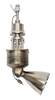

# 400NMHT
> 2019.05.12 [🚀](../index/index.md) [despace](index.md) → **[ДУ](ps.md)**

[TOC]

---

**400NMHT** — 1‑компонентный [двигатель](ps.md) производства [OPC LAM](zz_opc_lam.md). Разработан в 1996 г.

<small>

Характеристики указаны для вакуума и номинальных условий работы в непрерывном режиме. Режим работы считать установившимся со 2‑й секунды подачи напряжения на электроклапаны.

|*Характеристика*|*[Значение](si.md) <small>(400NMHT)</small>*|
|:--|:--|
|Габариты, длина × ⌀ среза сопла, mm||
|Давление: вход в двигатель, МПа (kgf/cm²)|0.56 ‑ 2.65 (5.5 ‑ 26)|
|Давление: камера сгорания, МПа (kgf/cm²)||
|Давление: срез сопла, МПа (kgf/cm²)||
|Длительность одного включения, с|450|
|[Res.impulse](ing.md), N·s (kgf·s), ≤||
|Макс. расход, kg/с, ≤|0.058 ‑ 0.19|
|Макс. частота включений, Гц||
|Mass, kg, ≤|2.7 или 3.8|
|Массовое соотношение КРТ|—|
|Мощность потребляемая, W||
|Обороты ТНА|—|
|Продукты горения||
|Раствор пучка, °||
|Ресурс: количество включений, ≥|3 900|
|Ресурс: сумм. длит. включений, c, ≥|850|
|Ресурс: сумм. импульс, Н·с (кгс·с), ≥||
|Ресурс: сумм. тяга, Н (кгс), ≥|188 000|
|Ресурс: топливо, kg, ≥|300|
|[САС](lifetime.md) в космосе, ч (лет)||
|Температура: камера сгорания, К (℃)||
|Температура: срез сопла, К (℃)||
|[Топливо](fuel.md)|[Гидразин](гидразин.md)|
|Тяга: номинальная, N (kgf)||
|Тяга: отклонение, N (kgf)|120 ‑ 420 (12.2 ‑ 42.8)|
|[TRL](trl.md)|9|
|[УИ тяги](isp.md), Н·с/кг (с), ≥|2 080 ‑ 2 160 (212 ‑ 220)|
|Число Маха / [Показатель адиабаты](heat_cr.md)||
|Изображения||

</small>

 

## Примечания
   1. …

## Применяемость
   - Ariane 5 G, GS and ES versions for the roll and attitude control ┊ ExoMars-2016 DM

 

## Docs & links (TRANSLATEME ALREADY)
|Navigation|
|:--|
|<small>**[FAQ](faq.md)**, **[Cable](cable.md)**·БКС, **[Camera](cam.md)**·Камера, **[Comms](comms.md)**·Радио, **[Contact](contact.md)**·Контакт, **[Control](control.md)**·Упр., **[Doc](doc.md)**·Док., **[Doppler](doppler.md)**·ИСР, **[DS](ds.md)**·ЗУ, **[EB](eb.md)**·ХИТ, **[ECO](ecology.md)**·Экол., **[EF](ef.md)**·ВВФ, **[ElC](elc.md)**·ЭКБ, **[EMC](emc.md)**·ЭМС, **[Error](error.md)**·Ошибки, **[Event](event.md)**·События, **[FS](fs.md)**·ТЭО, **[Fuel](fuel.md)**·Топливо, **[GNC](gnc.md)**·БКУ, **[GS](scs.md)**·НС, **[HF&E](hfe.md)**·Эрго., **[IU](iu.md)**·Гиро., **[KT](kt.md)**·КТЕХ, **[LAG](lag.md)**·ПУC, **[LES](les.md)**·САСП, **[LS](ls.md)**·СЖО, **[LV](lv.md)**·РН, **[MCC](mcc.md)**·ЦУП, **[Model](model.md)**·Модель, **[MSC](sc.md)**·ПКА, **[N&B](nnb.md)**·БНО, **[NR](nr.md)**·ЯР, **[OBC](obc.md)**·ЦВМ, **[OE](oe.md)**·БА, **[Pat.](патент.md)**·Патент, **[Project](project.md)**·Проект, **[PS](ps.md)**·ДУ, **[R&D](rnd.md)**·НИОКР, **[SRRQ](srrq.md)**·БКНР, **[Robot](robotics.md)**·Робот, **[Rover](rover.md)**·Планетоход, **[RTG](rtg.md)**·РИТЭГ, **[SARC](sarc.md)**·ПСК, **[Sensor](sensor.md)**·Датчик, **[SC](sc.md)**·КА, **[SCS](scs.md)**·КК, **[SGM](sgm.md)**·КММ, **[SI](si.md)**·СИ, **[Soft](soft.md)**·ПО, **[SP](sp.md)**·БС, **[Spaceport](spaceport.md)**·Космодром, **[SPS](sps.md)**·СЭС, **[SSS](sss.md)**·ГЗУ, **[TCS](tcs.md)**·СОТР, **[Test](test.md)**·ЭО, **[Timeline](timeline.md)**·ЦГМ, **[TMS](tms.md)**·ТМС, **[TOR](tor.md)**·ТЗ, **[TRL](trl.md)**·УГТ</small>|
|*Sections & pages*|
|**`Двигательная установка (ДУ):`**  [HTAE](htae.md) ┊ [TALOS](talos.md) ┊ [Баки топливные](fuel_tank.md) ┊ [Варп‑двигатель](warp_drive.md) ┊ [Газовый двигатель](cgt.md) ┊ [Гибридный двигатель](гбрд.md) ┊ [Двигатель Бассарда](bussard_ramjet.md) ┊ [ЖРД](lpr.md) ┊ [ИПТ](ing.md) ┊ [Ионный двигатель](иод.md) ┊ [Как считать топливо?:](si.md) ┊ [КЗУ](cinu.md) ┊ [КХГ](cgs.md) ┊ [Номинал](nominal.md) ┊ [Мятый газ](exhsteam.md) ┊ [РДТТ](spr.md) ┊ [Сильфон](сильфон.md) ┊ [СОЗ](соз.md) ┊ [СОИС](соис.md) ┊ [Солнечный парус](солнечный_парус.md) ┊ [ТНА](turbopump.md) ┊ [Топливные мембраны](топливные_мембраны.md) ┊ [Топливные мешки](топливные_мешки.md) ┊ [Топливо](fuel.md) ┊ [Тяговооружённость](ttwr.md) ┊ [ТЯРД](тярд.md) ┊ [УИ](isp.md) ┊ [Фотонный двигатель](фотонный_двигатель.md) ┊ [ЭРД](epsp.md) ┊ [Эффект Оберта](oberth_eff.md) ┊ [ЯРД](ntr.md)|

   1. Docs:
      - [Брошюры выпускаемой продукции ❐](f/contact/o/opc_lam_brochures.7z)
   1. Notable interwikies — …
   1. <http://www.space-propulsion.com/spacecraft-propulsion/hydrazine-thrusters/400n-hydrazine-thruster.html> — [archive ❐](f/ps/400nmht_site.pdf) of 2019.02.21)
