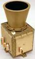

# A-STR
> 2019.07.26 **[🚀](../index/index.md) [despace](index.md)** → **[ЗД](sensor.md)**

[TOC]

---

> <small>*Термины:* **A-STR** — англоязычный термин, не имеющий аналога в русском языке. **A-STR** — дословный перевод с английского на русский.</small>

**A-STR** — звёздный датчик для определения и выдачи в [GNC](gnc.md) информации о положении и угловых скоростях системы координат (СК) изделия относительно геоцентрической СК.  
*Разработчик:* [Leonardo](leonardo.md), EU. Разработано в 2001 году. Активное применение.

<small>

|*•    Характеристика    •*|*[Значение](si.md) <small>(A-STR)</small>*|
|:--|:--|
|[УГТ](trl.md)| 9  |
|Время опознавания, с| 6  |
|Вых. информация|   |
|Допуст. угл. скор., °/с| 2  |
|Запаздывание, с, ≤|   |
|Исполнение| Моноблок (ОБ + БЭ)  |
|Объектив| MPP CCD  |
|Поле зрения, °| 16.4 × 16.4  |
|Режим готовности|   |
|Точность| 63″ (0.1 °/с), 230″ (2 °/с)  |
|Частота обновл., Гц| 10  |
|Яркость фона, кд/m²|   |
|**Etc:**|• • •|
|[ВБР](rams.md) за САС| 0.99787 (1 346 [FIT](fit.md)) или 0.99619 (2 415 [FIT](fit.md))   |
|Dimensions, L×W×H, mm| 195 × 175 × 291 с блендой 40°  |
|Интерфейсы| RS-422, [MIL-STD-1553B](mil_std_1553b.md)  |
|Mass, kg| 3.55 с блендой 40°  |
|[Voltage](voltage.md), V| … (20 ‑ 50)  |
|Overload, g|   |
|[Rad.resist](ion_rad.md), Gy (rad)|   |
|Resource, h (y)|   |
|[Lifetime](lifetime.md), h (y)| ГСО: 157 680 (18)  |
|[Тепловой режим](tcs.md), °C| −30 ‑ +60  |
|Consumption, W| 9 при 20 °C, 13.5 при 60 °C  |
||   |

</small>

 

## Примечания
   1. …

## Применяемость
   1. …

 

## Docs & links (TRANSLATEME ALREADY)
|…°·•¹²³±×÷≤≥≈≠ ‑ −— ⎆✉ ❐“”’«»✔→✘☐☑├┕┆ 1 lb = 0.453592 kg; 1 g = 9.80665 m/s²|
|:--|
|<small>**[FAQ](faq.md)**, **[Cable](cable.md)**·БКС, **[Camera](camera.md)**·Камера, **[Comms](comms.md)**·Радиосв., **[Contact](contact.md)**·Контакт, **[Control](control.md)**·Управ., **[Doc](doc.md)**·Док., **[Doppler](doppler.md)**·ИСР, **[DS](ds.md)**·ЗУ, **[EB](eb.md)**·ХИТ, **[ECO](ecology.md)**·Экол., **[EF](ef.md)**·ВВФ, **[ElC](elc.md)**·ЭКБ, **[EMC](emc.md)**·ЭМС, **[Errors](error.md)**·Ошибки, **[Events](event.md)**·События, **[FS](fs.md)**·ТЭО, **[Fuel](fuel.md)**·Топливо, **[GNC](gnc.md)**·БКУ, **[GS](scs.md)**·НС, **[HF&E](hfe.md)**·Эргоном., **[IMU](imu.md)**·Гироскоп, **[Incubator](incubator.md)**·Инкуб., **[KT](kt.md)**·КТЕХ, **[LAG](lag.md)**·ПУC, **[LES](les.md)**·САСП, **[LS](ls.md)**·СЖО, **[LV](lv.md)**·РН, **[MAG](mag.md)**·Магнитом., **[MCC](mcc.md)**·ЦУП, **[Model](model.md)**·Модель, **[MSC](sc.md)**·ПКА, **[N&B](nnb.md)**·БНО, **[NR](nr.md)**·ЯР, **[OBC](obc.md)**·ЦВМ, **[OE](oe.md)**·БА, **[Patent](патент.md)**·Патент, **[Project](project.md)**·Проект, **[PS](ps.md)**·ДУ, **[QA](quality.md)**·QA, **[R&D](rnd.md)**·НИОКР, **[RAMS](rams.md)**·НиБ, **[Risk](risk.md)**·Риск, **[Robot](robotics.md)**·Робот, **[Rover](rover.md)**·Планетоход, **[RTG](rtg.md)**·РИТЭГ, **[RW](rw.md)**·ДМ, **[SARC](sarc.md)**·ПСК, **[Sensor](sensor.md)**·Датчик, **[SC](sc.md)**·КА, **[SCS](scs.md)**·КК, **[SGM](sgm.md)**·КММ, **[SI](si.md)**·СИ, **[Soft](soft.md)**·ПО, **[SP](sp.md)**·БС, **[Spaceport](spaceport.md)**·Космодром, **[SPS](sps.md)**·СЭС, **[SSS](sss.md)**·ГЗУ, **[TCS](tcs.md)**·СОТР, **[Test](test.md)**·ЭО, **[Timeline](timeline.md)**·Циклограмма, **[TMS](tms.md)**·ТМС, **[TOR](tor.md)**·ТЗ, **[TRL](trl.md)**·УГТ</small>|
|*Sections & pages*|
|**`Звёздный датчик (ЗД):`**  [Видимая звёздная величина](app_mag.md) ┊ [ПЗр](fov.md) • • •  **Европа:** [ASTRO 15](astro_15.md) (6.15) ┊ [Hydra](hydra.md) (4.6) ┊ [ASTRO 10](astro_10.md) (3.8) ┊ [A-STR](a_str.md) (3.55) ┊ [AA-STR](aa_str.md) (2.6) ┊ [HE-5AS](he_5as.md) (2.2) ┊ [ASTRO APS](astro_aps.md) (2) ┊ [Horus](horus.md) (1.6) ┊ [T2](t2.md) (0.8) ┊ [T1](t1.md) (0.6 ‑ 1) ┊ [Auriga](auriga.md) (0.21)  ▮  **РФ:** [348К](348k.md) (3.45) ┊ [360К](360k.md) () ┊ [АД-1](ad_1.md) (3.8) ┊ [БОКЗ-МФ](bokz_mf.md) (2.8) ┊ [мБОКЗ-2](мбокз_2.md) (1.5) ┊ [SX-SR-MicroBOKZ](sx_sr_microbokz.md) (0.5)  ▮  **США:** [HAST](hast.md) (7.7) ┊ [CT-2020](ct_2020.md) (3) ┊ [µSTAR](mustar.md) (2.1) ┊ [MIST](mist.md) (0.55)  |

   1. Docs:
      - [A-STR & AA-STR Datasheet ❐](f/sensor/a/a_aa_str_datasheet.pdf)
   1. Notable interwikies — …
   1. <…>
