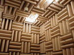
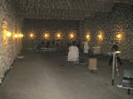

# Anechoic chamber
> 2020.05.14 **[🚀](../index/index.md) [despace](index.md)** → **[Test](test.md)**, [EMC](emc.md)

[TOC]

---

> <small>*Terms:*  • **Anechoic chamber (ACH)** — English term. **Безэховая камера (БЭК)** — Russian equivalent.  • **Anechoic gas chamber (ACHG)** — English term. **Безэховая газовая камера (БЭКГ)** — Russian equivalent.</small>

**Anechoic chamber (ACH)** (an‑echoic meaning “non‑reflective, non‑echoing, echo‑free”) is a room designed to completely absorb reflections of either sound or electromagnetic waves.

They are also often isolated from waves entering from their surroundings. This combination means that a person or detector exclusively hears direct sounds (no reverberant sounds), in effect simulating being inside an infinitely large room.

They’re two types of chambers:

   1. Acoustic anechoic chambers;
   1. Radio‑frequency anechoic chambers.

They are also often isolated from waves entering from their surroundings. The size of the chamber depends on the size of the objects and frequency ranges being tested.

## Acoustic anechoic chambers
Anechoic chambers are commonly used in acoustics to conduct experiments in nominally “free field” conditions, free‑field meaning that there are no reflected signals. All sound energy will be traveling away from the source with almost none reflected back. Common anechoic chamber experiments include measuring the transfer function of a loudspeaker or the directivity of noise radiation from industrial machinery. In general, the interior of an anechoic chamber is very quiet, with typical noise levels in the 10 ‑ 20 dBA range.

## Radio‑frequency anechoic chambers
The interior surfaces of the radio frequency (RF) are covered with radiation absorbent material  instead of acoustically absorbent material. Uses for RF anechoic chambers include testing antennas, radars, and is typically used to house the antennas for performing measurements of antenna radiation patterns, electromagnetic interference.

Performance expectations (gain, efficiency, pattern characteristics, etc.) constitute primary challenges in designing stand alone or embedded antennas. Designs are becoming ever more complex with a single device incorporating multiple technologies such as cellular, WiFi, Bluetooth, LTE, MIMO, RFID and GPS.

| Acoustic anechoic chambers | Acoustic anechoic chambers, volume — 2 000 m³, useful volume — 1 000 m³. University of Applied Sciences Dresden, German |
|:--|:--|
|  |  |

 

## Docs & links
|…°·•¹²³±×÷≤≥≈≠ ‑ −— ⎆✉ ❐“”’«»✔→✘☐☑├┕┆ 1 lb = 0.453592 kg; 1 g = 9.80665 m/s²|
|:--|
|<small>**[FAQ](faq.md)**, **[Cable](cable.md)**·БКС, **[Camera](camera.md)**·Камера, **[Comms](comms.md)**·Радио, **[Contact](contact.md)**·Контакт, **[Control](control.md)**·Управ., **[Doc](doc.md)**·Док., **[Doppler](doppler.md)**·ИСР, **[DS](ds.md)**·ЗУ, **[EB](eb.md)**·ХИТ, **[ECO](ecology.md)**·Экол., **[EF](ef.md)**·ВВФ, **[ElC](elc.md)**·ЭКБ, **[EMC](emc.md)**·ЭМС, **[Errors](error.md)**·Ошибки, **[Events](event.md)**·События, **[FS](fs.md)**·ТЭО, **[Fuel](fuel.md)**·Топливо, **[GNC](gnc.md)**·БКУ, **[GS](scs.md)**·НС, **[HF&E](hfe.md)**·Эрго., **[IU](iu.md)**·Гиро., **[KT](kt.md)**·КТЕХ, **[LAG](lag.md)**·ПУC, **[LES](les.md)**·САСП, **[LS](ls.md)**·СЖО, **[LV](lv.md)**·РН, **[MCC](mcc.md)**·ЦУП, **[Model](model.md)**·Модель, **[MSC](sc.md)**·ПКА, **[N&B](nnb.md)**·БНО, **[NR](nr.md)**·ЯР, **[OBC](obc.md)**·ЦВМ, **[OE](oe.md)**·БА, **[Pat.](патент.md)**·Патент, **[Project](project.md)**·Проект, **[PS](ps.md)**·ДУ, **[QA](quality.md)**·QA, **[R&D](rnd.md)**·НИОКР, **[RAMS](rams.md)**·НиБ, **[Risk](risk.md)**·Риск, **[Robot](robotics.md)**·Робот, **[Rover](rover.md)**·Планетоход, **[RTG](rtg.md)**·РИТЭГ, **[SARC](sarc.md)**·ПСК, **[Sensor](sensor.md)**·Датчик, **[SC](sc.md)**·КА, **[SCS](scs.md)**·КК, **[SGM](sgm.md)**·КММ, **[SI](si.md)**·СИ, **[Soft](soft.md)**·ПО, **[SP](sp.md)**·БС, **[Spaceport](spaceport.md)**·Космодром, **[SPS](sps.md)**·СЭС, **[SSS](sss.md)**·ГЗУ, **[TCS](tcs.md)**·СОТР, **[Test](test.md)**·ЭО, **[Timeline](timeline.md)**·Циклограмма, **[TMS](tms.md)**·ТМС, **[TOR](tor.md)**·ТЗ, **[TRL](trl.md)**·УГТ</small>|
|*Sections & pages*|
|**`Испытания:`**  [Proto fligt model](pfm.md) ┊ [Безэховая камера](ach.md) ┊ [Валидация](validation.md) ┊ [Класс чистоты](clean_lvl.md) ┊ [КПЭО](ctpr.md) ┊ [Перечень методик испытаний](list_tp.md) ┊ [Программа и методика испытаний](pmot.md) ┊ [Опытный образец](pilot_sample.md) ┊ [Циклограмма](obc.md) ┊ [Штатный образец](flight_unit.md) ┊ [ЭО](test.md) ┊ [Экспериментально‑теоретический метод](etetm.md) |
|**`Электромагнитная совместимость (ЭМС):`**  [Безэховая камера](ach.md) ┊ [Помехи](emi.md) (EMI, RFI) ┊ [СКЭ](elmsys.md) |

   1. Docs: …
   1. Notable interwikies — …
   1. <https://en.wikipedia.org/wiki/Anechoic_chamber>
   1. <https://ru.wikipedia.org/wiki/Безэховая_камера>

