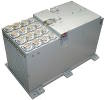
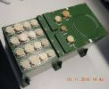

# Агат‑15
> 2019.05.12 ┊ **🚀 [despace](index.md)** → **[ДМ](rw.md)**

[TOC]

---

> <small>*Термины:* **Агат‑15** — русскоязычный термин, не имеющий аналога в английском языке. **Agat-15** — дословный перевод с русского на английский.</small>

**Агат‑15** — инерциальное устройство ([двигатель‑маховик](rw.md)), предназначенное для использования в качестве исполнительного органа системы ориентации и стабилизации [космического аппарата](sc.md).  
*Разработчик:* [НПЦ Полюс](03_polus_tomsk.md). Разработано в 2005 году Активное использование. Покупное изделие. <small>(по состоянию на 21.06.2017)</small>

| | |
|:--|:--|
|   |   |

<small>

|*•    Характеристика    •*|*[Значение](si.md) <small>(Агат‑15)</small>*|
|:--|:--|
|[УГТ](trl.md)|    |
|Исполнение|  4 УДМ [УДМ‑15‑0,15](udm_15.md); 1 БА.  БА содержит 4 канала управления моментом. Каждый из каналов управления моментом управляет соответствующим УДМ. Агат‑15 обеспечивает формирование динамических моментов по осям вращения каждого УДМ.  |
|Кинет. момент, Н·м·с| ± 15 для каждого УДМ  |
|Макс. упр. момент, Н·м|   |
|Режим готовности|  1 с с момента подачи напряжения  |
|**Etc:**|• • •|
|[ВБР](rams.md) за САС|  0.98 за 11.4 года;  0.99799 за 3 года  |
|Dimensions, L×W×H, mm|   |
|Интерфейсы|   |
|Mass, kg|  21 (3.7 УДМ; 6.2 БА)  |
|[Voltage](voltage.md), V|  27 (24  ‑ 28)  |
|Overload, g|   |
|[Rad.resist](ion_rad.md), Gy (rad)|    |
|Resource, h (y)|  100 000 (11.4); 2 500 циклов вкл/выкл  |
|[Lifetime](lifetime.md), h (y)| … ();  1 000 при выходе кинетического момента за допустимые нормы  |
|[Тепловой режим](tcs.md), °C|   |
|Consumption, W|  от –75 до +145 (для 2 работающих УДМ)  |

</small>

 

## Примечания
   1. …

## Применяемость
   1. КА [Венера‑Д](венера‑д.md)
   1. КА [Луна‑26](луна_26.md)

 

## Docs & links (TRANSLATEME ALREADY)
|…°·•¹²³±×÷≤≥≈≠ ‑ −— ⎆✉ ❐“”’«»✔→✘☐☑├┕┆ 1 lb = 0.453592 kg; 1 g = 9.80665 m/s²|
|:--|
|<small>**[FAQ](faq.md)**, **[Cable](cable.md)**·БКС, **[Camera](camera.md)**·Камера, **[Comms](comms.md)**·Радиосв., **[Contact](contact.md)**·Контакт, **[Control](control.md)**·Управ., **[Doc](doc.md)**·Док., **[Doppler](doppler.md)**·ИСР, **[DS](ds.md)**·ЗУ, **[EB](eb.md)**·ХИТ, **[ECO](ecology.md)**·Экол., **[EF](ef.md)**·ВВФ, **[ElC](elc.md)**·ЭКБ, **[EMC](emc.md)**·ЭМС, **[Errors](error.md)**·Ошибки, **[Events](event.md)**·События, **[FS](fs.md)**·ТЭО, **[Fuel](fuel.md)**·Топливо, **[GNC](gnc.md)**·БКУ, **[GS](scs.md)**·НС, **[HF&E](hfe.md)**·Эргоном., **[IMU](imu.md)**·Гироскоп, **[Incubator](incubator.md)**·Инкуб., **[KT](kt.md)**·КТЕХ, **[LAG](lag.md)**·ПУC, **[LES](les.md)**·САСП, **[LS](ls.md)**·СЖО, **[LV](lv.md)**·РН, **[MAG](mag.md)**·Магнитом., **[MCC](mcc.md)**·ЦУП, **[Model](model.md)**·Модель, **[MSC](sc.md)**·ПКА, **[N&B](nnb.md)**·БНО, **[NR](nr.md)**·ЯР, **[OBC](obc.md)**·ЦВМ, **[OE](oe.md)**·БА, **[Patent](патент.md)**·Патент, **[Project](project.md)**·Проект, **[PS](ps.md)**·ДУ, **[QA](quality.md)**·QA, **[R&D](rnd.md)**·НИОКР, **[RAMS](rams.md)**·НиБ, **[Risk](risk.md)**·Риск, **[Robot](robotics.md)**·Робот, **[Rover](rover.md)**·Планетоход, **[RTG](rtg.md)**·РИТЭГ, **[RW](rw.md)**·ДМ, **[SARC](sarc.md)**·ПСК, **[Sensor](sensor.md)**·Датчик, **[SC](sc.md)**·КА, **[SCS](scs.md)**·КК, **[SGM](sgm.md)**·КММ, **[SI](si.md)**·СИ, **[Soft](soft.md)**·ПО, **[SP](sp.md)**·БС, **[Spaceport](spaceport.md)**·Космодром, **[SPS](sps.md)**·СЭС, **[SSS](sss.md)**·ГЗУ, **[TCS](tcs.md)**·СОТР, **[Test](test.md)**·ЭО, **[Timeline](timeline.md)**·Циклограмма, **[TMS](tms.md)**·ТМС, **[TOR](tor.md)**·ТЗ, **[TRL](trl.md)**·УГТ</small>|
|*Sections & pages*|
|**`Двигатель‑маховик (ДМ):`**  … • • •  **РФ:** [ДМБ](dmb.md) (29.4/350) ┊ [Агат‑10](agat_10.md) (250/0.1) ┊ [ДМ20-250](dm20_250.md) (20/250) ┊ [ГД-200-125](gd_200_125.md) (200/125) ┊ [ГД-02-150](gd_02_150.md) (150/2) ┊ [ДМ14-120](dm14_120.md) (14/120) ┊ [Агат‑5](agat_5.md) (100/0.125) ┊ [ДМ5-50](dm5_50.md) (5/50) ┊ [Агат‑40](agat_40.md) (40/…) ┊ [ДМ10-25](dm10_25.md) (10/25) ┊ [ДМ1-20](dm1_20.md) (1/20) ┊ [СГК-20-20](sgk_20_20.md) (20/20) ┊ [Агат‑15](agat_15.md) (15/0.15) ┊ [МДМ-2-50](mdm_2_50.md) (2/0.05) ┊ [МДМ-1,0](mdm_1_0.md) (1/0.02) ┊ [МДМ-0,5](mdm_0_5.md) (0.5/0.015) ┊ [SX-WH](sx_wh.md) (0.5 ‑ 0.03/…) ┊ [SX-GY](sx_gy.md) (0.04/…) |

**Docs:**

   1. [3D-модель ❐](f/rw/a/agat_15_ba_3d_2017.7z)
   1. [Чертёж блока автоматики ❐](f/rw/a/agat_15_ba_sketch_2015.djvu)

**Links:**

   1. Notable interwikies — …
   1. <http://polus.tomsknet.ru/?id=211> *([Архивировано ❐](f/rw/a/agat_15_polus_tomsknet_ru.djvu) 2018.03.07)*

