# Akatsuki
> 2019.05.29 ┊ **🚀 [despace](index.md)** → [Venus](venus.md), **[Project](project.md)**

[TOC]

---

> <small>*Terms:* **Akatsuki** — English term with no analogues in Russian. **Акацуки** — rough Russian equivalent.</small>

**Akatsuki** (あかつき, 暁, «Dawn»), also known as the Venus **Climate Orbiter (VCO)** and **Planet-C** (next after [PLANET-B (Nozomi)](nozomi.md)) — is a Japanese spacecraft tasked to study the atmosphere of [Venus](venus.md).

[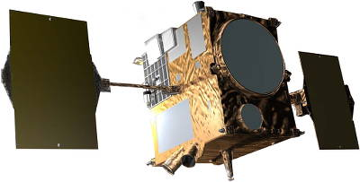](f/project/akatsuki/pic01.png) [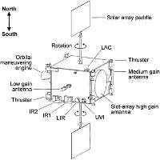](f/project/akatsuki/pic04.png)

 

|*Parameter*|*[Value](si.md)*|
|:--|:--|
||**`Mission`**|
|Duration| 2 years (plan) и 4.5 years (estimated maximum);  2010.05.21 - <mark>TBD</mark> (fact) |
|Operator| [JAXA](03_jaxa.md) |
|Program| … |
|Development| … ‑ ┊ |
|Launch| 2010.05.20 21:58:22 UTC (00:58 MSK) [Tanegashima YLP-1](tanegashima.md) with [H-IIA 202](h2.md) |
|Similar missions| • Proposed: [Venus Flagship Mission](venus_flagship_mission.md) (US).  • Current: ….  • Past: [Venus Express](venus_express.md) (EU 2005), [VeGa‑1/2](vega_1_2.md) (SU 1984), [Venera‑11/12](venera_11_12.md) (SU 1978), [Venera‑9/10](venera_9_10.md) (SU 1975). |
|[Type](sc.md)| Orbiter spacecraft |
|Goal| Investigations of atmospheric stratification, dynamics, physics of clouds, hydrodynamic gravitational waves; survey of clouds and surface; exploring Venusian meteorology and super rotation of the atmosphere, the presence of lightning and volcanism |
|Price| $ 290M ot 7 370 kg of [gold](sc_price.md) in 2010 priсes |
||**`Spacecraft`**|
|Mass| 517.6 kg, (dry: 320 kg) ([minisatellite](спутник.md), [EVN‑070](venus.md)) |
|[Number](spaceid.md)| NSSDC ID (COSPAR ID): 2010-020D, SCN: 36576 |
|Orbit / Place| 300 × 80 000 km, 172°, 30 hr |
|Payload| • 5 cameras for: lightning, glow, IR, UV;  • equipment for radiography |
|Contractor| … |
|Developer| NEC Space Technologies |
|Communication| [X‑band](rf.md), 20 W, 1.6 m² dish antenna |
|Structure| Orbiter |
|Power| 700 W, 2 × 1.4 m² |

Targets & investigations:

   - **T** — technical; **Draft** — minimum for working with object. **D** — distant exploration; **C** — contact exploration; **F** — fly‑by; **H** — manned flight; **S** — soil sampe return; **X** — technology demonstration
   - **Sections of measurement and observation:**
      - Atmospheric/climate — **Ac** composition, **Ai** imaging, **Am** mapping, **Ap** pressure, **As** samples, **At** temperature, **Aw** wind speed/direction.
      - General — **Gi** planet’s interactions with outer space.
      - Soil/surface — **Sc** composition, **Si** imaging, **Sm** mapping, **Ss** samples.

<small>

|*EVN‑XXX*|*T*|*EN*|*Section of m&o*|*D*|*C*|*F*|*H*|*S*|
|:--|:--|:--|:--|:--|:--|:--|:--|:--|
|EVN‑005|T|Exploration: from Venusian orbit.|  |D||F|||
|EVN‑010||Atmosphere: vertical model.|  |D|||||
|EVN‑011||Atmosphere: common circulation model.|  |D|||||
|EVN‑012||Atmosphere: lightnings.|  |D|||||
|EVN‑023||Surface: mineralogical composition.|  ||C||||
|EVN‑034||Atmosphere: nature of the superrotation.|  |D|||||
|EVN‑035||Atmosphere: nature of the UF‑absorber.|  |D|||||
|EVN‑067||Atmosphere: nature of the polar turbulence.|  |D|||||
|EVN‑068||Atmosphere: nature of the polar dipole.|  |D|||||
|EVN‑070|T|Exploration with [satellites](sc.md): minisatellites.|  |D||F|||
|EVN‑074||Meteorological model.|  |D||F|||
|EVN‑075||Atmosphere: clouds, their nature.|  |D||F|||
|EVN‑076||Surface: volcanoes, their presence.|  |D||F|||
|EVN‑077||Atmosphere: chemical elements distribution.|  |D||F|||
|EVN‑078|T|Atmosphere: radiography.|  |D|||||

</small>

 

## Description
Exploring Venus helps get to know our planet better.

It is believed that Venus and Earth appeared around the same time 4.6 billion years ago. At that time, Venus may have had earth-like oceans. However, today Venus has no oceans and is covered by an atmosphere of CO₂. Venus is closer to the Sun than Earth, so the temperature is higher and more water molecules are carried out of the atmosphere into space. This may mean that water vapor rising into the upper atmosphere was then broken up into oxygen and hydrogen by solar UV radiation, and then lighter hydrogen atoms were released into space. Without oceans, CO₂ cannot dissolve in water, as it does on Earth, and accumulates in large quantities in the atmosphere.

Unlike Earth, the upper atmosphere moves 60 times faster than the surface. Terrestrial meteorology cannot explain this phenomenon.

There is no clear evidence to shed light on the reasons for such a large difference between Venus and Earth. If it were possible to determine how the current conditions on Venus arose, it would be possible to understand how Earth became a planet with a temperature and humidity sufficient to support such a large variety of life. In addition, a thorough study of the phenomena of Venusian meteorology and its accurate mathematical modeling in relation to earth's meteorology would allow to develop a universal planetary meteorology, as well as understand the causes of the current state of the earth's atmosphere and predict its possible future changes.

Similar to the Japanese meteorological satellite Himawari, which is in orbit of an artificial earth satellite, 4 Akatsuki cameras (IR1, IR2, LIR, UVI) are designed to obtain images of the cloud cover of Venus (the location, shape, temperature and volume of cloud substances). Clouds appear and disappear, change their shape; by tracking their changes in their characteristics, can be observed the movement of clouds. It is assumed that the longest-lived clouds move with wind currents in the atmosphere, which allows you to model the movement of winds in the atmosphere of Venus. Cameras with optics in different ranges allow to observe the atmosphere not only horizontally, but also vertically. Moreover, if LAC registers the presence of lightning, it will shed light on updrafts similar to those seen in earth's rain clouds that produce lightning, as well as on atmospheric currents at altitudes.

Observing the above-mentioned changes in cloud shapes over a long period of time will allow to gather information about the waves in the atmosphere. When a major earthquake occurs at the bottom of the earth's sea, tsunamis spread over long distances. Atmospheric waves (their causes may be different) propagate in the atmosphere in a similar way, spreading energy in different directions. In this case, atmospheric waves play a key role on planets. Information about atmospheric waves obtained from Akatsuki is expected to provide a better understanding of the nature and mechanisms of large circulations, such as super rotation, based on smaller circulations, as well as the mechanisms of energy exchange between the layers of the atmosphere.

Earth's meteorology was built through a wide range of measurements and observations. The variety of data sent by Akatsuki to Earth can shed light on the meteorological phenomena of Venus, allowing for a better understanding of Earth's meteorology.

### Mission
Venus rotates inside the Earth's orbit and is the closest planet to Earth. The radius of the orbit is about 182 million km or 72 % of the distance between the Sun and the Earth; the diameter of Venus is 95 % of the Earth's, and the mass is 82 %. Thus, Venus in this aspect is almost a twin of Earth.

Venus has been known for a long time as a planet that is seen especially brightly at dawn and sunset. This is because, in addition to its proximity to Earth, Venus' atmosphere reflects sunlight. Venus is covered with clouds of sulfuric acid up to 20 km thick, so it is impossible to see the surface of Venus with the naked eye through its atmosphere. These clouds reflect about 80 % of the Sun's light, which means that the Venusian surface receives half as much energy as Earth's. However, due to the high density of the atmosphere, which consists mainly of carbon dioxide (the pressure at the surface is 90 bar), the greenhouse effect leads to a temperature at the surface of about 460 °C (860 °F). This atmosphere moves at a high speed (one cycle in 4 Earth days), surpassing the slow rotation of Venus (243 Earth days) — this effect is called superrotation.

The oceans, magnetic field, and tectonics of the lithosphere present on Earth are missing on Venus. In addition, the presence of lightning and active volcanoes has not yet been confirmed. And although Venus is often called the Earth's twin, they have many differences.

The cost of the mission is $ 290 million or 7 370 kg of [gold](sc_price.md) in 2010 prices (SC is $ 174 million or 4 422 kg of [gold](sc_price.md), launch is $ 116 million or 2 948 kg of [gold](sc_price.md), or ¥ 14.6 billion and ¥ 9.8 billion, respectively).

The mission was supposed to fly for 7 months with an exit to a operating orbit of 300 × 80 000 km 24 h, but during braking, one of the fuel valves of the main engine failed. This caused the fuel components to mix in dangerous proportions, causing an explosion and damage to the engine nozzle. The spacecraft failed to reach the target orbit, and entered the solar orbit with a period of 203 days. Since the period of Venus ' rotation is 225 days, this allowed to catch up with Venus and enter the highly elongated orbit of the artificial satellite of Venus in 6 years. As a result, the rest of the braking and maneuvers were performed using low-thrust engines. Because of this, the mission was delayed longer than the calculated value, some of the devices began to fail. In the end, the spacecraft was released into its target orbit and began functioning.

The cause of the problem is the deposition of salts in the pipeline between the boost tank (helium) and the fuel tank, as a result, the oxidizer became predominant in the combustion chamber and the increased temperature damaged the nozzle. A similar problem destroyed [Mars Observer](mars_observer.md) in 1993.

From October 2009 to January 2010, a public campaign was conducted by the [Planetary Society](03_planetary_society.md) and JAXA, allowing everyone to send their name into space on Board Akatsuki. Names and messages were printed on an aluminum plate on Board the spacecraft; 260 214 people wrote their names and messages. 90 aluminum plates were created, including 3 plates with printed images of Vocaloid Hatsune Miku and its very deformed figure.

 

### Goals and Payload
** The goal of the project** Akatsuki is a three-dimensional investigation of the movement of the Venusian atmosphere over time and the construction of the meteorology of Venus ([EVN‑074](venus.md)).

Research on Venus began in the 1960s, when the United States and the Soviet Union began sending spacecraft to the planet. It was found that the surface is extremely hot, and there are no oceans, and that the atmosphere differs from the earth's in density, composition, and rotation patterns. Venus was very different from Earth.

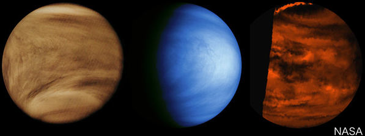  
Images obtained from past missions, in various wavelength ranges. On the left — an image from the spacecraft [Pioneer-Venus-1](pioneer_venus_1.md) (NASA) from 1979 in the UV range. In the center and right are images from the solid‑state imaging system (SSI) and near‑infrared mapping spectrometer (NIMS) from the spacecraft [Galileo](galileo.md) (NASA) from 1990.

This raises a great mystery of atmospheric motion. Venus rotates very slowly, but the upper atmosphere moves at speeds up to 100 m/s, 60 times faster than the surface. Usually, if the upper part of the atmosphere moves faster than the lower, this causes friction, which eventually leads to the alignment of speeds throughout the height. However, on Venus, the atmosphere does not equalize the speed.

To solve the mysteries of the atmosphere, Akatsuki observes the movements of the atmosphere at various altitudes and tries to clarify the dynamics of the atmosphere in three dimensions ([EVN‑011](venus.md)). Also, the task is to determine the causes of clouds ([EVN‑075](venus.md)) and the presence or absence of lightning in them ([EVN‑012](venus.md)). By comparing these observations, it is possible to systematize Venusian meteorology and later create a more universal planetary meteorology based on it.

   - 2020.04.23 According to the [phys.org article ⎆](https://phys.org/news/2020-04-atmospheric-tidal-venus-super-rotation.html) there is an update of atmosphere's superrotation nature ([EVN‑034](venus.md)). An international research team led by Takeshi Horinouchi of Hokkaido University has revealed that this 'super-rotation' is maintained near the equator by atmospheric tidal waves formed from solar heating on the planet's dayside and cooling on its nightside. Closer to the poles, however, atmospheric turbulence and other kinds of waves have a more pronounced effect. The study was published online in *Science* on April 23.

 

### Spacecraft
[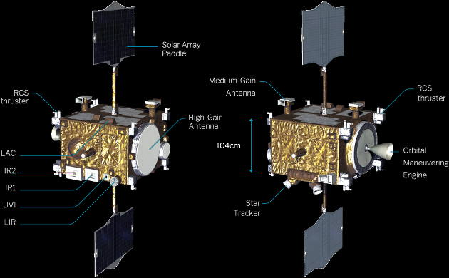](f/project/akatsuki/pic03.png)

**Spacecraft** is a cube of 1.45 × 1.04 × 1.44 m.

|*Complex/system*|*Mass, kg*|*Comments*|
|:--|:--|:--|
|1. Spacecraft  | 284.9 | <mark>TBD</mark> |
|·· Accelerometers |··  | <mark>TBD</mark> |
|·· Gyroscopes  |··  | <mark>TBD</mark> |
|·· Flywheel engines  |··  | <mark>TBD</mark> |
|·· Stellar sensors  |··  | <mark>TBD</mark> |
|·· Solar sensors  |··  | <mark>TBD</mark> |
|·· <mark>TBD</mark>  |··  | <mark>TBD</mark> |
|2. Payload  | 36.4 |  |
|·· IR1  |·· 6.7 |  |
|·· IR2  |·· 18 | Including the cryocooler and on-board cable system shared with IR1 (~3.9 kg) |
|·· LAC  |·· 2.3 |  |
|·· LIR  |·· 3.3 |  |
|·· USO  |·· 2 |  |
|·· UVI  |·· 4.1 |  |
|3. Fuel  | 196.3 |  |
|·· Dinitrogen tetroxide  |··  | <mark>TBD</mark> |
|·· Hydrazine  |··  | <mark>TBD</mark> |
|·· Helium  |··  | <mark>TBD</mark> |
||||
|**Total:**  |**517.6**|  |

**Propulsion system** includes:  
• 1 × 500 N (51 kgf) primary engine on [Dinitrogen tetroxide + Hydrazine](at_plus.md),  
• 12 × 23 N (2.3 kgf) correction engines on [Hydrazine](гидразин.md),  
• 4 × 3 N (0.3 kgf) correction engines on [Hydrazine](гидразин.md).  
The first spacecraft to use silicon nitride brake engines.

**Communication** is carried out in the []X-band](rf.md) at a frequency of 8 GHz, a transmitter with a power of 20 W.  
• 1 × HGA, 1.6 m diameter antenna for Earth connection, flat shape to reduce heat dissipation,
• 2 × rotary MGA for receiving and transmitting service information,  
• 2 × LGA for receiving and transmitting service information.

**Thermal condition** is provided by MLI, radiators and heaters. The temperature inside the spacecraft is maintained at about 20 °C.

**Power supply** is provided by two solar panels with an area of 1.4 m² each, which can be rotated around its longitudinal axis. Solar panels provide 700 W in the orbit of an artificial satellite of Venus.

**Orientation** is performed using:  
• 4 flywheel engines (2 with 20 N·m·s moment, 2 with 4 N·m·s moment); unloading is carried out by the propulsion system;   
• accelerometers, gyroscope, solar and stellar sensors.

**Ballistics and navigation program.**

   1. 2010.03.17 21:58:22 UTC — Earth launch.
   1. 2010.12.06 23:49:00 UTC — Operation of the propulsion system, braking to reach an orbit of 550 × 200 000 km with a period of 4 days. The impulse was issued partly due to problems in the propulsion system (plan: 12 minutes, fact: 2 minutes). Entering an unplanned solar orbit with a period of 203 days.
   1. 2011.09.07‑14 — Test launches of the primary engine. Failure.
   1. 2011.10 — It was decided to no longer use the primary propulsion system, so 65 kg of oxidizer was drained overboard to reduce the mass of the spacecraft.
   1. 2015.07.17‑09.11 — Series of maneuvers.
   1. 2015.11.01‑21 — Maneuvers with a shared V 243.8 m/s.
   1. 2015.12.07 — Entering the orbit of an artificial satellite of Venus 400 × 440 000 km with a period 13 days 14 hours.
   1. 2016.03.26 — Impulse that reduces the apocenter to 330 000 km with a period of 9 days ([EVN‑005](venus.md)).
   1. 2016.05 — Start of the main two-year scientific program.
   1. 2016.12 — Failure IR1 и IR2.
   1. 2018.04 — End of the main program, start of the extended program.

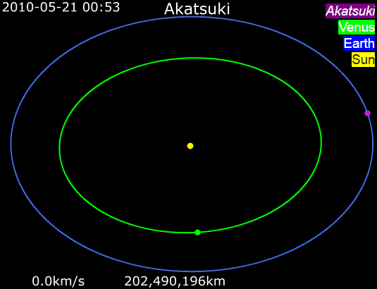  

### Connection with Venus Express
The experiments on Akatsuki are strongly related to those on [Venus Express](venus_express.md), a Venus Orbiter from ESA that was launched in April 2006. The scientific objectives of Venus Express were to study the atmosphere, plasma, and surface of Venus. Scientific equipment included: Planetary Fourier Spectrometer (PFS); Spectroscopy for Investigation of Characteristics of the Atmosphere of Venus (SPICAV); Visible and Infrared Thermal Imaging Spectrometer (VIRTIS); Venus Monitoring Camera (VMC); Analyzer of Space Plasmas and Energetic Atoms (ASPERA‑4); Magnetometer (MAG); USO for Venus Radio Science (VeRa).

The spacecraft entered a 24-hour orbit of 250‑350 × 66 000 km with an inclination of 78 N, allowing close observations of the North pole and global observations of the southern hemisphere. The main part of the mission ended in October 2007 and was extended until December 2012. In terms of atmospheric and surface observations, the main difference between Akatsuki and Venus Express is that Venus Express focused on global observations from Equatorial orbit, while Akatsuki focuses on spectroscopy from polar orbit, despite the fact that VMC on Venus Express did a global survey of the southern hemisphere and VIRTIS created a map of the planetary disk in mosaic mode. These various tasks complement each other in various aspects of the study of Venus.

Information about the vertical position of clouds and their composition is important for accurate interpretation of images from VCO; it is difficult to get information about the location of clouds from VCO, and multi-band observations will allow you to differentiate the atmosphere into levels ([EVN-010](venus.md)). Information about the vertical composition of the atmosphere obtained by the Venus Express spectrographic instruments (PFS, SPICAV, VIRTIS) is the basis for Akatsuki's operation.

Due to orbital limitations, Akatsuki cameras take global images of both hemispheres with an emphasis on low and middle latitudes, while VMC and VIRTIS Venus Express take global views of the southern hemisphere with an emphasis on high latitudes. Observations of Venus Express are suitable for obtaining the planet scale of symmetrical or asymmetric wave modes, for example, horizontal Y feature (Del Genio and Rossow, 1990) and allow you to observe a hemispherical difference. Akatsuki will tell more about the polar vortex ([EVN-067] (venus.md)) and the so-called polar dipole ([EVN-068] (venus.md)), Taylor et al., 1980).

The method of ringing the surface using the near-IR range is also slightly different from that in Venus Express. IR1 scans the surface globally and continuously while simultaneously scanning clouds at a wavelength of 1.01 µm. This makes it quite easy to separate the surface structure from the clouds, since clouds rarely change their size and shape. Venus Express, however, uses a larger set of wavelengths to isolate individual materials in the surface. The latitude coverage of Akatsuki and Venus Express also differs, in the same way as atmospheric observations.

 

## Payload
The payload includes 6 instruments, including 5 cameras for exploring Venus in the [range](rf.md) UV to mid-IR, as well as one instrument for radio transmission:

   - **Infrared 1 μm camera (IR1)** — for shooting thermal radiation emitted by the surface of Venus on the shadow side (range 0.90 — 1.01 µm), which allows you to detect active volcanoes, if they exist. The camera also allows you to observe solar near-IR radiation (0.90 µm) reflected from clouds at an average altitude on the solar side of Venus. A camera with a focal length of 84.2 mm (f/4) and a field of view (FOV) of 12°. Detector with a 1024 × 1024 pixel CCD sensor, cooled to 260 K. Due to problems with electronics, it has not been functioning since December 2016. [PI](principal_investigator.md) — [Naomoto Iwagami](02_iwagami1.md) (ex. Tokyo Univ.).
   - **Infrared 2 μm camera (IR2)** — to investigate the permeability of low clouds on the shadow side of Venus in relation to the thermal radiation of the surface and near ‑ surface atmosphere (1.74 — 2.32 µm). It also detects a range of CO₂ (2.02 µm) on the solar side, which allows to determine the upper boundary of clouds. Third, the 1.65 µm filter allows to study the zodiac light during the flight Earth — Venus. A camera with a focal length of 84.2 mm (f/4) and FOV of 12°. Detector with a 1024 × 1024 pixel CCD sensor, cooled to 65 K. Due to problems with electronics, it has not been functioning since December 2016. [PI](principal_investigator.md) — [Takehiko Satoh](02_satoh1.md) (ISAS/JAXA).
   - **Lightning and Airglow Camera (LAC)** — (range 552 — 777 nm). Camera with FOV of 16°. Detector based on an array of avalanche photodiodes, in the form of a matrix of 8 × 8 pixels. [PI](principal_investigator.md) — [Yukihiro Takahashi](02_takahashi1.md) (Hokkaido Univ.).
   - **Longwave infrared camera (LIR)** — to study the structure of high-altitude clouds at the wavelengths at which they emit heat (range 10 µm). Camera with f/1.4, 12° FOV and 0.05° resolution. Detector with an uncooled microbolometer matrix with a resolution of 240 × 240 pixels. [PI](principal_investigator.md) — [Makoto Taguchi](02_taguchi1.md) (Rikkyo Univ.).
   - **Ultra-Stable Oscillator (USO)** — for an experiment in radio illumination. [PI](principal_investigator.md) — [Takeshi Imamura](02_imamura1.md) (Tokyo Univ.).
   - **Ultraviolet imager (UVI)** — to study the distribution of certain atmospheric gases, such as sulfur dioxide and an unknown UV absorber (range 283 — 365 nm). Camera with FOV of 12°. Sensor with a CCD sensor with a resolution of 1024 × 1024 pixels. [PI](principal_investigator.md) — [Shigeto Watanabe](02_watanabe1.md) (Hokkaido Information Univ.).

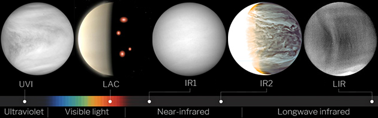

[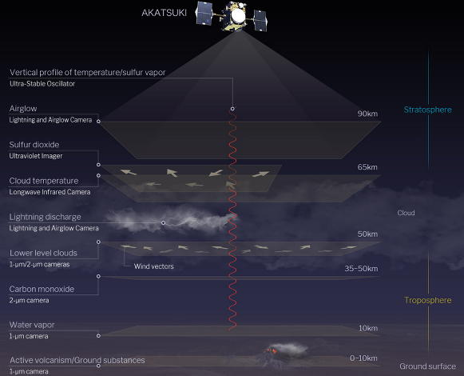](f/project/akatsuki/payload09.jpg)  
Concept image of Akatsuki measurements.  
The six instruments placed on Akatsuki are designed to study various aspects of the atmosphere of Venus at various altitudes. The figure on the left shows targets and instruments, and on the right — heights. By observing atmospheric objects for a long time, for example, clouds, it is possible to obtain the distribution of wind speeds (wind vectors).

 

### IR1 (1 µm camera)
The observation of radio waves with a length of about 1 µm allows us to observe the lower layer of clouds and the near-surface part of Venus, and by comparing the intensity of radiation at different IR wavelengths, it is possible to study the movement of the lower layer of clouds ([EVN-011](venus.md)), water vapor distribution ([EVN-077](venus.md)), surface mineral composition ([EVN-023](venus.md)), and detect the presence of active volcanoes ([EVN-076](venus.md)).

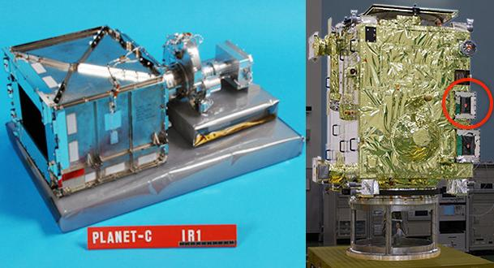

 

### IR2 (2 µm camera)
Radio waves with a length of 2 µm coming from the regions of the bottom of the lower layer of the atmosphere allow to judge their density, cloud particle size, CO distribution, and other parameters, allowing to judge the movement of the atmosphere at low altitudes ([EVN-011](venus.md)) and understand how the clouds of Venus are formed ([EVN-075](venus.md)). The instrument also allows to measure the zodiacal light along the path of Venus in order to investigate the distribution of dust in the solar system ([ECT-002](ect2.md)).

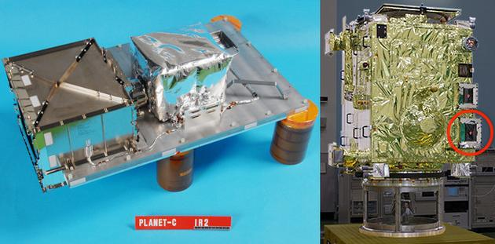

 

### LAC (Lightning and airglow camera)
LAC allows to record flashes lasting up to 1/30 000 s, record lightning discharges of short duration and resolve the question of the presence of lightning in the atmosphere of Venus ([EVN-012](venus.md)). It also allows to record the glow in the atmosphere caused by oxygen at the very top of the atmosphere at an altitude of about 100 km, allowing to build a model of the movement of the atmosphere between the Sun and the shadow side of Venus ([EVN-011](venus.md)).

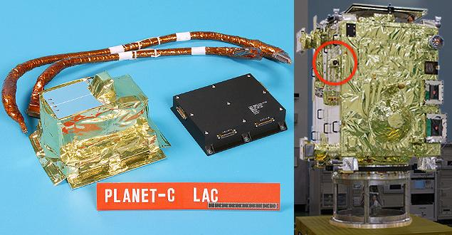

 

### LIR (Long-wave infrared camera)
The IR spectrum at a wavelength of 10 µm is used to measure the temperature of the upper atmosphere. This information can be used to obtain the distribution of altitudes, as well as horizontal and vertical flows in the upper atmosphere ([EVN-010](venus.md)).

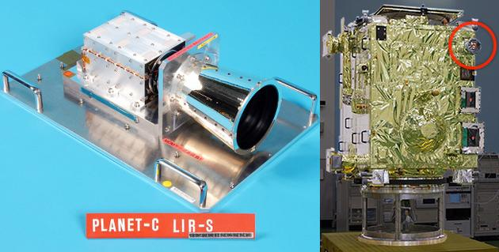

 

### USO (Ultra-stable oscillator)
When Akatsuki is obscured by Venus from observations from Earth, radio waves emitted by the spacecraft enter the atmosphere of Venus and reach the Earth ([EVN-078](venus.md)). The transit of radio waves through the atmosphere of Venus causes a change in their frequency. By analyzing these changes, could be constructed vertical temperature profiles ([EVN-010](venus.md)) and sulphuric acid mist ([EVN-077](venus.md)). An ultra-stable oscillator is used to generate the radio wave.

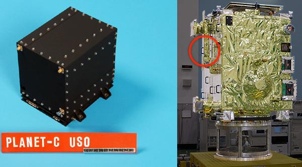

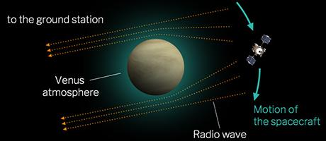

 

### UVI (Ultraviolet imager)
UVI takes pictures in the UV range, allowing to determine the distribution of SO₂ ([EVN-077](venus.md)) related to the formation of clouds and the distribution of unidentified chemical substances that absorb UV rays ([EVN-035] (venus.md)). The instrument can also measure the wind speed of upper clouds ([EVN-011](venus.md)), observing the spread of UV rays in the clouds of Venus.

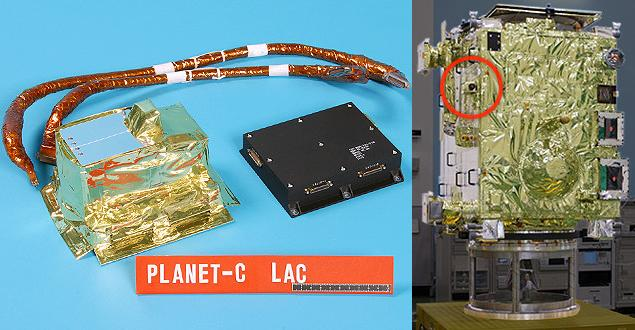

 

## Community, links, people

**PEOPLE:**

   - Constantine Tsang — Senior Research Scientist;
   - Masatoshi Ebara — System Manager, Deputy Project Manager;
   - Yasumasa Kasaba — Co-Investigator on IR2.

**Leadership:**

   1. [Takeshi Imamura](02_imamura1.md) — Member of the scientific group (former scientific director of the project), Tokyo Univ. (**Vice-manager**)
   1. [Masato Nakamura](02_nakamura1.md) — **Project manager**, ISAS/JAXA (**Director**)
   1. [Takehiko Satoh](02_satoh1.md) — Scientific director of the project, ISAS/JAXA

**Members:**

   1. [Takafumi Hino](02_hino1.md) — Network manager, National Inst. of Technology Matsue College
   1. [Nobuaki Ishii](02_ishii1.md) — **Main contact person**, ISAS/JAXA
   1. [Naomoto Iwagami](02_iwagami1.md) — former Tokyo Univ.
   1. [Yeon Joo Lee](02_lee1.md) — Member of the scientific group, Tokyo Univ.
   1. [Shin-ya Murakami](02_murakami1.md) — Member of the scientific group, ISAS/JAXA
   1. [Javier Peralta](02_peralta1.md) — Member of the scientific group, ISAS/JAXA
   1. [Koichiro Sugiyama](02_sugiyama1.md) — Member of the scientific group / Network manager, National Inst. of Technology, Matsue Coll.
   1. [Makoto Taguchi](02_taguchi1.md) — Rikkyo Univ.
   1. [Yukihiro Takahashi](02_takahashi1.md) — Hokkaido Univ.
   1. [Shigeto Watanabe](02_watanabe1.md) — Hokkaido Information Univ.

**COMMUNITIES:**

**[2019 International Venus Conference. Fujihara Seminar 74 (IVC2019)](ivc_2019.md)**.  
IVC2019 is the successor to the Venusian conferences of the past (La Thuile, Aussois, Sicily and Oxford), and was organized by the Akatsuki team and the community in Japan. The purpose of the conference is to cover all areas of Venus research with a focus on new results obtained from the Japanese Akatsuki.

 

## Docs & links
|…°·•¹²³±×÷≤≥≈≠ ‑ −— ⎆✉ ❐“”’«»✔→✘☐☑├┕┆ 1 lb = 0.453592 kg; 1 g = 9.80665 m/s²|
|:--|
|<small>**[FAQ](faq.md)**, **[Cable](cable.md)**·БКС, **[Camera](camera.md)**·Камера, **[Comms](comms.md)**·Радиосв., **[Contact](contact.md)**·Контакт, **[Control](control.md)**·Управ., **[Doc](doc.md)**·Док., **[Doppler](doppler.md)**·ИСР, **[DS](ds.md)**·ЗУ, **[EB](eb.md)**·ХИТ, **[ECO](ecology.md)**·Экол., **[EF](ef.md)**·ВВФ, **[ElC](elc.md)**·ЭКБ, **[EMC](emc.md)**·ЭМС, **[Errors](error.md)**·Ошибки, **[Events](event.md)**·События, **[FS](fs.md)**·ТЭО, **[Fuel](fuel.md)**·Топливо, **[GNC](gnc.md)**·БКУ, **[GS](scs.md)**·НС, **[HF&E](hfe.md)**·Эргоном., **[IMU](imu.md)**·Гироскоп, **[Incubator](incubator.md)**·Инкуб., **[KT](kt.md)**·КТЕХ, **[LAG](lag.md)**·ПУC, **[LES](les.md)**·САСП, **[LS](ls.md)**·СЖО, **[LV](lv.md)**·РН, **[MAG](mag.md)**·Магнитом., **[MCC](mcc.md)**·ЦУП, **[Model](model.md)**·Модель, **[MSC](sc.md)**·ПКА, **[N&B](nnb.md)**·БНО, **[NR](nr.md)**·ЯР, **[OBC](obc.md)**·ЦВМ, **[OE](oe.md)**·БА, **[Patent](патент.md)**·Патент, **[Project](project.md)**·Проект, **[PS](ps.md)**·ДУ, **[QA](quality.md)**·QA, **[R&D](rnd.md)**·НИОКР, **[RAMS](rams.md)**·НиБ, **[Risk](risk.md)**·Риск, **[Robot](robotics.md)**·Робот, **[Rover](rover.md)**·Планетоход, **[RTG](rtg.md)**·РИТЭГ, **[RW](rw.md)**·ДМ, **[SARC](sarc.md)**·ПСК, **[Sensor](sensor.md)**·Датчик, **[SC](sc.md)**·КА, **[SCS](scs.md)**·КК, **[SGM](sgm.md)**·КММ, **[SI](si.md)**·СИ, **[Soft](soft.md)**·ПО, **[SP](sp.md)**·БС, **[Spaceport](spaceport.md)**·Космодром, **[SPS](sps.md)**·СЭС, **[SSS](sss.md)**·ГЗУ, **[TCS](tcs.md)**·СОТР, **[Test](test.md)**·ЭО, **[Timeline](timeline.md)**·Циклограмма, **[TMS](tms.md)**·ТМС, **[TOR](tor.md)**·ТЗ, **[TRL](trl.md)**·УГТ</small>|
|*Sections & pages*|
|**··•  •··**  <mark>NOCAT</mark> |

**Docs:**

   1. [Page directory](f/project/akatsuki/)
   1. [Brochure ❐](f/project/akatsuki/brochure01.pdf)
   1. [Overview of Venus orbiter, Akatsuki ❐](f/project/akatsuki/eps_2011_02_009.pdf)

**Links:**

   1. Notable interwikies — …
   1. <https://ru.wikipedia.org/wiki/Акацуки_(космический_аппарат)>
   1. <https://en.wikipedia.org/wiki/Akatsuki_(spacecraft)>
   1. <https://global.jaxa.jp/projects/sas/planet_c/> — project overview
   1. <https://akatsuki.matsue-ct.jp/> — fan site
   1. <http://www.isas.jaxa.jp/en/missions/spacecraft/current/akatsuki.html>
   1. <https://global.jaxa.jp/countdown/f17/index_e.html>
   1. <http://www.stp.isas.jaxa.jp/venus/top_english.html>
   1. <http://akatsuki.isas.jaxa.jp/en/>
   1. <https://nssdc.gsfc.nasa.gov/nmc/spacecraft/display.action?id=2010-020D>
   1. <https://space.skyrocket.de/doc_sdat/planet-c.htm>
   1. Information archives:
      1. <https://www.darts.isas.jaxa.jp/planet/project/akatsuki/> — on-board information archive
      1. <http://alpo-j.asahikawa-med.ac.jp/indexE.htm> — [ALPO](03_alpo.md) Japan
      1. <http://www.alpo-astronomy.org/venusblog/> — [ALPO](03_alpo.md) Venus section
      1. <http://pvol2.ehu.eus/pvol2/> — PVOL (Planetary Virtual Observatory & Laboratory)
      1. <https://www.britastro.org/section_front/18> — British Astronomical Association
      1. <http://www.cosmos.esa.int/web/venus/active-archive> — ESA's Venus Ground-Based Image Archive
      1. <http://www.skytrip.de/ven.htm> — SlikyTrip.de
      1. <http://www.damianpeach.com/venus.htm> — Damian Peach
