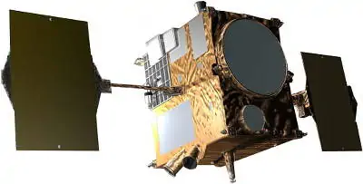
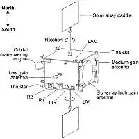
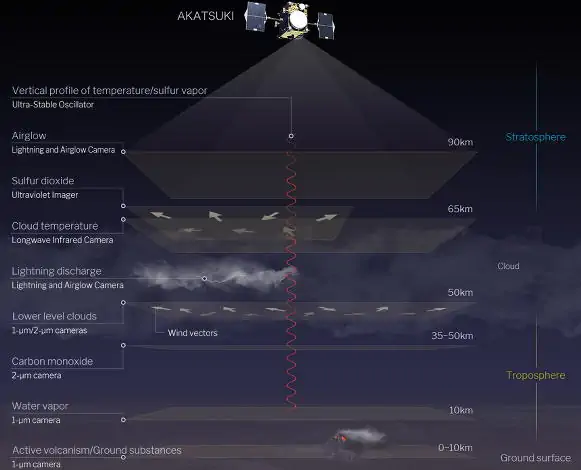

# Akatsuki
> 2019.05.29 [🚀](../index/index.md) [despace](index.md) → [Venus](venus.md), **[Project](project.md)**

[TOC]

---

> <small>**Akatsuki** — EN term. **Акацуки** — rough RU analogue.</small>

**Akatsuki** (あかつき, 暁, «Dawn»), also known as the Venus **Climate Orbiter (VCO)** & **Planet-C** (next after [PLANET-B (Nozomi)](nozomi.md)) is a Japanese spacecraft tasked to study the [Venus](venus.md) atmosphere.

 

 

|*Parameter*|*[Value](si.md)*|
|:--|:--|
|**【Mission】**|• • •|
|Duration|2 years (plan) и 4.5 years (estimated maximum);  2010.05.21 - <mark>TBD</mark> (fact)|
|Operator|[JAXA](contact/jaxa.md)|
|Program|…|
|Development|… ‑ …|
|Launch|2010.05.20 21:58:22 UTC (00:58 MSK) [Tanegashima YLP-1](spaceport.md) with [H-IIA 202](h2.md)|
|Similar to|・Proposed: [Venus Flagship Mission](venus_flagship_mission.md) (US).  ・Current: ….  ・Past: [Venus Express](venus_express.md) (EU 2005), [VeGa‑1/2](vega_1_2.md) (SU 1984), [Venera‑11/12](venera_11_12.md) (SU 1978), [Venera‑9/10](venera_9_10.md) (SU 1975).|
|[Type](sc.md)|Orbiter spacecraft|
|Goal|Investigations of atmospheric stratification, dynamics, physics of clouds, hydrodynamic gravitational waves; survey of clouds & surface; exploring Venusian meteorology & super rotation of the atmosphere, the presence of lightning & volcanism|
|Price|$ 290M ot 7 370 ㎏ of [gold](sc_price.md) in 2010 priсes|
|**【Spacecraft】**|• • •|
|Mass|517.6 ㎏, (dry: 320 ㎏) ([minisatellite](спутник.md), [EVN‑070](venus.md))|
|[Number](spaceid.md)|NSSDC ID (COSPAR ID): 2010-020D, SCN: 36576|
|Orbit / Place|300 × 80 000 ㎞, 172°, 30 hr|
|Payload|・5 cameras for: lightning, glow, IR, UV;  ・equipment for radiography|
|Contractor|…|
|Developer|[NEC Space Technologies](contact/nec.md)|
|Communication|[X‑band](comms.md), 20 W, 1.6 m² dish antenna|
|Structure|Orbiter|
|Power|700 W, 2 × 1.4 m²|

Targets & investigations:

   - **T** — technical; **C** — contact research; **D** — distant research; **F** — fly‑by; **H** — manned; **S** — soil sample return; **X** — technology demonstration
   - **Sections of measurement & observation:**
      - Atmospheric/climate — **Ac** composition, **Ai** imaging, **Am** mapping, **Ap** pressure, **As** samples, **At** temperature, **Aw** wind speed/direction.
      - General — **Gi** planet’s interactions with outer space.
      - Soil/surface — **Sc** composition, **Si** imaging, **Sm** mapping, **Ss** samples.

<small>

|*EVN‑XXX*|*T*|*EN*|*Section of m&o*|*D*|*C*|*F*|*H*|*S*|
|:--|:--|:--|:--|:--|:--|:--|:--|:--|
|EVN‑005|T|Exploration: from Venusian orbit.| |D| |F| | |
|EVN‑007| |Atmosphere: connection between the topography & the atmo circulation| | |D| | | |
|EVN‑010| |Atmosphere: vertical model.| |D| | | | |
|EVN‑011| |Atmosphere: common circulation model.| |D| | | | |
|EVN‑012| |Atmosphere: lightnings.| |D| | | | |
|EVN‑023| |Surface: mineralogical composition.| | |C| | | |
|EVN‑034| |Atmosphere: nature of the superrotation.| |D| | | | |
|EVN‑035| |Atmosphere: nature of the UV‑absorber.| |D| | | | |
|EVN‑049| |Nature & characteristics of the thermal tides| | |D| | | |
|EVN‑067| |Atmosphere: nature of the polar dipole & turbulence.| |D| | | | |
|EVN‑070|T|Exploration with [satellites](sc.md): minisatellites.| |D| |F| | |
|EVN‑074| |Meteorological model.| |D| |F| | |
|EVN‑075| |Atmosphere: clouds, their nature.| |D| |F| | |
|EVN‑076| |Surface: volcanoes, their presence.| |D| |F| | |
|EVN‑077| |Atmosphere: chemical elements distribution.| |D| |F| | |
|EVN‑078|T|Atmosphere: radiography.| |D| | | | |
|EVN‑080| |Albedo: changes in time|Gi| |D|F| | |
|EVN‑093|T|Atmosphere/surface imaging| | |D|F| | |

</small>

 

## Description
Exploring Venus helps get to know our planet better.

It is believed that Venus & Earth appeared around the same time 4.6 billion years ago. At that time, Venus may have had earth‑like oceans. However, today Venus has no oceans & is covered by an atmosphere of CO₂. Venus is closer to the Sun than Earth, so the temperature is higher & more water molecules are carried out of the atmosphere into space. This may mean that water vapor rising into the upper atmosphere was then broken up into oxygen & hydrogen by solar UV radiation, & then lighter hydrogen atoms were released into space. Without oceans, CO₂ cannot dissolve in water, as it does on Earth, & accumulates in large quantities in the atmosphere.

Unlike Earth, the upper atmosphere moves 60 times faster than the surface. Terrestrial meteorology cannot explain this phenomenon.

There is no clear evidence to shed light on the reasons for such a large difference between Venus & Earth. If it were possible to determine how the current conditions on Venus arose, it would be possible to understand how Earth became a planet with a temperature & humidity sufficient to support such a large variety of life. In addition, a thorough study of the phenomena of Venusian meteorology & its accurate mathematical modeling in relation to earth’s meteorology would allow to develop a universal planetary meteorology, as well as understand the causes of the current state of the earth’s atmosphere & predict its possible future changes.

Similar to the Japanese meteorological satellite Himawari, which is in orbit of an artificial Earth satellite, 4 Akatsuki cameras (IR1, IR2, LIR, UVI) are designed to obtain images of the cloud cover of Venus (the location, shape, temperature & volume of cloud substances). Clouds appear & disappear, change their shape; by tracking their changes in their characteristics, can be observed the movement of clouds. It is assumed that the longest-lived clouds move with wind currents in the atmosphere, which allows you to model the movement of winds in the atmosphere of Venus. Cameras with optics in different ranges allow to observe the atmosphere not only horizontally, but also vertically. Moreover, if LAC registers the presence of lightning, it will shed light on updrafts similar to those seen in earth’s rain clouds that produce lightning, as well as on atmospheric currents at altitudes.

Observing the above-mentioned changes in cloud shapes over a long period of time will allow to gather information about the waves in the atmosphere. When a major earthquake occurs at the bottom of the earth’s sea, tsunamis spread over long distances. Atmospheric waves (their causes may be different) propagate in the atmosphere in a similar way, spreading energy in different directions. In this case, atmospheric waves play a key role on planets. Information about atmospheric waves obtained from Akatsuki is expected to provide a better understanding of the nature & mechanisms of large circulations, such as super rotation, based on smaller circulations, as well as the mechanisms of energy exchange between the layers of the atmosphere.

Earth’s meteorology was built through a wide range of measurements & observations. The variety of data sent by Akatsuki to Earth can shed light on the meteorological phenomena of Venus, allowing for a better understanding of Earth’s meteorology.

### Mission
Venus rotates inside the Earth’s orbit & is the closest planet to Earth. The radius of the orbit is about 182 million ㎞ or 72 % of the distance between the Sun & the Earth; the diameter of Venus is 95 % of the Earth’s, & the mass is 82 %. Thus, Venus in this aspect is almost a twin of Earth.

Venus has been known for a long time as a planet that is seen especially brightly at dawn & sunset. This is because, in addition to its proximity to Earth, Venus’ atmosphere reflects sunlight. Venus is covered with clouds of sulfuric acid up to 20 ㎞ thick, so it is impossible to see the surface of Venus with the naked eye through its atmosphere. These clouds reflect about 80 % of the Sun’s light, which means that the Venusian surface receives half as much energy as Earth’s. However, due to the high density of the atmosphere, which consists mainly of carbon dioxide (the pressure at the surface is 90 ㍴), the greenhouse effect leads to a temperature at the surface of about 460 ℃ (860 ℉). This atmosphere moves at a high speed (one cycle in 4 Earth days), surpassing the slow rotation of Venus (243 Earth days) — this effect is called superrotation.

The oceans, magnetic field, & tectonics of the lithosphere present on Earth are missing on Venus. In addition, the presence of lightning & active volcanoes has not yet been confirmed. & although Venus is often called the Earth’s twin, they have many differences.

The cost of the mission is $ 290 million or 7 370 ㎏ of [gold](sc_price.md) in 2010 prices (SC is $ 174 million or 4 422 ㎏ of [gold](sc_price.md), launch is $ 116 million or 2 948 ㎏ of [gold](sc_price.md), or ¥ 14.6 billion & ¥ 9.8 billion, respectively).

The mission was supposed to fly for 7 months with an exit to a operating orbit of 300 × 80 000 ㎞ 24 h, but during braking, one of the fuel valves of the main engine failed. This caused the fuel components to mix in dangerous proportions, causing an explosion & damage to the engine nozzle. The spacecraft failed to reach the target orbit, & entered the solar orbit with a period of 203 days. Since the period of Venus’ rotation is 225 days, this allowed to catch up with Venus & enter the highly elongated orbit of the artificial satellite of Venus in 6 years. As a result, the rest of the braking & maneuvers were performed using low‑thrust engines. Because of this, the mission was delayed longer than the calculated value, some of the devices began to fail. In the end, the spacecraft was released into its target orbit & began functioning.

The cause of the problem is the deposition of salts in the pipeline between the boost tank (helium) & the fuel tank, as a result, the oxidizer became predominant in the combustion chamber & the increased temperature damaged the nozzle. A similar problem destroyed [Mars Observer](mars_observer.md) in 1993.

From October 2009 to January 2010, a public campaign was conducted by the [Planetary Society](contact/planetary_society.md) & JAXA, allowing everyone to send their name into space on Board Akatsuki. Names & messages were printed on an aluminum plate on Board the spacecraft; 260 214 people wrote their names & messages. 90 aluminum plates were created, including 3 plates with printed images of Vocaloid Hatsune Miku & its very deformed figure.

 

### Goals & Payload
**The goal of the project** Akatsuki is a three-dimensional investigation of the movement of the Venusian atmosphere over time & the construction of the meteorology of Venus ([EVN‑074](venus.md)).

Research on Venus began in the 1960s, when the United States & the Soviet Union began sending spacecraft to the planet. It was found that the surface is extremely hot, & there are no oceans, & that the atmosphere differs from the earth’s in density, composition, & rotation patterns. Venus was very different from Earth.

  
Images obtained from past missions, in various wavelength ranges. On the left — an image from the spacecraft [Pioneer-Venus-1](pioneer_venus_1.md) (NASA) from 1979 in the UV range. In the center & right are images from the solid‑state imaging system (SSI) & near‑infrared mapping spectrometer (NIMS) from the spacecraft [Galileo](galileo.md) (NASA) from 1990.

This raises a great mystery of atmospheric motion. Venus rotates very slowly, but the upper atmosphere moves at speeds up to 100 ㎧, 60 times faster than the surface. Usually, if the upper part of the atmosphere moves faster than the lower, this causes friction, which eventually leads to the alignment of speeds throughout the height. However, on Venus, the atmosphere does not equalize the speed.

To solve the mysteries of the atmosphere, Akatsuki observes the movements of the atmosphere at various altitudes & tries to clarify the dynamics of the atmosphere in three dimensions ([EVN‑011](venus.md)). Also, the task is to determine the causes of clouds ([EVN‑075](venus.md)) & the presence or absence of lightning in them ([EVN‑012](venus.md)). By comparing these observations, it is possible to systematize Venusian meteorology & later create a more universal planetary meteorology based on it.

   - 2018 LIR instrument found a long (~ 10 000 ㎞) standing wave in the atmosphere which may affect the Venus day longevity periodically shortening/elongating it.
   - 2020.04.23 According to the [phys.org article ⎆](https://phys.org/news/2020-04-atmospheric-tidal-venus-super‑rotation.html) there is an update of atmosphere’s superrotation nature ([EVN‑034](venus.md)). An international research team led by Takeshi Horinouchi of Hokkaido University has revealed that this ’super‑rotation' is maintained near the equator by atmospheric tidal waves formed from solar heating on the planet’s dayside & cooling on its nightside. Closer to the poles, however, atmospheric turbulence & other kinds of waves have a more pronounced effect. The study was published online in *Science* on April 23.

 

### Spacecraft

**Spacecraft** is a cube of 1.45 × 1.04 × 1.44 m.

|*Complex/system*|*Mass, ㎏*|*Comments*|
|:--|:--|:--|
|1. Spacecraft|284.9|<mark>TBD</mark>|
|·· Accelerometers|··|<mark>TBD</mark>|
|·· Gyroscopes|··|<mark>TBD</mark>|
|·· Flywheel engines|··|<mark>TBD</mark>|
|·· Stellar sensors|··|<mark>TBD</mark>|
|·· Solar sensors|··|<mark>TBD</mark>|
|·· <mark>TBD</mark>|··|<mark>TBD</mark>|
|2. Payload|36.4| |
|·· IR1|·· 6.7| |
|·· IR2|·· 18|Including the cryocooler & on-board cable system shared with IR1 (~3.9 ㎏)|
|·· LAC|·· 2.3| |
|·· LIR|·· 3.3| |
|·· USO|·· 2| |
|·· UVI|·· 4.1| |
|3. Fuel|196.3| |
|·· Dinitrogen tetroxide|··|<mark>TBD</mark>|
|·· Hydrazine|··|<mark>TBD</mark>|
|·· Helium|··|<mark>TBD</mark>|
| | | |
|**Total:**|**517.6**| |

**Propulsion system** includes:  
• 1 × 500 N (51 ㎏f) primary engine on [Dinitrogen tetroxide + Hydrazine](nto_plus.md),  
• 12 × 23 N (2.3 ㎏f) correction engines on [Hydrazine](hydrazine.md),  
• 4 × 3 N (0.3 ㎏f) correction engines on [Hydrazine](hydrazine.md).  
The first spacecraft to use silicon nitride brake engines.

**Communication** is carried out in the [X‑band](comms.md) at a frequency of 8 ㎓, a transmitter with a power of 20 W.  
• 1 × HGA, 1.6 m diameter antenna for Earth connection, flat shape to reduce heat dissipation,
• 2 × rotary MGA for receiving & transmitting service information,  
• 2 × LGA for receiving & transmitting service information.

**Thermal condition** is provided by MLI, radiators & heaters. The temperature inside the spacecraft is maintained at about 20 ℃.

**Power supply** is provided by two solar panels with an area of 1.4 m² each, which can be rotated around its longitudinal axis. Solar panels provide 700 W in the orbit of an artificial satellite of Venus.

**Orientation** is performed using:  
• 4 flywheel engines (2 × 20 N·m·s moment, 2 × 4 N·m·s moment); unloading is carried out by the propulsion system;   
• accelerometers, gyroscope, solar & stellar sensors.

**Ballistics & navigation program.**

   1. 2010.03.17 21:58:22 UTC — Earth launch.
   1. 2010.12.06 23:49:00 UTC — Operation of the propulsion system, braking to reach an orbit of 550 × 200 000 ㎞ with a period of 4 d. The impulse was issued partly due to problems in the propulsion system (plan: 12 minutes, fact: 2 minutes). Entering an unplanned solar orbit with a period of 203 d.
   1. 2011.09.07‑14 — Test launches of the primary engine. Failure.
   1. 2011.10 — It was decided to no longer use the primary propulsion system, so 65 ㎏ of oxidizer was drained overboard to reduce the mass of the spacecraft.
   1. 2015.07.17‑09.11 — Series of maneuvers.
   1. 2015.11.01‑21 — Maneuvers with a shared V 243.8 ㎧.
   1. 2015.12.07 — Entering the orbit of an artificial satellite of Venus 400 × 440 000 ㎞ with a period 13 d 14 h.
   1. 2016.03.26 — Impulse that reduces the apocenter to 330 000 ㎞ with a period of 9 d ([EVN‑005](venus.md)).
   1. 2016.05 — Start of the main two-year scientific program.
   1. 2016.12 — Failure IR1 и IR2.
   1. 2018.04 — End of the main program, start of the extended program.

  

### Connection with Venus Express
The experiments on Akatsuki are strongly related to those on [Venus Express](venus_express.md), a Venus Orbiter from ESA that was launched in April 2006. The scientific objectives of Venus Express were to study the atmosphere, plasma, & surface of Venus. Scientific equipment included: Planetary Fourier Spectrometer (PFS); Spectroscopy for Investigation of Characteristics of the Atmosphere of Venus (SPICAV); Visible & Infrared Thermal Imaging Spectrometer (VIRTIS); Venus Monitoring Camera (VMC); Analyzer of Space Plasmas & Energetic Atoms (ASPERA‑4); Magnetometer (MAG); USO for Venus Radio Science (VeRa).

The spacecraft entered a 24-hour orbit of 250‑350 × 66 000 ㎞ with an inclination of 78 N, allowing close observations of the North pole & global observations of the southern hemisphere. The main part of the mission ended in October 2007 & was extended until December 2012. In terms of atmospheric & surface observations, the main difference between Akatsuki & Venus Express is that Venus Express focused on global observations from Equatorial orbit, while Akatsuki focuses on spectroscopy from polar orbit, despite the fact that VMC on Venus Express did a global survey of the southern hemisphere & VIRTIS created a map of the planetary disk in mosaic mode. These various tasks complement each other in various aspects of the study of Venus.

Information about the vertical position of clouds & their composition is important for accurate interpretation of images from VCO; it is difficult to get information about the location of clouds from VCO, & multi‑band observations will allow you to differentiate the atmosphere into levels ([EVN‑010](venus.md)). Information about the vertical composition of the atmosphere obtained by the Venus Express spectrographic instruments (PFS, SPICAV, VIRTIS) is the basis for Akatsuki’s operation.

Due to orbital limitations, Akatsuki cameras take global images of both hemispheres with an emphasis on low & middle latitudes, while VMC & VIRTIS Venus Express take global views of the southern hemisphere with an emphasis on high latitudes. Observations of Venus Express are suitable for obtaining the planet scale of symmetrical or asymmetric wave modes, for example, horizontal Y feature (Del Genio & Rossow, 1990) & allow you to observe a hemispherical difference. Akatsuki will tell more about the polar vortex ([EVN‑067](venus.md)) & the so-called polar dipole ([EVN‑068](venus.md)), Taylor et al., 1980).

The method of ringing the surface using the near‑IR range is also slightly different from that in Venus Express. IR1 scans the surface globally & continuously while simultaneously scanning clouds at a wavelength of 1.01 µm. This makes it quite easy to separate the surface structure from the clouds, since clouds rarely change their size & shape. Venus Express, however, uses a larger set of wavelengths to isolate individual materials in the surface. The latitude coverage of Akatsuki & Venus Express also differs, in the same way as atmospheric observations.

 

## Payload
The payload includes 6 instruments, including 5 cameras for exploring Venus in the [range](comms.md) UV to mid-IR, as well as one instrument for radio transmission:

   - **Infrared 1 μm camera (IR1)** — for shooting thermal radiation emitted by the surface of Venus on the shadow side (range 0.90 ‑ 1.01 µm), which allows you to detect active volcanoes, if they exist. The camera also allows you to observe solar near‑IR radiation (0.90 µm) reflected from clouds at an average altitude on the solar side of Venus. A camera with a focal length of 84.2 ㎜ (f/4) & a field of view (FOV) of 12°. Detector with a 1024 × 1024 pixel CCD sensor, cooled to 260 K. Due to problems with electronics, it has not been functioning since December 2016. [PI](principal_investigator.md) — [Naomoto Iwagami](person.md) (ex. Tokyo Univ.).
   - **Infrared 2 μm camera (IR2)** — to investigate the permeability of low clouds on the shadow side of Venus in relation to the thermal radiation of the surface & near ‑ surface atmosphere (1.74 ‑ 2.32 µm). It also detects a range of CO₂ (2.02 µm) on the solar side, which allows to determine the upper boundary of clouds. Third, the 1.65 µm filter allows to study the zodiac light during the flight Earth — Venus. A camera with a focal length of 84.2 ㎜ (f/4) & FOV of 12°. Detector with a 1024 × 1024 pixel CCD sensor, cooled to 65 K. Due to problems with electronics, it has not been functioning since December 2016. [PI](principal_investigator.md) — [Takehiko Satoh](person.md) (ISAS/JAXA).
   - **Lightning & Airglow Camera (LAC)** — (range 552 ‑ 777 nm). Camera with FOV of 16°. Detector based on an array of avalanche photodiodes, in the form of a matrix of 8 × 8 pixels. [PI](principal_investigator.md) — [Yukihiro Takahashi](person.md) (Hokkaido Univ.).
   - **Longwave infrared camera (LIR)** — to study the structure of high‑altitude clouds at the wavelengths at which they emit heat (range 10 µm). Camera with f/1.4, 12° FOV & 0.05° resolution. Detector with an uncooled microbolometer matrix with a resolution of 240 × 240 pixels. [PI](principal_investigator.md) — [Makoto Taguchi](person.md) (Rikkyo Univ.).
   - **ultra‑Stable Oscillator (USO)** — for an experiment in radio illumination. [PI](principal_investigator.md) — [Takeshi Imamura](person.md) (Tokyo Univ.).
   - **Ultraviolet imager (UVI)** — to study the distribution of certain atmospheric gases, such as sulfur dioxide & an unknown UV absorber (range 283 ‑ 365 nm). Camera with FOV of 12°. Sensor with a CCD sensor with a resolution of 1024 × 1024 pixels. [PI](principal_investigator.md) — [Shigeto Watanabe](person.md) (Hokkaido Information Univ.).

  
Concept image of Akatsuki measurements.  
The six instruments placed on Akatsuki are designed to study various aspects of the atmosphere of Venus at various altitudes. The figure on the left shows targets & instruments, & on the right — heights. By observing atmospheric objects for a long time, for example, clouds, it is possible to obtain the distribution of wind speeds (wind vectors).

 

### IR1 (1 µm camera)
The observation of radio waves with a length of about 1 µm allows us to observe the lower layer of clouds & the near‑surface part of Venus, & by comparing the intensity of radiation at different IR wavelengths, it is possible to study the movement of the lower layer of clouds ([EVN‑011](venus.md)), water vapor distribution ([EVN‑077](venus.md)), surface mineral composition ([EVN‑023](venus.md)), & detect the presence of active volcanoes ([EVN‑076](venus.md)).

 

### IR2 (2 µm camera)
Radio waves with a length of 2 µm coming from the regions of the bottom of the lower layer of the atmosphere allow to judge their density, cloud particle size, CO distribution, & other parameters, allowing to judge the movement of the atmosphere at low altitudes ([EVN‑011](venus.md)) & understand how the clouds of Venus are formed ([EVN‑075](venus.md)). The instrument also allows to measure the zodiacal light along the path of Venus in order to investigate the distribution of dust in the solar system ([ECT-002](ect2.md)).

 

### LAC (Lightning & airglow camera)
LAC allows to record flashes lasting up to 1/30 000 s, record lightning discharges of short duration & resolve the question of the presence of lightning in the atmosphere of Venus ([EVN‑012](venus.md)). It also allows to record the glow in the atmosphere caused by oxygen at the very top of the atmosphere at an altitude of about 100 ㎞, allowing to build a model of the movement of the atmosphere between the Sun & the shadow side of Venus ([EVN‑011](venus.md)).

 

### LIR (Long-wave infrared camera)
The IR spectrum at a wavelength of 10 µm is used to measure the temperature of the upper atmosphere. This information can be used to obtain the distribution of altitudes, as well as horizontal & vertical flows in the upper atmosphere ([EVN‑010](venus.md)).

 

### USO (ultra‑stable oscillator)
When Akatsuki is obscured by Venus from observations from Earth, radio waves emitted by the spacecraft enter the atmosphere of Venus & reach the Earth ([EVN‑078](venus.md)). The transit of radio waves through the atmosphere of Venus causes a change in their frequency. By analyzing these changes, could be constructed vertical temperature profiles ([EVN‑010](venus.md)) & sulphuric acid mist ([EVN‑077](venus.md)). An ultra‑stable oscillator is used to generate the radio wave.

 

### UVI (Ultraviolet imager)
UVI takes pictures in the UV range, allowing to determine the distribution of SO₂ ([EVN‑077](venus.md)) related to the formation of clouds & the distribution of unidentified chemical substances that absorb UV rays ([EVN‑035](venus.md)). The instrument can also measure the wind speed of upper clouds ([EVN‑011](venus.md)), observing the spread of UV rays in the clouds of Venus.

 

## Community, links, people

**PEOPLE:**

   - Constantine Tsang — Senior Research Scientist;
   - Masatoshi Ebara — System Manager, Deputy Project Manager;
   - Yasumasa Kasaba — Co-Investigator on IR2.

**Leadership:**

   1. [Takeshi Imamura](person.md) — Member of the scientific group (former scientific director of the project), Tokyo Univ. (**Vice-manager**)
   1. [Masato Nakamura](person.md) — **Project manager**, ISAS/JAXA (**Director**)
   1. [Takehiko Satoh](person.md) — Scientific director of the project, ISAS/JAXA

**Members:**

   1. [Takafumi Hino](person.md) — Network manager, National Inst. of Technology Matsue College
   1. [Nobuaki Ishii](person.md) — **Main contact person**, ISAS/JAXA
   1. [Naomoto Iwagami](person.md) — former Tokyo Univ.
   1. [Yeon Joo Lee](person.md) — Member of the scientific group, Tokyo Univ.
   1. [Shin-ya Murakami](person.md) — Member of the scientific group, ISAS/JAXA
   1. [Javier Peralta](person.md) — Member of the scientific group, ISAS/JAXA
   1. [Koichiro Sugiyama](person.md) — Member of the scientific group / Network manager, National Inst. of Technology, Matsue Coll.
   1. [Makoto Taguchi](person.md) — Rikkyo Univ.
   1. [Yukihiro Takahashi](person.md) — Hokkaido Univ.
   1. [Shigeto Watanabe](person.md) — Hokkaido Information Univ.
   1. Masatoshi Ebara — [linkedin ⎆](https://www.linkedin.com/in/masatoshi-ebara-944683160/) — NEC, System Manager and Deputy Project Manager.

**COMMUNITIES:**

**[2019 International Venus Conference. Fujihara Seminar 74 (IVC2019)](ivc_2019.md)**.  
IVC2019 is the successor to the Venusian conferences of the past (La Thuile, Aussois, Sicily & Oxford), & was organized by the Akatsuki team & the community in Japan. The purpose of the conference is to cover all areas of Venus research with a focus on new results obtained from the Japanese Akatsuki.

 

## Docs & links
|Navigation|
|:--|
|**[FAQ](faq.md)**【**[SCS](scs.md)**·КК, **[SC (OE+SGM)](sc.md)**·КА】**[CON](contact.md)·[Pers](person.md)**·Контакт, **[Ctrl](control.md)**·Упр., **[Doc](doc.md)**·Док., **[Drawing](drawing.md)**·Чертёж, **[EF](ef.md)**·ВВФ, **[Error](error.md)**·Ошибки, **[Event](event.md)**·События, **[FS](fs.md)**·ТЭО, **[HF&E](hfe.md)**·Эрго., **[KT](kt.md)**·КТ, **[N&B](nnb.md)**·БНО, **[Project](project.md)**·Проект, **[QM](qm.md)**·БКНР, **[R&D](rnd.md)**·НИОКР, **[SI](si.md)**·СИ, **[Test](test.md)**·ЭО, **[TRL](trl.md)**·УГТ, **[Way](way.md)**·Пути|
|*Sections & pages*|
|**ã€】**  <mark>NOCAT</mark>|

   1. Docs:
      - [Page directory](f/project/a/akatsuki/)
      - [Brochure ❐](f/project/a/akatsuki/brochure01.pdf)
      - [Overview of Venus orbiter, Akatsuki ❐](f/project/a/akatsuki/eps_2011_02_009.pdf)
   1. <https://ru.wikipedia.org/wiki/Акацуки_(космический_аппарат)>
   1. <https://en.wikipedia.org/wiki/Akatsuki_(spacecraft)>
   1. <https://global.jaxa.jp/projects/sas/planet_c/> — project overview
   1. <https://akatsuki.matsue-ct.jp/> — fan site
   1. <http://www.isas.jaxa.jp/en/missions/spacecraft/current/akatsuki.html>
   1. <https://global.jaxa.jp/countdown/f17/index_e.html>
   1. <http://www.stp.isas.jaxa.jp/venus/top_english.html>
   1. <http://akatsuki.isas.jaxa.jp/en/>
   1. <https://nssdc.gsfc.nasa.gov/nmc/spacecraft/display.action?:id=2010-020D>
   1. <https://space.skyrocket.de/doc_sdat/planet-c.htm>
   1. Information archives:
      1. <https://www.darts.isas.jaxa.jp/planet/project/akatsuki/> — on-board information archive
      1. <http://alpo-j.asahikawa-med.ac.jp/indexE.htm> — [ALPO](contact/alpo.md) Japan
      1. <http://www.alpo-astronomy.org/venusblog/> — [ALPO](contact/alpo.md) Venus section
      1. <http://pvol2.ehu.eus/pvol2/> — PVOL (Planetary Virtual Observatory & Laboratory)
      1. <https://www.britastro.org/section_front/18> — British Astronomical Association
      1. <http://www.cosmos.esa.int/web/venus/active-archive> — ESA’s Venus Ground-Based Image Archive
      1. <http://www.skytrip.de/ven.htm> — SlikyTrip.de
      1. <http://www.damianpeach.com/venus.htm> — Damian Peach
