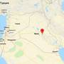
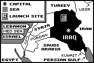

# Al-Anbar
> 2019.03.21 ┊ **🚀 [despace](index.md)** → **[Spaceport](spaceport.md)**

[TOC]

---

> <small>*Terms:* **Al‑Anbar** — English term with no analogues in Russian. **Аль‑Анбар** — literal translation to Russian.</small>

**Iraq's Al-Anbar Space Research Center** — Iraq's launch site.

On December 5, 1989, the Middle eastern nation became the tenth to launch an artificial moon to orbit above Earth.
The satellite was the 48-ton, third stage of a three-stage rocket in a flight from Al-Anbar Space Research Center 50 miles west of Baghdad to a six-orbit spaceflight.

**Six Revs.** A U.S. nuclear-attack-warning satellite spotted fiery exhaust from the rocket as it blasted up and away from Iraq. While the rocket did not leave a separate satellite in orbit, it's third stage swept around the Earth for six revolutions before falling out of orbit. North American Aerospace Defense Command tracked the third stage around the globe.

The launch made Iraq the tenth nation with a rocket powerful enough for space launches. It was the first time Iraq had exposed its space research.

**Scout-like.** Iraq's 75-ft., three-stage rocket probably was similar to a U.S. Scout rocket used to send small satellites to low orbits.

**Military missiles.** Iraq's space booster may have been a modified version of Argentina's Condor ballistic missile. Such a missile could carry a nuclear warhead 1,240 miles. Iraq also had a 600-mi. missile built around the USSR's Scud.

   - Scuds were launched by Iraq against Iran during their eight-year war in the 1980's.
   - Iraq again launched Scuds, against Israel and Saudi Arabia, in the first Persian Gulf War in 1991.
   - Iraq launched a few ballistic missiles against Kuwait and the opposing Coalition Forces in the second Persian Gulf War in 2003.

Al-Anbar Space Research Center and other Iraqi launch sites were damaged in the 1991 war, bringing to a halt Iraq's ability to continue in the Middle East space race with Israel.

|*Characteristic*|*[Value](si.md)*|
|:--|:--|
| Activity | *Closed* (1989 ‑ 1991) |
| Coordinates | 32.78220°N 44.29962°E |
| Distanse | 3 700 km to the equator;  2 800 km to [LAV](03_lav.md);  17 400 km  to [JPL](03_jpl.md);  50 km to Baghdad |
| Launch pads | 1 |
| [Launched vehicles](lv.md) | **Abid** <small>(modified version of Argentina's Condor ballistic missile and USSR's Scud rocket)</small> |
| Operator |  |
||   |
||  <small>*Мировая карта космодромов*</small>  |

 

## Docs & links
|…°·•¹²³±×÷≤≥≈≠ ‑ −— ⎆✉ ❐“”’«»✔→✘☐☑├┕┆ 1 lb = 0.453592 kg; 1 g = 9.80665 m/s²|
|:--|
|<small>**[FAQ](faq.md)**, **[Cable](cable.md)**·БКС, **[Camera](camera.md)**·Камера, **[Comms](comms.md)**·Радиосв., **[Contact](contact.md)**·Контакт, **[Control](control.md)**·Управ., **[Doc](doc.md)**·Док., **[Doppler](doppler.md)**·ИСР, **[DS](ds.md)**·ЗУ, **[EB](eb.md)**·ХИТ, **[ECO](ecology.md)**·Экол., **[EF](ef.md)**·ВВФ, **[ElC](elc.md)**·ЭКБ, **[EMC](emc.md)**·ЭМС, **[Errors](error.md)**·Ошибки, **[Events](event.md)**·События, **[FS](fs.md)**·ТЭО, **[Fuel](fuel.md)**·Топливо, **[GNC](gnc.md)**·БКУ, **[GS](scs.md)**·НС, **[HF&E](hfe.md)**·Эргоном., **[IMU](imu.md)**·Гироскоп, **[Incubator](incubator.md)**·Инкуб., **[KT](kt.md)**·КТЕХ, **[LAG](lag.md)**·ПУC, **[LES](les.md)**·САСП, **[LS](ls.md)**·СЖО, **[LV](lv.md)**·РН, **[MAG](mag.md)**·Магнитом., **[MCC](mcc.md)**·ЦУП, **[Model](model.md)**·Модель, **[MSC](sc.md)**·ПКА, **[N&B](nnb.md)**·БНО, **[NR](nr.md)**·ЯР, **[OBC](obc.md)**·ЦВМ, **[OE](oe.md)**·БА, **[Patent](патент.md)**·Патент, **[Project](project.md)**·Проект, **[PS](ps.md)**·ДУ, **[QA](quality.md)**·QA, **[R&D](rnd.md)**·НИОКР, **[RAMS](rams.md)**·НиБ, **[Risk](risk.md)**·Риск, **[Robot](robotics.md)**·Робот, **[Rover](rover.md)**·Планетоход, **[RTG](rtg.md)**·РИТЭГ, **[RW](rw.md)**·ДМ, **[SARC](sarc.md)**·ПСК, **[Sensor](sensor.md)**·Датчик, **[SC](sc.md)**·КА, **[SCS](scs.md)**·КК, **[SGM](sgm.md)**·КММ, **[SI](si.md)**·СИ, **[Soft](soft.md)**·ПО, **[SP](sp.md)**·БС, **[Spaceport](spaceport.md)**·Космодром, **[SPS](sps.md)**·СЭС, **[SSS](sss.md)**·ГЗУ, **[TCS](tcs.md)**·СОТР, **[Test](test.md)**·ЭО, **[Timeline](timeline.md)**·Циклограмма, **[TMS](tms.md)**·ТМС, **[TOR](tor.md)**·ТЗ, **[TRL](trl.md)**·УГТ</small>|
|*Sections & pages*|
|**··• [Spaceport](spaceport.md) •··**  …  • • •  **Brazil:** [Alcantara](alcantara.md) (260) ┊ **China:** [Jiuquan](jiuquan.md) (5 000), [Taiyuan](taiyuan.md) (4 500), [Wenchang](wenchang.md) (2 200), [Xichang](xichang.md) (3 200) ┊ **EU:** [Kourou](kourou.md) (650), (inactive: [San Marco](san_marco.md) (300), [Woomera](woomera.md) (3 300)) ┊ **India:** [Sriharikota](sriharikota.md) (1 600) ┊ **Int.:** …, (inactive: [Sea Launch](sea_launch.md) (0)) ┊ **Iran:** [Semnan](semnan.md) (4 300)) ┊ **Iraq:** …, (inactive: [Al Anbar](al_anbar.md) (3 700)) ┊ **Israel:** [Palmachim](palmachim.md) (3 700) ┊ **Japan:** [Taiki](taiki.md) (4 700), [Tanegashima](tanegashima.md) (3 400), [Uchinoura](uchinoura.md) (3 700) ┊ **Korea N.:** [Sohae](sohae.md) (4 900), [Tonghae](tonghae.md) (4 700) ┊ **Korea S.:** [Naro](naro.md) (4 000) ┊ **RF,CIF:** [Baikonur](baikonur.md) (5 200), [Dombarovsky](dombarovsky.md) (5 500), [Kapustin Yar](kapustin_yar.md) (5 400), [Plesetsk](plesetsk.md) (7 400), [Vostochny](vostochny.md) (5 500), (inactive: [Svobodny](svobodny.md) (5 500)) ┊ **USA:** [Rocket Lab LC1](rocket_lab_lc1.md) (4 700), [SpaceX STLS](spacex_stls.md) (2 800), [America](america.md) (3 900), [Canaveral](canaveral.md) (3 400), [Kennedy](kennedy.md) (3 400), [Kodiak](kodiak.md) (6 600), [Kwajalein](kwajalein.md) (1 000), [Vandenberg](vandenberg.md) (4 200), [Wallops](wallops.md) (4 500)|

**Docs:**

   1. …

**Links:**

   1. Notable interwikies — …
   1. <…>
