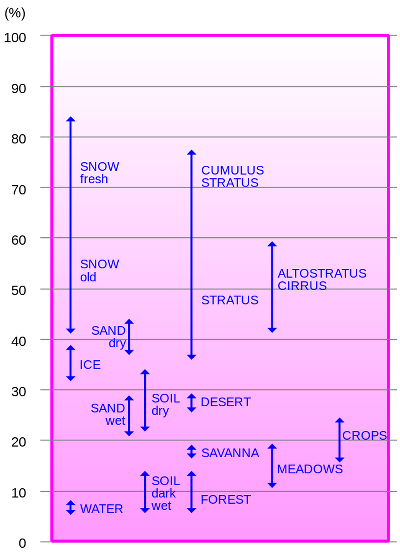

# Albedo
> 2020.05.14 ┊ **[🚀](../index/index.md) [despace](index.md)** → [SGM](sgm.md)

[TOC]

---

> <small>*Terms:* **Albedo** — English term. **Альбедо** — Russian equivalent.</small>

**Альбе́до** *(лат. albus — белый)* — характеристика диффузной отражательной способности поверхности.

## Description

Albedo (/ælˈbiːdoʊ/) (Latin: albedo, meaning 'whiteness') is the measure of the diffuse reflection of solar radiation out of the total solar radiation and measured on a scale from 0, corresponding to a black body that absorbs all incident radiation, to 1, corresponding to a body that reflects all incident radiation. 

## Astronomical albedo
The albedos of planets, satellites and minor planets such as asteroids can be used to infer much about their properties. The study of albedos, their dependence on wavelength, lighting angle ("phase angle"), and variation in time composes a major part of the astronomical field of photometry. For small and far objects that cannot be resolved by telescopes, much of what we know comes from the study of their albedos. For example, the absolute albedo can indicate the surface ice content of outer Solar System objects, the variation of albedo with phase angle gives information about regolith properties, whereas unusually high radar albedo is indicative of high metal content in asteroids. 

Two common albedos that are used in astronomy are the (V‑band) geometric albedo (measuring brightness when illumination comes from directly behind the observer) and the Bond albedo (measuring total proportion of electromagnetic energy reflected). Their values can differ significantly, which is a common source of confusion

*Planet’s and planetoid’s albedo in [Solar System](солнечная_система.md).*  

|*Planet*| <small>*Geometric  albedo *</small> | <small>*Bond  albedo*</small> |
|:--|:--|:--|
| [Merccury](mercury.md)  |  0.106  |  0.119  |
| [Venus](venus.md)  |  0.65  |  0.76  |
| [Earth](earth.md)  |  0.367  |  0.306  |
| [Mars](mars.md)  |  0.15  |  0.16  |
| [Jupiter](jupiter.md)  |  0.52  |  0.343  |
| [Saturn](saturn.md)  |  0.47  |  0.342  |
| [Uranus](uranus.md)  |  0.51  |  0.3  |
| [Neptune](neptune.md)  |  0.41  |  0.29  |
| [Pluto](pluto.md)  |  0.6  |  0.5  |

## Ламбертово (истинное, плоское) альбедо
Истинное или плоское альбедо — коэффициент диффузного отражения, то есть отношение светового потока, рассеянного плоским элементом поверхности во всех направлениях, к потоку, падающему на этот элемент. Обычно определяется с помощью специального фотометрического прибора — альбедометра.

В случае освещения и наблюдения, нормальных к поверхности, истинное альбедо называют нормальным.

Нормальное альбедо чистого снега составляет ~0,9, древесного угля ~0,04.

## Geometric albedo
В планетной фотометрии геометрическое (плоское) альбедо `Ar = E0/Eπ` определяется отношением освещённости у Земли, создаваемой планетой в полной фазе **E0**, к освещённости **Eπ**, которую создал бы плоский абсолютно белый экран того же размера, что и планета, расположенный на её месте перпендикулярно лучу зрения и солнечным лучам.

Геометрическое оптическое альбедо [Луны](moon.md) — 0.12, [Земли](earth.md) — 0.367.

## The Bond albedo
Альбедо Бонда **Ac** определяется как отношение светового потока, рассеянного сферическим телом во всех направлениях, к потоку, падающему на тело. Альбедо Бонда связано с геометрическим альбедо следующим отношением: `Ac = Ar·Q`, где:  
**Ar** — геометрическое альбедо;  
**Q** — фазовый интеграл, учитывающий только ту часть освещённой поверхности, которая видна наблюдателю.

Бондовское альбедо Земли — около 0.29, Луны — 0.067.

 

## Docs & links (TRANSLATEME ALREADY)
|…°·•¹²³±×÷≤≥≈≠ ‑ −— ⎆✉ ❐“”’«»✔→✘☐☑├┕┆ 1 lb = 0.453592 kg; 1 g = 9.80665 m/s²|
|:--|
|<small>**[FAQ](faq.md)**, **[Cable](cable.md)**·БКС, **[Camera](camera.md)**·Камера, **[Comms](comms.md)**·Радиосв., **[Contact](contact.md)**·Контакт, **[Control](control.md)**·Управ., **[Doc](doc.md)**·Док., **[Doppler](doppler.md)**·ИСР, **[DS](ds.md)**·ЗУ, **[EB](eb.md)**·ХИТ, **[ECO](ecology.md)**·Экол., **[EF](ef.md)**·ВВФ, **[ElC](elc.md)**·ЭКБ, **[EMC](emc.md)**·ЭМС, **[Errors](error.md)**·Ошибки, **[Events](event.md)**·События, **[FS](fs.md)**·ТЭО, **[Fuel](fuel.md)**·Топливо, **[GNC](gnc.md)**·БКУ, **[GS](scs.md)**·НС, **[HF&E](hfe.md)**·Эргоном., **[IMU](imu.md)**·Гироскоп, **[Incubator](incubator.md)**·Инкуб., **[KT](kt.md)**·КТЕХ, **[LAG](lag.md)**·ПУC, **[LES](les.md)**·САСП, **[LS](ls.md)**·СЖО, **[LV](lv.md)**·РН, **[MAG](mag.md)**·Магнитом., **[MCC](mcc.md)**·ЦУП, **[Model](model.md)**·Модель, **[MSC](sc.md)**·ПКА, **[N&B](nnb.md)**·БНО, **[NR](nr.md)**·ЯР, **[OBC](obc.md)**·ЦВМ, **[OE](oe.md)**·БА, **[Patent](патент.md)**·Патент, **[Project](project.md)**·Проект, **[PS](ps.md)**·ДУ, **[QA](quality.md)**·QA, **[R&D](rnd.md)**·НИОКР, **[RAMS](rams.md)**·НиБ, **[Risk](risk.md)**·Риск, **[Robot](robotics.md)**·Робот, **[Rover](rover.md)**·Планетоход, **[RTG](rtg.md)**·РИТЭГ, **[RW](rw.md)**·ДМ, **[SARC](sarc.md)**·ПСК, **[Sensor](sensor.md)**·Датчик, **[SC](sc.md)**·КА, **[SCS](scs.md)**·КК, **[SGM](sgm.md)**·КММ, **[SI](si.md)**·СИ, **[Soft](soft.md)**·ПО, **[SP](sp.md)**·БС, **[Spaceport](spaceport.md)**·Космодром, **[SPS](sps.md)**·СЭС, **[SSS](sss.md)**·ГЗУ, **[TCS](tcs.md)**·СОТР, **[Test](test.md)**·ЭО, **[Timeline](timeline.md)**·Циклограмма, **[TMS](tms.md)**·ТМС, **[TOR](tor.md)**·ТЗ, **[TRL](trl.md)**·УГТ</small>|
|*Sections & pages*|
|**··•  •··**  <mark>NOCAT</mark> |

   1. Docs: …
   1. Notable interwikies — …
   1. <https://en.wikipedia.org/wiki/Albedo>
   1. <https://ru.wikipedia.org/wiki/Альбедо>
   2. <https://en.wikipedia.org/wiki/Bond_albedo>
   3. <https://en.wikipedia.org/wiki/Geometric_albedo>
