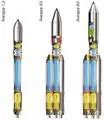
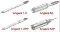
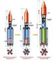
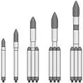
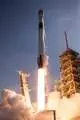

# Ангара
> 2019.07.04 [🚀](../index/index.md) [despace](index.md) → [LV](lv.md)

[TOC]

---

> <small>**Ангара** — русскоязычный термин, не имеющий аналога в английском языке. **Angara** — дословный перевод с русского на английский.</small>

**«Ангарá»** — семейство российских одноразовых жидкостных [ракет‑носителей](lv.md) от лёгкого до тяжёлого классов. Различные варианты «Ангары» реализуются с помощью различного числа универсальных ракетных модулей (УРМ). Ангара призвана заменить большинство типов РН, созданных в СССР:

   - «Ангара‑А1.1» вместо «Космоса‑3М»
   - «Ангара‑А1.2» вместо «Циклона‑2/3» (снят с производства на Украине)
   - «Ангара‑А3» вместо «[Зенита‑2](zenit.md)» (производится на Украине)
   - «Ангара» А5, А7 вместо «[Протона](proton.md)»

|*Version*|*Description*|*Activity*|
|:--|:--|:--|
|Ангара‑А1|Базовый вариант.|Отменена (2014)|
|╟ Ангара‑А1.1|Модификация Ангара‑А1.|Отменена (2014)|
|╙ Ангара‑А1.2|Модификация Ангара‑А1.|**Активен** (2014 ‑ …)|
|Ангара‑А3|Модификация Ангара‑А1.|Не создавалась|
|Ангара‑А5|Модификация Ангара‑А1.|**Активен** (2014 ‑ …)|
|╟ Ангара‑А5В|Модификация Ангара‑А5.|*В разработке* (2027 ‑ …)|
|╟ Ангара‑А5М|Модификация Ангара‑А5.|*В разработке* (2025 ‑ …)|
|╙ Ангара‑А5П|Модификация Ангара‑А5.|*В разработке* (2025 ‑ …)|
|Ангара‑А7|Модификация Ангара‑А1.|Не создавалась|
|╙ Ангара‑А7.2В|Модификация Ангара‑А7.|Не создавалась|

   

---

 

## Ангара‑А5
**Ангара‑А5** — российская одноразовая жидкостная ракета‑носитель тяжёлого класса.

   - **Ангара‑А5В** — вар. с верхней водородной ступенью.
   - **Ангара‑А5М** — вар. с двигателями РД-191М, ПН НОО увеличится с 22.3 т до 24.5-25 т.
   - **Ангара‑А5П** — пилотируемый вар.

|*Characteristic*|*[Value](si.md)*|
|:--|:--|
|Активность|А5: **Активен** (2014.12.23 ‑ …);  А5В: *В разработке* (2027 ‑ …);  А5М: *В разработке* (2025 ‑ …);  А5П: *В разработке* (2025 ‑ …)|
|[Аналоги](analogue.md)|[Ariane 5/6](arian.md) (Европа)・ [Ангара‑А5](angara.md) (РФ)|
|Длина/диаметр|55.23 м / 8.86 м|
|[Космодромы](spaceport.md)|[Восточный](spaceport.md)・ [Плесецк](spaceport.md)|
|Масса старт./сух.|773 000 ㎏ / … ㎏|
|Разраб./изготов.|[ГКНПЦ Хруничева](contact/khrunichev.md) (Россия) / [ГКНПЦ Хруничева](contact/khrunichev.md) (Россия)|
|Ступени|3|
|[Fuel](ps.md)|[O + Kerosene](o_plus.md)|
| ||

**Выводимые массы.**

|*Космодром*|*РН*|*Масса,  [НОО](nnb.md), т  ([ГСО](nnb.md), т)*|<small>*Масса к  [Луне](moon.md), т*</small>|<small>*Масса к  [Венере](venus.md), т*</small>|<small>*Масса к  [Марсу](mars.md), т*</small>|*Примечания*|*Док.*|
|:--|:--|:--|:--|:--|:--|:--|:--|
|[Восточный](spaceport.md)|Ангара‑А5  + [Бриз‑М](бриз.md)|24.5| | | |Пуск — $ 100 млн (2017 г);  ПН 3.16 % от ст.массы| |
|[Восточный](spaceport.md)|Ангара‑А5  + [ДМ-3](блок_д.md)|24.5  (3.9)|7.1|6.2 ‑ 6.9|6.2 ‑ 6.9|Пуск — $ 100 млн (2017 г);  ПН 3.16 % от ст.массы| |
|[Восточный](spaceport.md)|Ангара‑А5  + [КВТК](квтк.md)|24.5  (5)|8.5|6.3 ‑ 7.0|6.3 ‑ 7.0|Пуск — $ 100 млн (2017 г);  ПН 3.16 % от ст.массы| |
|[Восточный](spaceport.md)|Ангара‑А5В  + [ДМ-УЗ](блок_д.md)|37.5  (8)|13.5|10.6 ‑ 11|10.6 ‑ 11|Пуск — $ 100 млн (2017 г);  ПН 4.85 % от ст.массы| |
|[Восточный](spaceport.md)|Ангара‑А5В  + [КВТК-УЗ](квтк.md)| | | |10 ‑ 11.8|Пуск — $ 100 млн (2017 г);  ПН … % от ст.массы|[zip ❐](f/lv/angara/angara_a5v_kvtk_uz_doc01.zip)|
|[Восточный](spaceport.md)|Ангара‑А5М|27  (4.1)|7.4|6.3 |6.3|Пуск — $ 100 млн (2017 г);  ПН 3.49 % от ст.массы| |
|[Восточный](spaceport.md)|Ангара‑А5П| | | | |Пуск — $ 100 млн (2017 г);  ПН … % от ст.массы| |
|[Плесецк](spaceport.md)|Ангара‑А5  + [Бриз‑М](бриз.md)|24  (2.8)| | | |Пуск — $ 100 млн (2017 г);  ПН 3.1 % от ст.массы| |
|[Плесецк](spaceport.md)|Ангара‑А5  + [ДМ-3](блок_д.md)|24  (2.6)| | | |Пуск — $ 100 млн (2017 г);  ПН 3.1 % от ст.массы| |
|[Плесецк](spaceport.md)|Ангара‑А5  + [КВТК](квтк.md)|24  (4.5)| | | |Пуск — $ 100 млн (2017 г);  ПН 3.1 % от ст.массы| |
|[Плесецк](spaceport.md)|Ангара‑А5П| | | | |Пуск — $ 100 млн (2017 г);  ПН … % от ст.массы| |

<small>Примечания:  **1)** Указана масса для наихудших условий старта.  **2)** В скобках указана масса для наилучших условий старта.</small>

 

## Архивные

   - **Angara‑100.** The Angara‑100 was a 2005 proposal by Khrunichev to build a heavy‑lift launch vehicle for NASA’s Vision for Space Exploration. The rocket would consist of 4 RD‑170‑powered boosters, an RD‑180‑powered core stage, and a cryogenic upper stage using a modified Energia RD‑0120 engine, the RD‑0122. Its payload capacity to LEO would be in excess of 100 tons.
   - **Baikal.** Together with NPO Molniya, Khrunichev has also proposed a reusable URM‑1 booster named Baikal. The URM‑1 would be fitted with a wing, an empennage, a landing gear, a return flight engine and attitude control thrusters, to enable the rocket to return to an airfield after completing its mission.

 

### Ангара‑А1

…

 

### Ангара‑А3

…

 

### Ангара‑А7

…

 

## Docs & links (TRANSLATEME ALREADY)
|Navigation|
|:--|
|**[FAQ](faq.md)**【**[SCS](scs.md)**·КК, **[SC (OE+SGM)](sc.md)**·КА】**[CON](contact.md)·[Pers](person.md)**·Контакт, **[Ctrl](control.md)**·Упр., **[Doc](doc.md)**·Док., **[Drawing](drawing.md)**·Чертёж, **[EF](ef.md)**·ВВФ, **[Error](error.md)**·Ошибки, **[Event](event.md)**·События, **[FS](fs.md)**·ТЭО, **[HF&E](hfe.md)**·Эрго., **[KT](kt.md)**·КТ, **[N&B](nnb.md)**·БНО, **[Project](project.md)**·Проект, **[QM](qm.md)**·БКНР, **[R&D](rnd.md)**·НИОКР, **[SI](si.md)**·СИ, **[Test](test.md)**·ЭО, **[TRL](trl.md)**·УГТ, **[Way](way.md)**·Пути|
|*Sections & pages*|
|**【[Launch vehicle (LV)](lv.md)】**  [ICBM](icbm.md)・ [Integrated payload unit](lv.md)・ [Non‑rocket spacelaunch](nrs.md)・ [Throw weight](throw_weight.md) • • •  **China:** [Long March](long_march.md) ┊ **EU:** [Arian](arian.md), [Vega](vega.md) ┊ **India:** [GSLV](gslv.md), [PSLV](pslv.md) ┊ **Israel:** [Shavit](shavit.md) ┊ **Japan:** [Epsilon](epsilon.md), [H2](h2.md), [H3](h3.md) ┊ **Korea N.:** [Unha](unha.md) ┊ **Korea S.:** *([Naro‑1](naro_1.md))* ┊ **RF,CIF:** [Angara](angara.md), [Proton](proton.md), [Soyuz](soyuz.md), [Yenisei](yenisei.md), [Zenit](zenit.md) *([Energia](energia.md), [Korona](korona.md), [N‑1](n_1.md), [R‑1](r_7.md))* ┊ **USA:** [Antares](antares.md), [Atlas](atlas.md), [BFR](bfr.md), [Delta](delta.md), [Electron](electron.md), [Falcon](falcon.md), [Firefly Alpha](firefly_alpha.md), [LauncherOne](launcherone.md), [New Armstrong](new_armstrong.md), [New Glenn](new_glenn.md), [Minotaur](minotaur.md), [Pegasus](pegasus.md), [Shuttle](shuttle.md), [SLS](sls.md), [Vulcan](vulcan.md) *([Saturn](saturn_lv.md), [Sea Dragon](sea_dragon.md))*|

   1. Docs: …
   1. <…>
