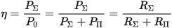
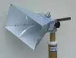

# Антенна
> 2019.05.12 [🚀](../index/index.md) [despace](index.md) → [OE](sc.md), [SGM](sc.md), **[Радиосвязь](comms.md)**

**Table of contents:**

[TOC]

---

> <small>**Антенна** — русскоязычный термин. **Antenna** — англоязычный эквивалент.</small>

**Анте́нна** — устройство, предназначенное для [излучения или приёма радиоволн](comms.md).

Антенны в зависимости от назначения подразделяются на приёмные, передающие и приёмопередающие. Антенна в режиме передачи преобразует энергию поступающего от радиопередатчика электромагнитного колебания в распространяющуюся в пространстве электромагнитную волну. Антенна в режиме приёма преобразует энергию падающей на антенну электромагнитной волны в электромагнитное колебание, поступающее в радиоприёмник. Таким образом, антенна является преобразователем подводимого к ней по [фидеру](feeder.md) электромагнитного колебания (переменного электрического тока, канализированной в волноводе электромагнитной волны) в электромагнитное излучение и наоборот.

Совокупность антенны и фидерного тракта, входящую в качестве составной части в радиоэлектронное изделие, образец, комплекс, систему, называют [антенно‑фидерным устройством](afdev.md).

Может наводиться на объект при помощи [привода направленной антенны](devd.md).

## Antenna gain

|*° full open.*|0.1|0.5|1|2|4|6|8|10|12|14|16|18|20|25|30|35|40|60|90|180|360|
|:-|:-|:-|:-|:-|:-|:-|:-|:-|:-|:-|:-|:-|:-|:-|:-|:-|:-|:-|:-|:-|:-|
|*Antenna gain, ㏈*| | | |31|28|24|22|20|18.5|17.5|15|13|12|8|5|2|0|−4|−9|−13|−21|

## КПД антенны
> <small>**КПД антенны (КПДА)** — русскоязычный термин. **Antenna aperture** — англоязычный эквивалент.</small>

**КПД антенны (в режиме передачи)** — отношение мощности радиоизлучения, создаваемого [антенной](antenna.md), к мощности радиочастотного сигнала, подводимого к антенне.

   1. <https://en.wikipedia.org/wiki/Aperture_efficiency_(antennas)>

КПД антенны определяет различие [коэффициента усиления (КУ)](ку.md) и [коэффициента направленного действия (КНД) антенны](directivity.md). КПД через КУ входит в уравнение дальности радиолокации и радиосвязи, а также влияет на шумовую температуру антенны.

КПД ОНА, создаваемых в РФ, близок к 100 %.

Понятие КПД антенны удобно пояснить в режиме передачи: антенна потребляет от источника (например, радиопередатчика) электрическую мощность, часть которой преобразуется антенной в электромагнитное излучение, а часть — теряется в виде тепла и тратится на разогрев элементов конструкции антенны, окружающих предметов, грунта и др. Входное сопротивление (электрический импеданс) **Z = R + jX** реальной антенны — величина комплексная, и активная мощность **P₀**, потребляемая антенной от источника, целиком рассеивается на активной составляющей **R** входного сопротивления. Условно в этой активной составляющей можно выделить две части, которые называют сопротивлением излучения **RΣ** и сопротивлением потерь **RΠ**:

**R = RΣ + RΠ**

Сопротивление излучения — коэффициент, имеющий размерность сопротивления (Ом) и связывающий квадрат амплитудного значения силы электрического тока с мощностью **PΣ**, излученной антенной в виде электромагнитной волны. Сопротивление потерь - коэффициент, связывающий квадрат амплитудного значения силы электрического тока с мощностью потерь **PΣ**. Используя эти понятия, КПД антенны удобно (наглядно) записать в виде:

## В космосе
Применяются 3 основных типа антенн:

| |*Наименование*|*Сектор углов*|
|:-|:-|:-|
||**Малонаправленная (МНА)** или  **слабонаправленная**|± 90°|
||**Направленная (НА)** или  **средненаправленная (СНА)** или  **рупорная**|± 5 ‑ 15°|
||**Остронаправленная (ОНА)**|± 0.05 ‑ 1°|

 

## Docs & links (TRANSLATEME ALREADY)
|Navigation|
|:-|
|**[FAQ](faq.md)**【**[SCS](scs.md)**·КК, **[SC (OE+SGM)](sc.md)**·КА】**[CON](contact.md)·[Pers](person.md)**·Контакт, **[Ctrl](control.md)**·Упр., **[Doc](doc.md)**·Док., **[Drawing](drawing.md)**·Чертёж, **[EF](ef.md)**·ВВФ, **[Error](error.md)**·Ошибки, **[Event](event.md)**·Событ., **[FS](fs.md)**·ТЭО, **[HF&E](hfe.md)**·Эрго., **[KT](kt.md)**·КТ, **[N&B](nnb.md)**·БНО, **[Project](project.md)**·Проект, **[QM](qm.md)**·БКНР, **[R&D](rnd.md)**·НИОКР, **[SI](si.md)**·СИ, **[Test](test.md)**·ЭО, **[TRL](trl.md)**·УГТ|
|*Sections & pages*|
|**`Бортовая аппаратура (БА):`**  [PDD](pdd.md)・ [Антенна](antenna.md)・ [АПС](hns.md)・ [БУ](eas.md)・ [ЗУ](ds.md)・ [Изделие](unit.md)・ [КЛЧ](clean_lvl.md)・ [ПЗР](fov.md)・ [ПО](soft.md)・ [Прототип](prototype.md)・ [Радиосвязь](comms.md)・ [СКЭ](elmsys.md)・ [ССИТД](tsdcs.md)・ [СИТ](etedp.md)・ [УГТ](trl.md)・ [ЭКБ](elc.md)・ [EMC](emc.md)|
|**【[Communications](comms.md)】**  [CCSDS](ccsds.md)・ [Антенна](antenna.md)・ [АФУ](afdev.md)・ [Битрейт](bitrate.md)・ [ВОЛП](ofts.md)・ [ДНА](дна.md)・ [Диапазоны частот](comms.md)・ [Зрение](view.md)・ [Интерферометр](interferometer.md)・ [Информация](info.md)・ [КНД](directivity.md)・ [Код Рида‑Соломона](rsco.md)・ [КПДА](antenna.md)・ [КСВ](swr.md)・ [КУ](ку.md)・ [ЛКС, АОЛС, FSO](fso.md)・ [Несущий сигнал](carrwave.md)・ [ПНА, ПОНА, ПСНА](devd.md)・ [Помехи](emi.md) (EMI, RFI)・ [Последняя миля](last_mile.md)・ [Регламент радиосвязи](comms.md)・ [СИТ](etedp.md)・ [Фидер](feeder.md)  • • •  **РФ:** [БА КИС](ба_кис.md) (21)・ [БРК](brk_lav.md) (12)・ [РУ ПНИ](ру_пни.md) ()・ [HSXBDT](comms_lst.md) (1.8)・ [CSXBT](comms_lst.md) (0.38)・ [ПРИЗЫВ-3](comms_lst.md) (0.17) *([ПРИЗЫВ-1](comms_lst.md) (0.075))*|

   1. Docs: …
   1. <https://en.wikipedia.org/wiki/Antenna_(radio)>
   1. <https://en.wikipedia.org/wiki/Horn_antenna>
