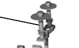
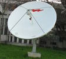

# Антенна
> 2019.05.12 [🚀](../index/index.md) [despace](index.md) → [OE](oe.md), [SGM](sgm.md), **[Радиосвязь](comms.md)**

[TOC]

---

> <small>**Антенна** — русскоязычный термин. **Antenna** — англоязычный эквивалент.</small>

**Анте́нна** — устройство, предназначенное для [излучения или приёма радиоволн](comms.md).

Антенны в зависимости от назначения подразделяются на приёмные, передающие и приёмопередающие. Антенна в режиме передачи преобразует энергию поступающего от радиопередатчика электромагнитного колебания в распространяющуюся в пространстве электромагнитную волну. Антенна в режиме приёма преобразует энергию падающей на антенну электромагнитной волны в электромагнитное колебание, поступающее в радиоприёмник. Таким образом, антенна является преобразователем подводимого к ней по [фидеру](feeder.md) электромагнитного колебания (переменного электрического тока, канализированной в волноводе электромагнитной волны) в электромагнитное излучение и наоборот.

Совокупность антенны и фидерного тракта, входящую в качестве составной части в радиоэлектронное изделие, образец, комплекс, систему, называют [антенно‑фидерным устройством](afdev.md).

Может наводиться на объект при помощи [привода направленной антенны](aiad.md).

## Antenna gain

|*° full open.*|0.1|0.5|1|2|4|6|8|10|12|14|16|18|20|25|30|35|40|60|90|180|360|
|:--|:--|:--|:--|:--|:--|:--|:--|:--|:--|:--|:--|:--|:--|:--|:--|:--|:--|:--|:--|:--|:--|
|*Antenna gain, ㏈*| | | |31|28|24|22|20|18.5|17.5|15|13|12|8|5|2|0|−4|−9|−13|−21|

## В космосе
Применяются 3 основных типа антенн:

| |*Наименование*|*Сектор углов*|
|:--|:--|:--|
||**Малонаправленная (МНА)** или  **слабонаправленная**|± 90°|
||**Направленная (НА)** или  **средненаправленная (СНА)** или  **рупорная**|± 5 ‑ 15°|
||**Остронаправленная (ОНА)**|± 0.05 ‑ 1°|

 

## Docs & links (TRANSLATEME ALREADY)
|Navigation|
|:--|
|**[FAQ](faq.md)**, **[Cable](cable.md)**·БКС, **[Camera](cam.md)**·Камера, **[Comms](comms.md)**·Радио, **[CON](contact.md)·[Pers](person.md)**·Контакт, **[Control](control.md)**·Упр., **[Doc](doc.md)**·Док., **[Doppler](doppler.md)**·ИСР, **[DS](ds.md)**·ЗУ, **[EB](eb.md)**·ХИТ, **[ECO](ecology.md)**·Экол., **[EF](ef.md)**·ВВФ, **[ElC](elc.md)**·ЭКБ, **[EMC](emc.md)**·ЭМС, **[Error](error.md)**·Ошибки, **[Event](event.md)**·События, **[FS](fs.md)**·ТЭО, **[Fuel](fuel.md)**·Топливо, **[GNC](gnc.md)**·БКУ, **[GS](scs.md)**·НС, **[HF&E](hfe.md)**·Эрго., **[IU](iu.md)**·Гиро., **[KT](kt.md)**·КТЕХ, **[LAG](lag.md)**·ПУC, **[LES](les.md)**·САСП, **[LS](ls.md)**·СЖО, **[LV](lv.md)**·РН, **[MCC](mcc.md)**·ЦУП, **[Model](model.md)**·Модель, **[MSC](sc.md)**·ПКА, **[N&B](nnb.md)**·БНО, **[NR](nr.md)**·ЯР, **[OBC](obc.md)**·ЦВМ, **[OE](oe.md)**·БА, **[Pat.](патент.md)**·Патент, **[Proj.](project.md)**·Проект, **[PS](ps.md)**·ДУ, **[QM](qm.md)**·БКНР, **[R&D](rnd.md)**·НИОКР, **[Robot](robotics.md)**·Робот, **[Rover](rover.md)**·Ровер, **[RTG](rtg.md)**·РИТЭГ, **[SARC](sarc.md)**·ПСК, **[SE](se.md)**·СЭ, **[Sens.](sensor.md)**·Датч., **[SC](sc.md)**·КА, **[SCS](scs.md)**·КК, **[SGM](sgm.md)**·КММ, **[SI](si.md)**·СИ, **[Soft](soft.md)**·ПО, **[SP](sp.md)**·БС, **[Spaceport](spaceport.md)**·Космодр., **[SPS](sps.md)**·СЭС, **[SSS](sss.md)**·ГЗУ, **[TCS](tcs.md)**·СОТР, **[Test](test.md)**·ЭО, **[Timeline](timeline.md)**·ЦГМ, **[TMS](tms.md)**·ТМС, **[TOR](tor.md)**·ТЗ, **[TRL](trl.md)**·УГТ|
|*Sections & pages*|
|**`Бортовая аппаратура (БА):`**  [PDD](pdd.md)・ [Антенна](antenna.md)・ [АПС](hns.md)・ [БУ](sp.md)・ [ЗУ](ds.md)・ [Изделие](unit.md)・ [КЛЧ](clean_lvl.md)・ [ПЗР](fov.md)・ [ПО](soft.md)・ [Прототип](prototype.md)・ [Радиосвязь](comms.md)・ [СКЭ](elmsys.md)・ [ССИТД](tsdcs.md)・ [СИТ](etedp.md)・ [УГТ](trl.md)・ [ЭКБ](elc.md)・ [EMC](emc.md)|
|**`Радиосвязь:`**  [CCSDS](ccsds.md)・ [Антенна](antenna.md)・ [АФУ](afdev.md)・ [Битрейт](bitrate.md)・ [ВОЛП](ofts.md)・ [ДНА](дна.md)・ [Диапазоны частот](rf.md)・ [Зрение](view.md)・ [Интерферометр](interferometer.md)・ [Информация](info.md)・ [КНД](directivity.md)・ [Код Рида‑Соломона](rsco.md)・ [КПДА](antenna_ap.md)・ [КСВ](swr.md)・ [КУ](ку.md)・ [ЛКС, АОЛС, FSO](fso.md)・ [Несущий сигнал](carrwave.md)・ [ПНА, ПОНА, ПСНА](aiad.md)・ [Помехи](emi.md) (EMI, RFI)・ [Последняя миля](last_mile.md)・ [Регламент радиосвязи](rf.md)・ [СИТ](etedp.md)・ [Фидер](feeder.md)  • • •  **РФ:** [БА КИС](ба_кис.md) (21)・ [БРК](brk_lav.md) (12)・ [РУ ПНИ](ру_пни.md) ()・ [HSXBDT](hsxbdt.md) (1.8)・ [CSXBT](csxbt.md) (0.38)・ [ПРИЗЫВ-3](prizyv_3.md) (0.17) *([ПРИЗЫВ-1](prizyv_1.md) (0.075))*|

   1. Docs: …
   1. Notable interwikies — …
   1. <https://ru.wikipedia.org/wiki/Антенна>
   1. <https://ru.wikipedia.org/wiki/Рупорная_антенна>

