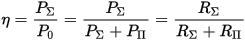

# КПД антенны
> 2019.05.12 ┊ **🚀 [despace](index.md)** → [Антенна](antenna.md), **[Радиосвязь](comms.md)**

[TOC]

---

> <small>*Термины:* **КПД антенны (КПДА)** — русскоязычный термин. **Antenna aperture** — англоязычный эквивалент.</small>

**КПД антенны (в режиме передачи)** — отношение мощности радиоизлучения, создаваемого [антенной](antenna.md), к мощности радиочастотного сигнала, подводимого к антенне.

КПД антенны определяет различие [коэффициента усиления (КУ)](ку.md) и [коэффициента направленного действия (КНД) антенны](directivity.md). КПД через КУ входит в уравнение дальности радиолокации и радиосвязи, а также влияет на шумовую температуру антенны.

КПД ОНА, создаваемых в РФ, близок к 100 %.

Понятие КПД антенны удобно пояснить в режиме передачи: антенна потребляет от источника (например, радиопередатчика) электрическую мощность, часть которой преобразуется антенной в электромагнитное излучение, а часть — теряется в виде тепла и тратится на разогрев элементов конструкции антенны, окружающих предметов, грунта и др. Входное сопротивление (электрический импеданс) **Z = R + jX** реальной антенны — величина комплексная, и активная мощность **P₀**, потребляемая антенной от источника, целиком рассеивается на активной составляющей **R** входного сопротивления. Условно в этой активной составляющей можно выделить две части, которые называют сопротивлением излучения **RΣ** и сопротивлением потерь **RΠ**:

**R = RΣ + RΠ**

Сопротивление излучения — коэффициент, имеющий размерность сопротивления (Ом) и связывающий квадрат амплитудного значения силы электрического тока с мощностью **PΣ**, излученной антенной в виде электромагнитной волны. Сопротивление потерь - коэффициент, связывающий квадрат амплитудного значения силы электрического тока с мощностью потерь **PΣ**. Используя эти понятия, КПД антенны удобно (наглядно) записать в виде:

 

## Docs & links (TRANSLATEME ALREADY)
|…°·•¹²³±×÷≤≥≈≠ ‑ −— ⎆✉ ❐“”’«»✔→✘☐☑├┕┆ 1 lb = 0.453592 kg; 1 g = 9.80665 m/s²|
|:--|
|<small>**[FAQ](faq.md)**, **[Cable](cable.md)**·БКС, **[Camera](camera.md)**·Камера, **[Comms](comms.md)**·Радиосв., **[Contact](contact.md)**·Контакт, **[Control](control.md)**·Управ., **[Doc](doc.md)**·Док., **[Doppler](doppler.md)**·ИСР, **[DS](ds.md)**·ЗУ, **[EB](eb.md)**·ХИТ, **[ECO](ecology.md)**·Экол., **[EF](ef.md)**·ВВФ, **[ElC](elc.md)**·ЭКБ, **[EMC](emc.md)**·ЭМС, **[Errors](error.md)**·Ошибки, **[Events](event.md)**·События, **[FS](fs.md)**·ТЭО, **[Fuel](fuel.md)**·Топливо, **[GNC](gnc.md)**·БКУ, **[GS](scs.md)**·НС, **[HF&E](hfe.md)**·Эргоном., **[IMU](imu.md)**·Гироскоп, **[Incubator](incubator.md)**·Инкуб., **[KT](kt.md)**·КТЕХ, **[LAG](lag.md)**·ПУC, **[LES](les.md)**·САСП, **[LS](ls.md)**·СЖО, **[LV](lv.md)**·РН, **[MAG](mag.md)**·Магнитом., **[MCC](mcc.md)**·ЦУП, **[Model](model.md)**·Модель, **[MSC](sc.md)**·ПКА, **[N&B](nnb.md)**·БНО, **[NR](nr.md)**·ЯР, **[OBC](obc.md)**·ЦВМ, **[OE](oe.md)**·БА, **[Patent](патент.md)**·Патент, **[Project](project.md)**·Проект, **[PS](ps.md)**·ДУ, **[QA](quality.md)**·QA, **[R&D](rnd.md)**·НИОКР, **[RAMS](rams.md)**·НиБ, **[Risk](risk.md)**·Риск, **[Robot](robotics.md)**·Робот, **[Rover](rover.md)**·Планетоход, **[RTG](rtg.md)**·РИТЭГ, **[RW](rw.md)**·ДМ, **[SARC](sarc.md)**·ПСК, **[Sensor](sensor.md)**·Датчик, **[SC](sc.md)**·КА, **[SCS](scs.md)**·КК, **[SGM](sgm.md)**·КММ, **[SI](si.md)**·СИ, **[Soft](soft.md)**·ПО, **[SP](sp.md)**·БС, **[Spaceport](spaceport.md)**·Космодром, **[SPS](sps.md)**·СЭС, **[SSS](sss.md)**·ГЗУ, **[TCS](tcs.md)**·СОТР, **[Test](test.md)**·ЭО, **[Timeline](timeline.md)**·Циклограмма, **[TMS](tms.md)**·ТМС, **[TOR](tor.md)**·ТЗ, **[TRL](trl.md)**·УГТ</small>|
|*Sections & pages*|
|**`Радиосвязь:`**  [CCSDS](ccsds.md) ┊ [Антенна](antenna.md) ┊ [АФУ](afdev.md) ┊ [Битрейт](bitrate.md) ┊ [ВОЛП](ofts.md) ┊ [ДНА](дна.md) ┊ [Диапазоны частот](rf.md) ┊ [Зрение](view.md) ┊ [Интерферометр](interferometer.md) ┊ [Информация](info.md) ┊ [КНД](directivity.md) ┊ [Код Рида‑Соломона](rsco.md) ┊ [КПДА](antenna_ap.md) ┊ [КСВ](swr.md) ┊ [КУ](ку.md) ┊ [ЛКС, АОЛС, FSO](fso.md) ┊ [Несущий сигнал](carrwave.md) ┊ [ПНА, ПОНА, ПСНА](aiad.md) ┊ [Помехи](emi.md) (EMI, RFI) ┊ [Последняя миля](last_mile.md) ┊ [Регламент радиосвязи](rr.md) ┊ [СИТ](etedp.md) ┊ [Фидер](feeder.md)  • • •  **РФ:** [БА КИС](ба_кис.md) (21) ┊ [БРК](brk_lav.md) (12) ┊ [РУ ПНИ](ру_пни.md) () ┊ [HSXBDT](hsxbdt.md) (1.8) ┊ [CSXBT](csxbt.md) (0.38) ┊ [ПРИЗЫВ-3](prizyv_3.md) (0.17) *([ПРИЗЫВ-1](prizyv_1.md) (0.075))*|

**Docs:**

   1. …

**Links:**

   1. Notable interwikies — …
   1. <https://ru.wikipedia.org/wiki/КПД_антенны>

