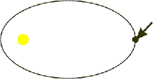
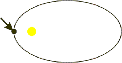
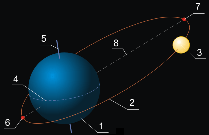

# Апоцентр и перицентр
> 2019.05.12 [🚀](../index/index.md) [despace](index.md) → **[БНО](nnb.md)**, [Space](index.md)

[TOC]

---

> <small>**Апоцентр** — русскоязычный термин. **Apocenter** — англоязычный эквивалент.</small>  
> <small>**Перицентр** — русскоязычный термин. **Pericenter** — англоязычный эквивалент.</small>

**Перице́нтр** и **апоце́нтр** (др.-греч. περί «пери» — вокруг, около, возле, др.-греч. από «апо» — из, от (часть сложного слова, означающая отрицание и отсутствие чего‑либо), лат. centrum — центр) — точки орбиты небесного тела — ближайшая к центральному телу и наиболее удалённая от центрального тела, вокруг которого совершается движение.

Иногда вместо слова «центр» (после «пери‑» либо «апо‑») используется название центрального тела, вокруг которого рассматривается обращение: гелиос — Солнце, гея — Земля, астрон — звезда и т. п. Так, в орбитах тел, движущихся вокруг Солнца (например, планет, астероидов и комет) перицентр и апоцентр обычно называют, соответственно, периге́лием и афе́лием (апоге́лием), в орбитах Луны и искусственных спутников Земли — периге́й и апоге́й, в орбитах вокруг Луны — периселе́ний и апоселе́ний, вокруг Венеры — перигесперий и апогесперий, в орбитах каждой звезды в системах двойных звёзд — периа́стр и апоа́стр.

Ранее для обозначения этих двух крайних точек орбиты также использовалось обобщающее понятие апси́да (от др.-греч. ἁψίς — дуга, петля, свод, выступ). Линия апси́д — линия, соединяющая перицентр и апоцентр орбиты; для эллиптической орбиты линия апсид совпадает с большой осью эллипса и проходит также через фокус. Невозмущённая орбита симметрична относительно линии апсид.

Апоцентр определён только для эллиптических орбит. Параболические и гиперболические орбиты имеют только перицентр.

|*Апоцентр*|*Перицентр*|
|:--|:--|
|||

## Перигей и апогей
**Периге́й** (др.-греч. περίγειος, букв. «околоземный») — ближайшая к Земле точка орбиты небесного тела, обращающегося вокруг Земли, обычно Луны или искусственного спутника Земли.

Возмущающие силы вызывают изменение положения перигея в пространстве. Так, вследствие действия возмущающей силы Солнца, перигей Луны движется по орбите в ту же сторону, что и Луна, совершая полный оборот за 8,85 года. Перемещение перигея искусственных спутников Земли обусловлено главным образом отличием формы Земли от шара, причём величина и направление этого движения зависят от наклона плоскости орбиты спутника к плоскости земного экватора.

Расстояние от перигея до центра Земли называется перигейным расстоянием.

Совпадение перигея с новолунием или полнолунием — суперлуние.

**Апоге́й** (от др.-греч. απόγεια, букв. «от земли») — точка орбиты небесного тела, обращающегося вокруг Земли, обычно Луны или искусственного спутника Земли, наиболее удалённая от центра Земли.

Точка апогея прямо противоположна точке перигея, так как обе эти точки — концы линии апсид, и изменяют свое положение с изменением положения линии апсид. Таким образом, изменение направления линии апогея, например, Луны непосредственно получается из изменения положения перигея её орбиты. Что касается расстояния точки апогея, то изменение этого расстояния зависит от изменений эксцентриситета лунной орбиты и её большой оси.

|<small>1 Земля  2 орбита спутника  3 спутник Земли  4 линия земного экватора  5 ось вращения Земли  6 перигей  7 апогей  8 линия апсид</small>|
|:--|
||

 

## Docs & links (TRANSLATEME ALREADY)
|Navigation|
|:--|
|**[FAQ](faq.md)**【**[SCS](scs.md)**·КК, **[SC (OE+SGM)](sc.md)**·КА】**[CON](contact.md)·[Pers](person.md)**·Контакт, **[Ctrl](control.md)**·Упр., **[Doc](doc.md)**·Док., **[Drawing](drawing.md)**·Чертёж, **[EF](ef.md)**·ВВФ, **[Error](error.md)**·Ошибки, **[Event](event.md)**·События, **[FS](fs.md)**·ТЭО, **[HF&E](hfe.md)**·Эрго., **[KT](kt.md)**·КТ, **[N&B](nnb.md)**·БНО, **[Project](project.md)**·Проект, **[QM](qm.md)**·БКНР, **[R&D](rnd.md)**·НИОКР, **[SI](si.md)**·СИ, **[Test](test.md)**·ЭО, **[TRL](trl.md)**·УГТ, **[Way](way.md)**·Пути|
|*Sections & pages*|
|**`Баллистико‑навигационное обеспечение (БНО):`**  [SPICE](spice.md)・ [Апоцентр и перицентр](apopericentre.md)・ [Гравманёвр](gravass.md)・ [Кеплеровы элементы](keplerian.md)・ [Космическая скорость](esc_vel.md)・ [Сфера Хилла](hill_sphere.md)・ [Терминатор](terminator.md)・ [Точки Лагранжа](l_points.md)・ [Эффект Оберта](oberth_eff.md)|

   1. Docs: …
   1. <https://en.wikipedia.org/wiki/Apsis>
   1. <http://ru.wikipedia.org/wiki/Апоцентр_и_перицентр>

