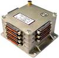

# Астра
> 2019.05.12 [🚀](../index/index.md) [despace](index.md) → **[ТМС](tms.md)**

[TOC]

---

> <small>*Термины:* **Астра** — русскоязычный термин, не имеющий аналога в английском языке. **Astra** — дословный перевод с русского на английский.</small>

**Универсальная малогабаритная радиотелеметрическая система (УМРТС) «Астра»** — [телеметрическая система](tms.md) (ТМС) — совокупность устройств, обеспечивающих сбор сигналов со средств первичного преобразования, формирование телеметрических сигналов, передачу их по каналу связи, регистрацию и отображение телеметрических сообщений на приёмной стороне.  
*Разработчик:* [НПО ИТ](zz_npoit.md). Разработано  …

||
|:--|
||

<small>

|*Характеристика*|*Значение*|
|:--|:--|
|[TRL](trl.md)||
|Исполнение|Моноблок из [слайсов](слайс.md)|
|Кол‑во входов информации|—|
|<small>• аналоговых генераторных милливольтового диапазона (термопар) и параметрических (термометров сопротивления)</small>||
|<small>• аналоговых генераторных с напряжением положительной полярности</small>||
|<small>• аналоговых параметрических (потенциометров)</small>||
|<small>• массивов цифровой информации</small>||
|<small>• сигнальных</small>||
|<small>• цифровых датчиков давления</small>||
|<small>• цифровых датчиков температуры</small>||
|Кол‑во разовых команд||
|Объём памяти, кбайт||
|Скорость, кбит/с|… — записи;  … — НП|
|**`Прочее`**||
|[ВБР](srrq.md) за САС||
|Dimensions, L×W×H, mm||
|Интерфейсы|RS‑485|
|Mass, kg||
|[Voltage](voltage.md), V||
|Overload, g||
|[Rad.resist](ion_rad.md), Gy (rad)||
|Resource, h (y)||
|[Lifetime](lifetime.md), h (y)||
|[Temp. range](tcs.md), ℃||
|Consumption, W||

</small>

 

## Примечания
   1. …

## Применяемость
   1. …

 

## Docs & links (TRANSLATEME ALREADY)
|Navigation|
|:--|
|<small>**[FAQ](faq.md)**, **[Cable](cable.md)**·БКС, **[Camera](cam.md)**·Камера, **[Comms](comms.md)**·Радио, **[Contact](contact.md)**·Контакт, **[Control](control.md)**·Упр., **[Doc](doc.md)**·Док., **[Doppler](doppler.md)**·ИСР, **[DS](ds.md)**·ЗУ, **[EB](eb.md)**·ХИТ, **[ECO](ecology.md)**·Экол., **[EF](ef.md)**·ВВФ, **[ElC](elc.md)**·ЭКБ, **[EMC](emc.md)**·ЭМС, **[Error](error.md)**·Ошибки, **[Event](event.md)**·События, **[FS](fs.md)**·ТЭО, **[Fuel](fuel.md)**·Топливо, **[GNC](gnc.md)**·БКУ, **[GS](scs.md)**·НС, **[HF&E](hfe.md)**·Эрго., **[IU](iu.md)**·Гиро., **[KT](kt.md)**·КТЕХ, **[LAG](lag.md)**·ПУC, **[LES](les.md)**·САСП, **[LS](ls.md)**·СЖО, **[LV](lv.md)**·РН, **[MCC](mcc.md)**·ЦУП, **[Model](model.md)**·Модель, **[MSC](sc.md)**·ПКА, **[N&B](nnb.md)**·БНО, **[NR](nr.md)**·ЯР, **[OBC](obc.md)**·ЦВМ, **[OE](oe.md)**·БА, **[Pat.](патент.md)**·Патент, **[Project](project.md)**·Проект, **[PS](ps.md)**·ДУ, **[R&D](rnd.md)**·НИОКР, **[SRRQ](srrq.md)**·БКНР, **[Robot](robotics.md)**·Робот, **[Rover](rover.md)**·Планетоход, **[RTG](rtg.md)**·РИТЭГ, **[SARC](sarc.md)**·ПСК, **[Sensor](sensor.md)**·Датчик, **[SC](sc.md)**·КА, **[SCS](scs.md)**·КК, **[SGM](sgm.md)**·КММ, **[SI](si.md)**·СИ, **[Soft](soft.md)**·ПО, **[SP](sp.md)**·БС, **[Spaceport](spaceport.md)**·Космодром, **[SPS](sps.md)**·СЭС, **[SSS](sss.md)**·ГЗУ, **[TCS](tcs.md)**·СОТР, **[Test](test.md)**·ЭО, **[Timeline](timeline.md)**·ЦГМ, **[TMS](tms.md)**·ТМС, **[TOR](tor.md)**·ТЗ, **[TRL](trl.md)**·УГТ</small>|
|*Sections & pages*|
|**`Телеметрическая система (ТМС):`**  …  • • •  **РФ:** [ТМС-Л](tms_l.md) (8.5) ┊ [ТМС-УФ](tms_uf.md) (7.25) ┊ [ТМС-РГ](tms_rg.md) (5) ┊ [Пирит](pirit.md) (2.6) ┊ [Оникс](onyx.md) (1.1) ┊ [Астра](astra.md) ()|

   1. Docs:
      - [Чертёж ❐](f/tms/a/astra_sketch1.png)
   1. Notable interwikies — …
   1. <http://www.npoit.ru/products/telemetricheskie-sistemy/universalnaya-malogabaritnaya-radiotelemetricheskaya-sistema-umrts-astra>

