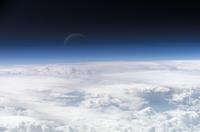
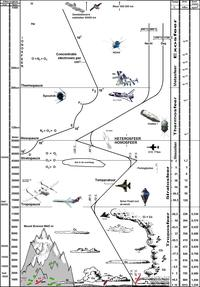

# Атмосфера
> 2019.05.12 [🚀](../index/index.md) [despace](index.md) → [ВВФ](ef.md), [СИ и формулы](si.md)

[TOC]

---

> <small>• **Атмосфера** — русскоязычный термин. **Atmosphere** — англоязычный эквивалент.  ・**[Атмосфера Земли](earth.md)** — русскоязычный термин. **Atmosphere of Earth** — англоязычный эквивалент.</small>

**Атмосфера** *(от. др.‑греч. ἀτμός — «пар» и σφαῖρα — «сфера»)* — газовая оболочка небесного тела, удерживаемая около него гравитацией. Поскольку не существует резкой границы между атмосферой и межпланетным пространством, то обычно атмосферой принято считать область вокруг небесного тела, в которой газовая среда вращается вместе с ним как единое целое. Толщина атмосферы некоторых планет, состоящих в основном из газов (газовые планеты), может быть очень большой.

**Атмосфера** — внесистемная единица измерения давления, приблизительно равная атмосферному давлению на поверхности Земли на уровне Мирового океана. См. [СИ, формулы](si.md). 101 325 ㎩ ≈ 101 ㎪ = 760 ㎜ рт ст.

## Введение

Атмосфера [Земли](earth.md) содержит кислород, используемый большинством живых организмов для дыхания, и диоксид углерода, потребляемый растениями и цианобактериями в процессе фотосинтеза. Атмосфера также является защитным слоем планеты, защищая её обитателей от солнечного ультрафиолетового излучения и метеоритов.

Атмосфера есть у всех массивных тел — планет земного типа, газовых гигантов.

Также единица давления, см. [СИ](si.md).

## Атмосфера Земли

Атмосферные газы Земли рассеивают синие длины волн лучше других, поэтому если смотреть из космоса, то вокруг нашей планеты имеется голубое гало, а если смотреть с Земли, то видно голубое небо.

|Голубое небо|[Атмосфера Земли](earth.md)|
|:--|:--|
|||

 

## Docs & links (TRANSLATEME ALREADY)
|Navigation|
|:--|
|**[FAQ](faq.md)**, **[Cable](cable.md)**·БКС, **[Camera](cam.md)**·Камера, **[Comms](comms.md)**·Радио, **[CON](contact.md)·[Pers](person.md)**·Контакт, **[Control](control.md)**·Упр., **[Doc](doc.md)**·Док., **[Doppler](doppler.md)**·ИСР, **[DS](ds.md)**·ЗУ, **[EB](eb.md)**·ХИТ, **[ECO](ecology.md)**·Экол., **[EF](ef.md)**·ВВФ, **[ElC](elc.md)**·ЭКБ, **[EMC](emc.md)**·ЭМС, **[Error](error.md)**·Ошибки, **[Event](event.md)**·События, **[FS](fs.md)**·ТЭО, **[Fuel](fuel.md)**·Топливо, **[GNC](gnc.md)**·БКУ, **[GS](scs.md)**·НС, **[HF&E](hfe.md)**·Эрго., **[IU](iu.md)**·Гиро., **[KT](kt.md)**·КТЕХ, **[LAG](lag.md)**·ПУC, **[LES](les.md)**·САСП, **[LS](ls.md)**·СЖО, **[LV](lv.md)**·РН, **[MCC](mcc.md)**·ЦУП, **[Model](model.md)**·Модель, **[MSC](sc.md)**·ПКА, **[N&B](nnb.md)**·БНО, **[NR](nr.md)**·ЯР, **[OBC](obc.md)**·ЦВМ, **[OE](oe.md)**·БА, **[Pat.](патент.md)**·Патент, **[Proj.](project.md)**·Проект, **[PS](ps.md)**·ДУ, **[QA](qa.md)**·БКНР, **[R&D](rnd.md)**·НИОКР, **[Robot](robotics.md)**·Робот, **[Rover](rover.md)**·Ровер, **[RTG](rtg.md)**·РИТЭГ, **[SARC](sarc.md)**·ПСК, **[SE](se.md)**·СЭ, **[Sens.](sensor.md)**·Датч., **[SC](sc.md)**·КА, **[SCS](scs.md)**·КК, **[SGM](sgm.md)**·КММ, **[SI](si.md)**·СИ, **[Soft](soft.md)**·ПО, **[SP](sp.md)**·БС, **[Spaceport](spaceport.md)**·Космодр., **[SPS](sps.md)**·СЭС, **[SSS](sss.md)**·ГЗУ, **[TCS](tcs.md)**·СОТР, **[Test](test.md)**·ЭО, **[Timeline](timeline.md)**·ЦГМ, **[TMS](tms.md)**·ТМС, **[TOR](tor.md)**·ТЗ, **[TRL](trl.md)**·УГТ|
|*Sections & pages*|
|**··• [External factors (EF)](ef.md) •··**  [Astro.object](aob.md)┊ [Atmosphere](atmosphere.md)┊ [Atmosphere of Earth](earth.md)┊ [Cosmic rays](cr.md)┊ [EMI](emi.md)┊ [Grav.waves](gravwave.md)┊ [Ion.radiation](ion_rad.md)┊ [Radio frequency](rf.md)┊ [Solar phenomena](solar_ph.md)┊ [Space debris](sdeb.md)┊ [Standart conditions](sctp.md)┊ [Time](time.md)┊ [VA radiation belts](varb.md)|
|**`СИ, формулы:`**  [Атмосфера](atmosphere.md)┊ [Квази](quasi.md)┊ [Параллакс](parallax.md)┊ [Парсек](parsec.md)┊ [Ускорение свободного падения](g.md)|

   1. Docs: …
   1. Notable interwikies — …
   1. <https://en.wikipedia.org/wiki/Atmosphere>
   1. <https://en.wikipedia.org/wiki/Atmosphere_of_Earth>
   1. <https://ru.wikipedia.org/wiki/Атмосфера>
   1. <https://ru.wikipedia.org/wiki/Атмосфера_Земли>
