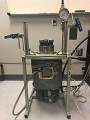

# AVEC
> 2020.01.23 [🚀](../index/index.md) [despace](index.md) → [JHU APL](zz_jhuapl.md), [Venus](venus.md), **[Test](test.md)**

[TOC]

---

> <small>*Термины:* **APL’s Venus Environment Chamber (AVEC)** — англоязычный термин, не имеющий аналога в русском языке. **Камера условий на Венере Лаборатории прикладной физики (АВЕК)** — дословный перевод с английского на русский.</small>

**APL’s Venus Environment Chamber (AVEC)** — камера, имитирующая условия атмосферы [Венеры](venus.md). Расположена в [JHU APL](zz_jhuapl.md).

|*AVEC*|
|:--|
||

## Описание
||*AVEC*|
|:--|:--|
|**Газовых потоков**||
|**Давление**|10 МПа (98.6 атм) номинал,  27+ МПа (267+ атм) макс.|
|**Масса**||
|**Объём**|0.7 л (0.0007 m³, 60 × 230 мм)|
|**Температура**|470 ℃ номинал,  500+ ℃ макс.|

   - Возможность подавать внутрь заданную газовую смесь.
   - Доступна для интернационального использования. Контакт в JHU APL — [Noam Izenberg](zz_izenberg1.md).
   - Длительность испытания не более недели.

 

## Docs & links (TRANSLATEME ALREADY)
|Navigation|
|:--|
|<small>**[FAQ](faq.md)**, **[Cable](cable.md)**·БКС, **[Camera](cam.md)**·Камера, **[Comms](comms.md)**·Радио, **[Contact](contact.md)**·Контакт, **[Control](control.md)**·Упр., **[Doc](doc.md)**·Док., **[Doppler](doppler.md)**·ИСР, **[DS](ds.md)**·ЗУ, **[EB](eb.md)**·ХИТ, **[ECO](ecology.md)**·Экол., **[EF](ef.md)**·ВВФ, **[ElC](elc.md)**·ЭКБ, **[EMC](emc.md)**·ЭМС, **[Error](error.md)**·Ошибки, **[Event](event.md)**·События, **[FS](fs.md)**·ТЭО, **[Fuel](fuel.md)**·Топливо, **[GNC](gnc.md)**·БКУ, **[GS](scs.md)**·НС, **[HF&E](hfe.md)**·Эрго., **[IU](iu.md)**·Гиро., **[KT](kt.md)**·КТЕХ, **[LAG](lag.md)**·ПУC, **[LES](les.md)**·САСП, **[LS](ls.md)**·СЖО, **[LV](lv.md)**·РН, **[MCC](mcc.md)**·ЦУП, **[Model](model.md)**·Модель, **[MSC](sc.md)**·ПКА, **[N&B](nnb.md)**·БНО, **[NR](nr.md)**·ЯР, **[OBC](obc.md)**·ЦВМ, **[OE](oe.md)**·БА, **[Pat.](патент.md)**·Патент, **[Project](project.md)**·Проект, **[PS](ps.md)**·ДУ, **[R&D](rnd.md)**·НИОКР, **[SRRQ](srrq.md)**·БКНР, **[Robot](robotics.md)**·Робот, **[Rover](rover.md)**·Планетоход, **[RTG](rtg.md)**·РИТЭГ, **[SARC](sarc.md)**·ПСК, **[Sensor](sensor.md)**·Датчик, **[SC](sc.md)**·КА, **[SCS](scs.md)**·КК, **[SGM](sgm.md)**·КММ, **[SI](si.md)**·СИ, **[Soft](soft.md)**·ПО, **[SP](sp.md)**·БС, **[Spaceport](spaceport.md)**·Космодром, **[SPS](sps.md)**·СЭС, **[SSS](sss.md)**·ГЗУ, **[TCS](tcs.md)**·СОТР, **[Test](test.md)**·ЭО, **[Timeline](timeline.md)**·ЦГМ, **[TMS](tms.md)**·ТМС, **[TOR](tor.md)**·ТЗ, **[TRL](trl.md)**·УГТ</small>|
|*Sections & pages*|
|**`Испытания:`**  [Proto fligt model](pfm.md) ┊ [Безэховая камера](ach.md) ┊ [Валидация](validation.md) ┊ [Класс чистоты](clean_lvl.md) ┊ [КПЭО](ctpr.md) ┊ [Перечень методик испытаний](list_tp.md) ┊ [Программа и методика испытаний](pmot.md) ┊ [Опытный образец](pilot_sample.md) ┊ [Циклограмма](obc.md) ┊ [Штатный образец](flight_unit.md) ┊ [ЭО](test.md) ┊ [Экспериментально‑теоретический метод](etetm.md)|

   1. Docs:
      - [Презентация с LPSC2019 ❐](f/tests/avec_doc01.pdf)
   1. Notable interwikies — …
   1. <…>
