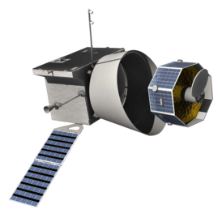
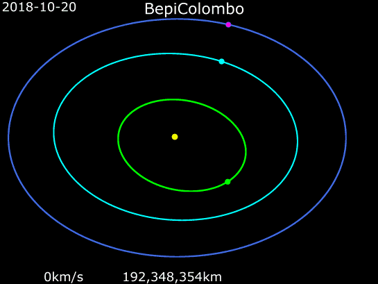
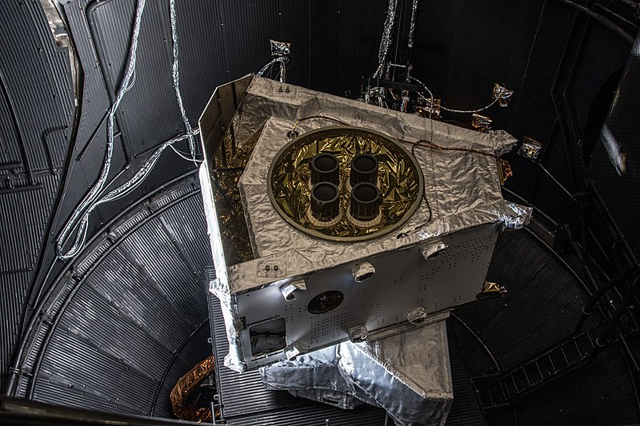
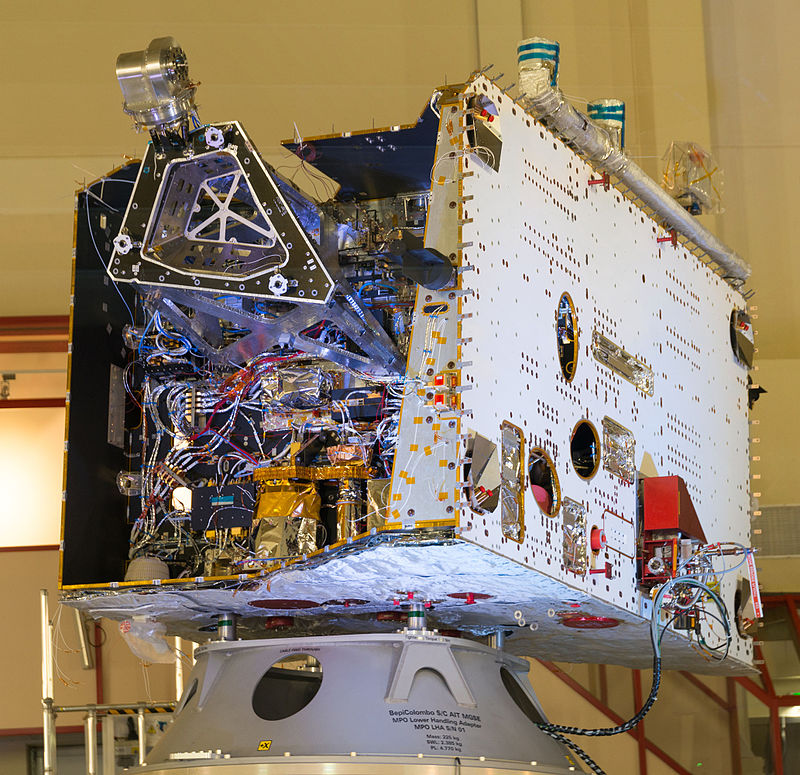
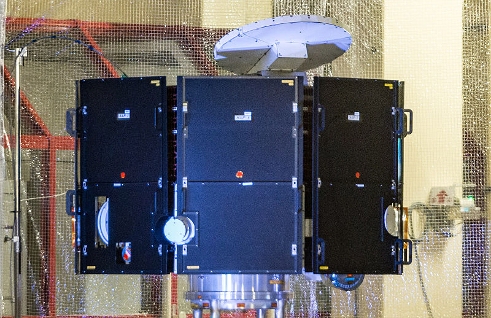

# BepiColombo
> Ver. . [🚀](../index/index.md) [despace](index.md) → **** <mark>NOCAT</mark>

[TOC]

---

> <small>**BepiColombo** — EN term. **БепиКоломбо** — rough RU analogue.</small>

**BepiColombo** is a joint mission of the European Space Agency and the Japan Aerospace Exploration Agency to the planet Mercury. The mission comprises two satellites launched together: the **Mercury Planetary Orbiter** (**MPO**) and ***Mio*** (**Mercury Magnetospheric Orbiter**, **MMO**).

 

|*Type*|*[Param.](si.md)*|
|:--|:--|
|**Mission:**|• • •|
|Cost|US$2 billion or 46 512 ㎏ of [gold](sc_price.md) in January 2018 prices|
|Development|2004 — 2018|
|Duration|Cruise: 7 years; Science phase: 1 year|
|Launch|20 October 2018, 01:45 UTC, Rocket: Ariane 5 ECA|
|Operator|ESA, JAXA|
|Programme|BepiColombo|
|Similar to|• Proposed: Меркурий‑П (2031)  • Current: …  • ㎩st: [MESSENGER](messenger.md), [Mariner-10](mariner_10.md)|
|Target|Performing a comprehensive study of mercury, including characterization of its magnetic field, magnetosphere, and internal and surface structure.|
|[Type](sc.md)|Orbiter spacecraft|
|**Spacecraft:**|• • •|
|Composition|2 Orbiters; Transfer Module|
|Contractor|Arianespace|
|Manufacturer|Airbus, [ISAS](zz_isas.md)|
| |**`…`**|
|Comms|MPO: X- and Ka‑band, diameter=1 m; Mio: X‑band, diameter=0.8 m|
|[ID](spaceid.md)|NSSDC ID (COSPAR ID): 2018-080A, SCN: 43653|
|Mass|**Dry mass:** 2 700 ㎏ **BOL mass**: *MPO*: 1 230 ㎏ ([Large satellite](спутник.md), [EVN‑073](venus.md)); *Mio*: 255 ㎏ ([Minisatellite](спутник.md), [EVN‑070](venus.md))|
|Orbit / Site|**MPO**: 480 × 1 500 ㎞; Inclination 90°  **Mio**: 590 × 1 500 ㎞; Inclination 90°|
|Payload|**MPO** − instruments for studying the surface and internal structure of the planet **Mio** − instruments for the study of the magnetic field and magnetosphere|
|Power|MPO: 150 W; Mio: 90 W|

Targets & investigations:

   - **T** — technical; **C** — contact research; **D** — distant research; **F** — fly‑by; **H** — manned; **S** — soil sample return; **X** — technology demonstration
   - **Sections of measurement and observation:**
      - Atmospheric/climate — **Ac** composition, **Ai** imaging, **Am** mapping, **Ap** pressure, **As** samples, **At** temperature, **Aw** wind speed/direction.
      - General — **Gi** planet’s interactions with outer space.
      - Soil/surface — **Sc** composition, **Si** imaging, **Sm** mapping, **Ss** samples.

<small>

|*EVN‑XXX*|*T*|*EN*|*Section of m&o*|*D*|*C*|*F*|*H*|*S*|
|:--|:--|:--|:--|:--|:--|:--|:--|:--|
|EVN‑070|T|Exploration with [satellites](sc.md): minisatellites.| |D| |F| | |
|EVN‑073|T|Exploration with [satellites](sc.md): large satellites.| |D| |F| | |

</small>

 

## Mission
It was launched on an Ariane VA245 rocket on 20 October 2018 at 01:45 UTC, with an arrival at Mercury planned for December 2025.

 During this time it will use solar-electric propulsion (ion thrusters) and nine gravity assists, flying past the Earth and Moon in April 2020, Venus in 2020 and 2021, and six Mercury fly‑bys between 2021 and 2025.

The stacked spacecraft left Earth with a hyperbolic excess velocity of 3.475 ㎞/s. Initially the craft is placed in an orbit similar to that of the Earth. After both the spacecraft and the Earth completed one and a half orbits, it returns to Earth to perform a gravity-assist manoeuvre and is deflected towards Venus. Two consecutive Venus fly‑bys reduce the perihelion nearly to Mercury distance with almost no need for thrust. A sequence of six Mercury fly‑bys will lower the relative velocity to 1.76 ㎞/s. After the fourth Mercury fly‑by the craft will be in an orbit similar to that of Mercury and will remain in the general vicinity of Mercury. Four final thrust arcs reduce the relative velocity to the point where Mercury will «weakly» capture the spacecraft on 5 December 2025 into polar orbit. Only a small manoeuvre is needed to bring the craft into an orbit around Mercury with an apocentre of 178 000 ㎞. The Orbiters then separate and will adjust their orbits using chemical thrusters.

During the cruise phase, BepiColombo will be a one-piece spacecraft. Upon arrival to the planet Mercury, the spacecraft will be divided into 3 separate spacecraft:

   - Mercury Transfer Module (MTM) for propulsion, built by ESA;
   - Mercury Planetary Orbiter, built by ESA;
   - Mercury Magnetospheric Orbiter (Mio), built by JAXA.

Arriving in Mercury orbit on 5 December 2025, the Mio and MPO satellites will separate and observe Mercury in collaboration for one year, with a possible one-year extension. The Orbiters are equipped with scientific instruments provided by various European countries and Japan. The mission will characterize the solid and liquid iron core and determine the size of each. The mission will also complete gravitational and magnetic field mappings. Russia provided gamma ray and neutron spectrometers to verify the existence of water ice in polar craters that are permanently in shadow from the Sun’s rays.

Mercury is too small and hot for its gravity to retain any significant atmosphere over long periods of time, but it has a «tenuous surface-bounded exosphere» containing hydrogen, helium, oxygen, sodium, calcium, potassium and other trace elements. Its exosphere is not stable as atoms are continuously lost and replenished from a variety of sources. The mission will study the exosphere composition and dynamics, including generation and escape.

As of 2018, the planned mission schedule is:

|*Date*|*Event*|*Comment*|
|:--|:--|:--|
|20 October 2018|Launch| |
|6 April 2020|Earth fly‑by|1.5 years after launch|
|12 October 2020|First Venus fly‑by| |
|11 August 2021|Second Venus fly‑by|1.35 Venus years after first Venus fly‑by|
|2 October 2021|First Mercury fly‑by| |
|23 June 2022|Second Mercury fly‑by|2 orbits (3.00 Mercury years) after 1st Mercury fly‑by|
|20 June 2023|Third Mercury fly‑by|> 3 orbits (4.12 Mercury years) after 2nd Mercury fly‑by|
|5 September 2024|Fourth Mercury fly‑by|~ 4 orbits (5.04 Mercury years) after 3rd Mercury fly‑by|
|2 December 2024|Fifth Mercury fly‑by|1 orbit (1.00 Mercury year) after 4th Mercury fly‑by|
|9 January 2025|Sixth Mercury fly‑by|~ 0.43 orbits (0.43 Mercury years) after 5th Mercury fly‑by|
|5 December 2025|Mercury orbit insertion|Spacecraft separation; 3.75 Mercury years after 6th Mercury fly‑by|
|14 March 2026|MPO in final science orbit|1.13 Mercury years after orbit insertion|
|1 May 2027|End of nominal mission|5.82 Mercury years after orbit insertion|
|1 May 2028|End of extended mission|9.98 Mercury years after orbit insertion|
 

||Pink — BepiColombo    Blue — Earth    Aqua — Venus    Green — Mercury    Yellow — Sun|
|:--|:--|
|***Animation of BepiColombo’s trajectory from 20 October 2018 to 2 November 2025***| |

 

## Science goals & payload
The main objectives of the mission are:

   - Study the origin and evolution of a planet close to its parent star;
   - Study Mercury’s form, interior, structure, geology, composition and craters;
   - Investigate Mercury’s exosphere, composition and dynamics, including generation and escape;
   - Study Mercury’s magnetised envelope (magnetosphere) − structure and dynamics;
   - Investigate the origin of Mercury’s magnetic field;
   - Verify Einstein’s theory of general relativity by measuring the parameters gamma and beta of the parameterized post-Newtonian formalism with high accuracy.

### MPO
MPO developed by the European Space Agency — an Orbiter for studying the surface and internal structure of the planet with a slightly elongated polar orbit (400 ㎞ by 1500 ㎞). In particular, it is planned to create a multi-wave map of the planet’s surface.

The science payload of the MPO consists of eleven instruments:

   - BepiColombo Laser Altimeter (**BELA**), developed by Switzerland and Germany;
   - Italian Spring Accelerometer (**ISA**), developed by Italy;
   - Mercury Magnetometer (**MERMAG**), developed by Germany and UK;
   - Mercury Radiometer and Thermal Infrared Spectrometer (**MERTIS**), developed by Germany;
   - Mercury Gamma‑ray and Neutron Spectrometer (**MGNS**). The instrument developed in the Space Research Institute of the Russian Academy of Sciences. Objectives:
      - the study of the elemental composition of the Mercurian surface that will allow us to refine the ideas about the formation and evolution of the planet;
      - measure the ratio of potassium to thorium and comparison of this value with those of other terrestrial planets, and studying the polar regions of Mercury and their comparison with the polar regions of the Moon.
   - Mercury Imaging X‑ray Spectrometer (**MIXS**), developed by UK and Finland;
   - Mercury Orbiter Radio-science Experiment (**MORE**), developed by Italy and the United States;
   - Probing of Hermean Exosphere by Ultraviolet Spectroscopy (**PHEBUS**) — for measuring the composition and dynamics of Mercury’s exosphere, developed by France and Russia;
   - Search for Exosphere Refilling and Emitted Neutral Abundances (**SERENA**), made up of 2 neutral and 2 ionised particle analysers: (**ELENA**) (Emitted Low-Energy Neutral Atoms) developed by Italy; (**STROFIO**) (Start from a ROtating Field mass spectrOmeter) developed by United States; (**MIPA**) (Miniature Ion Precipitation Analyser) developed by Sweden; (**PICAM**) (Planetary Ion CAMera) — panoramic energy-mass spectrometer of positively charged ions developed by Austria. The main objective of the experiment is to study the flow of ions from the planet’s surface and solar wind ions in the Mercury magnetosphere, and thus to study the Mercury soil and its interaction with the planet’s exosphere. The purpose of the experiment is to determine the chemical composition of the soil, to study the physical processes of emission from the surface of neutral particles and to measure the flows of magnetospheric ions that return to the surface; to understand whether Mercury has an ionosphere and how plasma convection occurs near it, to clarify the structure of the magnetosphere and the features of its interaction with the solar wind;
   - Spectrometers and Imagers for MPO BepiColombo Integrated Observatory System (**SI㎆IO-SYS**), high resolution stereo cameras and a visual and near infrared spectrometer, developed by Italy, France and Switzerland;
   - Solar Intensity X‑ray and Particle Spectrometer (**SIXS**), developed by Finland and UK.

### Mio
Mio developed by the Japan Aerospace Exploration Agency, is an Orbiter for studying the magnetic field and magnetosphere of mercury from a highly elliptical polar orbit (400 ㎞ by 12 000 ㎞).

Mio carries five groups of science instruments:

   - Mercury Plasma Particle Experiment (**MPPE**, studies the plasma and neutral particles from the planet, its magnetosphere, and the solar wind. It will employ these instruments:
      - Mercury Electron Analyzers (**MEA1**) and (**MEA2**);
      - Mercury Ion Analyzer (**MIA**);
      - Mass Spectrum Analyzer (**MSA**);
      - High‑Energy Particle instrument for electrons (**HEP-ele**);
      - High‑Energy Particle instrument for Ions (**HEP-ion**);
      - Energetic Neutrals Analyzer (**ENA**).
   - Mercury Magnetometer (**MMO-MGF**), studies Mercury’s magnetic field, magnetosphere, and interplanetary solar wind;
   - Plasma Wave Investigation (**PWI**), studies the electric field, electromagnetic waves, and radio waves from the magnetosphere and solar wind;
   - Mercury Sodium Atmosphere Spectral Imager (**MSASI**), studies the thin sodium atmosphere of Mercury;
   - Mercury Dust Monitor (**MDM**), studies dust from the planet and interplanetary space.

 

## Spacecraft
### MTM
|*QinetiQ T6*|*Performance*|
|:--|:--|
|Type|Kaufman Ion Engine|
|Units on board|4|
|Diameter|22 ㎝|
|Max. thrust|145 mN each|
|Specific impulse (Isp)|4 300 s|
|Propellant|Xenon|
|Total power|4 628 W|

 

||
|:--|
|***Mercury Transfer Module in The Large Space Simulator at ESTEC***|

The Mercury Transfer Module (MTM), developed by the European Space Agency, is located at the base of the stack. Its role is to carry the two science Orbiters to Mercury and to support them during the cruise.

The MTM is equipped with a solar electric propulsion system as the main spacecraft propulsion. Its four QinetiQ T6 ion thrusters operate singly or in pairs for a maximum combined thrust of 290 mN, making it the most powerful ion engine array ever operated in space. The MTM supplies electrical power for the two hibernating Orbiters as well as for its solar electric propulsion system thanks to two 14 meter-long solar panels. Depending on the probe’s distance to the Sun, the generated power will range between 7 and 14 kW, each T6 requiring between 2.5 and 4.5 kW according to the desired thrust level.

The solar electric propulsion system has typically very high specific impulse and low thrust. This leads to a flight profile with months-long continuous low‑thrust braking phases, interrupted by planetary gravity assists, to gradually reduce the velocity of the spacecraft. Moments before Mercury orbit insertion, the MTM will be jettisoned from the spacecraft stack. After separation from the MTM, the MPO will provide Mio all necessary power and data resources until Mio is delivered to its mission orbit; separation of Mio from MPO will be accomplished by spin-ejection.

### MPO

||
|:--|
|***Mercury Planetary Orbiter in ESTEC before stacking***|

The MPO will have a mass of 1 150 ㎏ and will use a single-sided solar array capable of providing up to 1000 W and featuring Optical Solar Reflectors to keep its temperature below 200 ℃. The solar array requires continuous rotation keeping the Sun at a low incidence angle in order to generate adequate power while at the same time limiting the temperature.

The MPO will carry a payload of 11 instruments, comprising cameras, spectrometers (IR, UV, X‑ray, γ‑ray, neutron), a radiometer, a laser altimeter, a magnetometer, particle analysers, a Ka‑band transponder, and an accelerometer. The payload components are mounted on the nadir side of the spacecraft to achieve low detector temperatures, apart from the MERTIS and PHEBUS spectrometers located directly at the main radiator to provide a better field of view.

A high‑temperature‑resistant 1.0 m diameter high‑gain antenna is mounted on a short boom on the zenith side of the spacecraft. Communications will be on the X and Ka band with an average bit rate of 50 Kb/s and a total data volume of 1550 Gb/year. ESA’s Cebreros 35-metre ground station is planned to be the primary ground facility for communications during all mission phases.

### Mio

||
|:--|
|***Mio in ESTEC before stacking***|

Mio developed and built mostly by Japan, has the shape of a short octagonal prism, 180 ㎝ long from face to face and 90 ㎝ high. It has a mass of 285 ㎏, including a 45 ㎏ scientific payload consisting of 5 instrument groups.

Mio is spin stabilized at 15 rpm with the spin axis perpendicular to the equator of Mercury and it will enter polar orbit at an altitude of 590 × 11 640 ㎞, outside of MPO’s orbit. The top and bottom of the octagon act as radiators with louvers for active temperature control. The sides are covered with solar cells which provide 90 W. Communications with Earth will be through a 0.8 m diameter X‑band phased array high‑gain antenna and two medium‑gain antennas operating in the X‑band. Telemetry will return 160 ㎇/year, about 5 Kb/s over the lifetime of the spacecraft, which is expected to be greater than one year. The reaction and control system is based on cold gas thrusters. After its release in Mercury orbit, Mio will be operated by Sagamihara Space Operation Center using Usuda Deep Space Center’s 64 m antenna located in Nagano, Japan.

 

## Community, library, links

**PEOPLE:**

   1. Giuseppe «Bepi» Colombo — a scientist, mathematician and engineer at the University of Padua, Italy, who first proposed the interplanetary gravity assist manoeuvre used by the 1974 Mariner 10 mission, a technique now used frequently by planetary probes.

**COMMUNITY:**

<mark>TBD</mark>

 

## Docs & links
|Navigation|
|:--|
|**[FAQ](faq.md)**, **[Cable](cable.md)**·БКС, **[Camera](cam.md)**·Камера, **[Comms](comms.md)**·Радио, **[CON](contact.md)·[Pers](person.md)**·Контакт, **[Control](control.md)**·Упр., **[Doc](doc.md)**·Док., **[Doppler](doppler.md)**·ИСР, **[DS](ds.md)**·ЗУ, **[EB](eb.md)**·ХИТ, **[ECO](ecology.md)**·Экол., **[EF](ef.md)**·ВВФ, **[ElC](elc.md)**·ЭКБ, **[EMC](emc.md)**·ЭМС, **[Error](error.md)**·Ошибки, **[Event](event.md)**·События, **[FS](fs.md)**·ТЭО, **[Fuel](fuel.md)**·Топливо, **[GNC](gnc.md)**·БКУ, **[GS](scs.md)**·НС, **[HF&E](hfe.md)**·Эрго., **[IU](iu.md)**·Гиро., **[KT](kt.md)**·КТЕХ, **[LAG](lag.md)**·ПУC, **[LES](les.md)**·САСП, **[LS](ls.md)**·СЖО, **[LV](lv.md)**·РН, **[MCC](mcc.md)**·ЦУП, **[Model](model.md)**·Модель, **[MSC](sc.md)**·ПКА, **[N&B](nnb.md)**·БНО, **[NR](nr.md)**·ЯР, **[OBC](obc.md)**·ЦВМ, **[OE](oe.md)**·БА, **[Pat.](патент.md)**·Патент, **[Proj.](project.md)**·Проект, **[PS](ps.md)**·ДУ, **[QM](qm.md)**·БКНР, **[R&D](rnd.md)**·НИОКР, **[Robot](robotics.md)**·Робот, **[Rover](rover.md)**·Ровер, **[RTG](rtg.md)**·РИТЭГ, **[SARC](sarc.md)**·ПСК, **[SE](se.md)**·СЭ, **[Sens.](sensor.md)**·Датч., **[SC](sc.md)**·КА, **[SCS](scs.md)**·КК, **[SGM](sgm.md)**·КММ, **[SI](si.md)**·СИ, **[Soft](soft.md)**·ПО, **[SP](sp.md)**·БС, **[Spaceport](spaceport.md)**·Космодр., **[SPS](sps.md)**·СЭС, **[SSS](sss.md)**·ГЗУ, **[TCS](tcs.md)**·СОТР, **[Test](test.md)**·ЭО, **[Timeline](timeline.md)**·ЦГМ, **[TMS](tms.md)**·ТМС, **[TOR](tor.md)**·ТЗ, **[TRL](trl.md)**·УГТ|
|*Sections & pages*|
|**【】**  <mark>NOCAT</mark>|

   1. Docs: …
   1. Notable interwikies — …

   1. <https://en.wikipedia.org/wiki/BepiColombo>
   2. [BepiColombo](http://www.esa.int/Our_Activities/Space_Science/BepiColombo/BepiColombo_factsheet) − European Space Agency, ESA
   3. [BepiColombo page at ESA Spacecraft Operations](http://www.esa.int/SPECIALS/Operations/SEMYRMQJNVE_0.html)
   4. [BepiColombo страница на сайте JAXA](http://global.jaxa.jp/projects/sat/bepi/)

