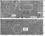
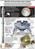
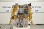
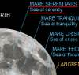

# Beresheet
> 2019.05.12 [🚀](../index/index.md) [despace](index.md) → [SpaceIL](spaceil.md), [Луна](moon.md), **[Project](project.md)**

[TOC]

---

> <small>**Beresheet** *(Иврит: בְּרֵאשִׁית‬, “In the beginning”)* — англоязычный термин, не имеющий аналога в русском языке. **В начале** — дословный перевод с английского на русский.</small>

Уникальность Beresheet среди претендентов на [GLXP](google_lunar_x_prize.md) в том, что вместо постройки гусеничного или колёсного вездехода, SpaceIL планирует удовлетворить требование преодолеть 500 метров по лунной поверхности, «прыгнув» с места посадки в другую точку в 500 метрах, используя ракетные двигатели. В случае успеха зонд станет самым маленьким и лёгким аппаратом в истории, осуществившем посадку на Луну.

|*Место  посадки*|*Плакат*|*Общий вид*|
|:--|:--|:--|
||||

## Характеристики
|<small>*Характеристика*</small>|*Значение*|
|:--|:--|
|Габариты, ㎜|2 000 диаметр (2 300 между посадочными опорами), 1 500 высота|
|Даты|2019.02.22 старт;  2019.04.11 посадка;  2019.04.14 плановый EoL|
|Массы, кг|530 стартовая, 150 сухая|
|Место|посадка в Море Ясности (Mare Serenitatis) <small>в северном полушарии, где находится одна из лунных магнитных аномалий, диаметр 674 км</small>  |
|САС| |
|Стоимость|90 000 000 $|

**Наземный сегмент:**

   - [SSC’s Global Ground Station Network](ssc_ggsn.md) — служебная связь, отслеживание положения;
   - [DSN](dsn.md) — управление КА, приём научной информации на Землю после посадки.

**КА:**

   - **БКУ.**
      - 6 × камера Imperx Bobcat B3320C с оптикой Ruda (8 МПикс).
      - ЗД <mark>TBD</mark>.
      - Процессор Gaisler HiRel [GR712RC](gr712rc.md) компании [Cobham](cobham.md): 100 ㎒.
      - СД <mark>TBD</mark>.
   - **БРК.**
   - **ДУ.**
      - 1 × [LEROS 2b](leros.md) ([MMH](mmh.md)+MON) с укороченным соплом, увеличенной тягой: 407 H → 441 H.
      - 8 × ДМТ <mark>TBD</mark>.
      - Топливо 380 кг.
   - **СОТР.**
      - Активная СОТР отсутствует; КА в итоге перегреется.
      - ЭВТИ, ЛКП.
   - **СЭС.**
      - БС <mark>TBD</mark>.

**НА:**

   1. капсула времени; <small>(containing over 30 million pages of data, including a full copy of English-language Wikipedia, the Bible, children’s drawings, memories of a Holocaust survivor, Israel’s national anthem (Hatikvah), the Israeli flag, and a copy of the Israeli Declaration of Independence)</small>
   1. [магнитометр](sensor.md) (Институт Вейцмана, Израиль);
   1. массив лазерных отражателей (by NASA Goddard Space Flight Center), ожидаемая точность измерения до 10 ㎝.

## Хронология
Перелёт за 47 суток с постепенным повышением орбиты в перицентре ([Эффект Оберта](oberth_eff.md)).

## Планы и результаты
…

 

## Community, library, links

**PEOPLE:**

   1. May Weissman — System Engineering and Ground Segment (2017 ‑ 2019, [SpaceIL](zz_spaceil.md))
   1. Lior Ezrai — Mission controller (2018 ‑ 2019, [SpaceIL](zz_spaceil.md))
   1. Tomer Klein — Deputy Head Of Mission (2019, [SpaceIL](zz_spaceil.md))
   1. Eran Shmidt — Deputy Manager, GS ([SpaceIL](zz_spaceil.md))
   1. Amir Notea — Simulation engineer (2016 ‑ 2019, [SpaceIL](zz_spaceil.md))
   1. Avi Barliya — Project manager (2013 ‑ 2016, [SpaceIL](zz_spaceil.md))
   1. Noam Arkind — control algorithms for the entire mission (2011 ‑ 2013, [SpaceIL](zz_spaceil.md))
   1. Alex Padwa — spacecraft industrial design
   1. Avi Nudler — project and technical aspects of the solution (2014 ‑ 2016, [SpaceIL](zz_spaceil.md))

**COMMUNITY:**

<mark>TBD</mark>

 

## Docs & links (TRANSLATEME ALREADY)
|Navigation|
|:--|
|**[FAQ](faq.md)**【**[SCS](scs.md)**·КК, **[SC (OE+SGM)](sc.md)**·КА】**[CON](contact.md)·[Pers](person.md)**·Контакт, **[Ctrl](control.md)**·Упр., **[Doc](doc.md)**·Док., **[EF](ef.md)**·ВВФ, **[Error](error.md)**·Ошибки, **[Event](event.md)**·События, **[FS](fs.md)**·ТЭО, **[HF&E](hfe.md)**·Эрго., **[KT](kt.md)**·КТ, **[Model](model.md)**·Модель, **[N&B](nnb.md)**·БНО, **[Patent](патент.md)**·Пат., **[Project](project.md)**·Проект, **[QM](qm.md)**·БКНР, **[R&D](rnd.md)**·НИОКР, **[SI](si.md)**·СИ, **[Test](test.md)**·ЭО, **[TRL](trl.md)**·УГТ, **[Way](way.md)**·Пути|
|*Sections & pages*|
|**【】**  <mark>NOCAT</mark>|

   1. Docs:
      - [Подборка материалов СМИ за 2019.02 ❐](f/project/b/beresheet/201902_docs.pdf)
   1. Notable interwikies — …
   1. <https://en.wikipedia.org/wiki/SpaceIL>
   1. <https://ru.wikipedia.org/wiki/SpaceIL>
   1. <https://space.skyrocket.de/doc_sdat/beresheet.htm>
   1. 2019.03.07 [Хабр: Лунная миссия «Берешит» — характеристики, маневры, путь ⎆](https://habr.com/ru/post/442922/) — [archive ❐](f/archive/20190307_1.7z) of 2019.03.10)
   1. 2019.02.22 [Хабр: Запущен первый коммерческий лунный КА Beresheet ⎆](https://habr.com/ru/post/441358/)
   1. 2019.02.21 [myNEWSdesk: Nammo’s British Rocket Engine Powers Israel’s Mission to the Moon ⎆](http://www.mynewsdesk.com/no/nammo/pressreleases/nammos-british-rocket-engine-powers-israels-mission-to-the-moon-2838630)
   1. 2019.02.04 [Космолента: Израильская автоматическая станция отправится на Луну в феврале ⎆](http://kosmolenta.com/index.php/1363-2019-02-04-beresheet)
