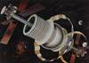
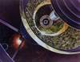

# Сфера Бернала
> 2019.05.12 [🚀](../index/index.md) [despace](index.md) → [Project](project.md)

[TOC]

---

> <small>**Сфера Бернала** — русскоязычный термин. **Bernal sphere** — англоязычный эквивалент.</small>

**Сфера Бернала** — это тип орбитальной станции и космического поселения, разработанный в 1929 году Джоном Десмондом Берналом; «пространственная среда», предназначенная для постоянного проживания людей. Оригинальный проект Бернала представлял собой сферу диаметром около 10 миль (16 км), способную вместить 20—30 тыс. человек и наполненную воздухом.

|<small>*Внешний вид  сферы Бернала*</small>|<small>*Внутренняя часть  сферы — вид через  световое окно сферы*</small>|
|:--|:--|
|||

 

## Docs & links (TRANSLATEME ALREADY)
|Navigation|
|:--|
|**[FAQ](faq.md)**【**[SCS](scs.md)**·КК, **[SC (OE+SGM)](sc.md)**·КА】**[CON](contact.md)·[Pers](person.md)**·Контакт, **[Ctrl](control.md)**·Упр., **[Doc](doc.md)**·Док., **[Drawing](drawing.md)**·Чертёж, **[EF](ef.md)**·ВВФ, **[Error](error.md)**·Ошибки, **[Event](event.md)**·События, **[FS](fs.md)**·ТЭО, **[HF&E](hfe.md)**·Эрго., **[KT](kt.md)**·КТ, **[N&B](nnb.md)**·БНО, **[Project](project.md)**·Проект, **[QM](qm.md)**·БКНР, **[R&D](rnd.md)**·НИОКР, **[SI](si.md)**·СИ, **[Test](test.md)**·ЭО, **[TRL](trl.md)**·УГТ, **[Way](way.md)**·Пути|
|*Sections & pages*|
|**【】**  <mark>NOCAT</mark>|

   1. Docs: …
   1. <https://en.wikipedia.org/wiki/Bernal_sphere>
   1. <https://ru.wikipedia.org/wiki/Сфера_Бернала>
