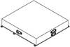

# БКУ-SxPA
> 2019.05.12 [🚀](../index/index.md) [despace](index.md) → ****

[TOC]

---

> <small>**БКУ‑SxPA** — русскоязычный термин, не имеющий аналога в английском языке. **BKU‑SxPA** — дословный перевод с русского на английский.</small>

**БКУ‑SxPA** — цифровая вычислительная машина ([компьютер](obc.md)), предназначенная для использования в составе [КА](sc.md).  
*Разработчик:* [Спутникс](zz_sputnix.md). Разработано  
   - **Предшественник:** 
   - **Преемник:** 

| |
|:--|
||

<small>

|*Характеристика*|*[Значение](si.md) <small>()</small>*|
|:--|:--|
|[TRL](trl.md)| |
|Быстродействие| |
|Время восстановления работоспособности, с|<small>(с момента фиксирования отказа аппаратурой автоматической реконфигурации)</small>|
|Команды, датчики, входы|… — команд управления;  … — релейных матричных команд управления;  … — ТМ‑датчиков;  … — входов прерываний от контактных датчиков;  … — входов прерываний от импульсных датчиков|
|Исполнение|2 блока:  процессорный блок;  маршрутизатор.|
|Объём, кбайт|… — ОЗУ;  … — ЭППЗУ;  … — защищённой памяти|
|Разрядность данных| |
|Тип процессора|LEON3|
|**`Прочее`**| |
|[ВБР](srrq.md) за САС| |
|Dimensions, L×W×H, mm|179 × 167 × 30 — процессорный блок;  119 × 107 × 30 — маршрутизатор|
|Интерфейсы|Space Plug-and-Play Architecture Standard;  [SpaceWire](spacewire.md);  CAN2B|
|Mass, kg|0.2 — процессорный блок;  0.15 — маршрутизатор;  **Итого:** 0.35|
|[Voltage](voltage.md), V| |
|Overload, g| |
|[Rad.resist](ion_rad.md), Gy (rad)| |
|Resource, h (y)| |
|[Lifetime](lifetime.md), h (y)| |
|[Temp. range](tcs.md), ℃| |
|Consumption, W| |

</small>

 

## Примечания
   1. …

## Применяемость
   1. …

 

## Docs & links (TRANSLATEME ALREADY)
|Navigation|
|:--|
|**[FAQ](faq.md)**, **[Cable](cable.md)**·БКС, **[Camera](cam.md)**·Камера, **[Comms](comms.md)**·Радио, **[Contact](contact.md)**·Контакт, **[Control](control.md)**·Упр., **[Doc](doc.md)**·Док., **[Doppler](doppler.md)**·ИСР, **[DS](ds.md)**·ЗУ, **[EB](eb.md)**·ХИТ, **[ECO](ecology.md)**·Экол., **[EF](ef.md)**·ВВФ, **[ElC](elc.md)**·ЭКБ, **[EMC](emc.md)**·ЭМС, **[Error](error.md)**·Ошибки, **[Event](event.md)**·События, **[FS](fs.md)**·ТЭО, **[Fuel](fuel.md)**·Топливо, **[GNC](gnc.md)**·БКУ, **[GS](scs.md)**·НС, **[HF&E](hfe.md)**·Эрго., **[IU](iu.md)**·Гиро., **[KT](kt.md)**·КТЕХ, **[LAG](lag.md)**·ПУC, **[LES](les.md)**·САСП, **[LS](ls.md)**·СЖО, **[LV](lv.md)**·РН, **[MCC](mcc.md)**·ЦУП, **[Model](model.md)**·Модель, **[MSC](sc.md)**·ПКА, **[N&B](nnb.md)**·БНО, **[NR](nr.md)**·ЯР, **[OBC](obc.md)**·ЦВМ, **[OE](oe.md)**·БА, **[Pat.](патент.md)**·Патент, **[Proj.](project.md)**·Проект, **[PS](ps.md)**·ДУ, **[R&D](rnd.md)**·НИОКР, **[Robot](robotics.md)**·Робот, **[Rover](rover.md)**·Ровер, **[RTG](rtg.md)**·РИТЭГ, **[SARC](sarc.md)**·ПСК, **[SE](se.md)**·СЭ, **[Sens.](sensor.md)**·Датч., **[SC](sc.md)**·КА, **[SCS](scs.md)**·КК, **[SGM](sgm.md)**·КММ, **[SI](si.md)**·СИ, **[Soft](soft.md)**·ПО, **[SP](sp.md)**·БС, **[Spaceport](spaceport.md)**·Космодр., **[SPS](sps.md)**·СЭС, **[SRRQ](srrq.md)**·БКНР, **[SSS](sss.md)**·ГЗУ, **[TCS](tcs.md)**·СОТР, **[Test](test.md)**·ЭО, **[Timeline](timeline.md)**·ЦГМ, **[TMS](tms.md)**·ТМС, **[TOR](tor.md)**·ТЗ, **[TRL](trl.md)**·УГТ|
|*Sections & pages*|
|**`Цифровая вычислительная машина (ЦВМ):`**  …  • • •  **РФ:** [МПК-003](mpk_003.md) (9) ┊ [БИВК-МР](bivk_mr.md) (8) ┊ [МАРС 4](mars_4.md) (8) ┊ [БИВК-Р](bivk_r.md) (7.1) ┊ [МАРС 7](mars_7.md) (6) ┊ [МПК-002](mpk2.md) (3.9) ┊ [ЦВМ-12](cvm_12.md) (2.2) ┊ [БКУ_SXPA](bku_sxpa.md) (0.35) ┊ [БИВК-МН](бивк‑мн.md) () *([ЦВМ22](cvm22.md) (2.1))*|

   1. Docs:
      - [Чертёж процессорного блока ❐](f/cpu/b/bku-sxpa_sketch_bku1.pdf)
      - [Чертёж маршрутизатора ❐](f/cpu/b/bku-sxpa_sketch_router1.pdf)
   1. Notable interwikies — …
   1. <http://www.sputnix.ru/ru/products/microsatellites-systems/obc-pnp/item/245-bku_sxpa_ru>

