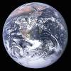
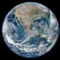

# Blue Marble
> 2019.08.24 **[🚀](../index/index.md) [despace](index.md)** → **[Space](index.md)**, [Земля](earth.md)

[TOC]

---

> <small>*Термины:* **Blue Marble** — англоязычный термин, не имеющий аналога в русском языке. **Синий марбл** — дословный перевод с английского на русский.</small>

**The Blue Marble («Блю марбл», в переводе с английского — «синий марбл»)** — знаменитая фотография планеты Земля, сделанная 7 декабря 1972 года экипажем космического корабля «Аполлон‑17» с расстояния примерно в 29 000 км (18 000 миль) от поверхности Земли. Находится в открытом доступе и, как работа НАСА, является общественным достоянием. Изображает полностью освещённую Землю (Солнце находилось позади астронавтов). Фотография использовалась во множестве произведений для изображения Земли из космоса.

|*Экипаж «Аполлона‑17».  Синий марбл. 1972. The Blue Marble*|*Blue Marble 2012*|
|:--|:--|
|  |  |

## Фотография
Снимок, сделанный астронавтами 7 декабря 1972 года в 5:39 EST (13:39 МСК), является одним из наиболее распространяемых снимков всех времён. Для астронавтов Земля имела размер и вид голубого марбла (игрушки, обычно представляющей собой цветной стеклянный шарик), отсюда и название.

Фотографию сделали примерно через 5 ч 6 мин после запуска «Аполлона‑17», и примерно через 1 ч 54 мин после того, как КА покинул опорную орбиту Земли и установил курс на Луну. Время запуска «Аполлона‑17» — 12:33 EST (20:33 МСК). Это значит, что Африка была полностью освещена в ранние часы полёта КА. Антарктида также была освещена, так как приближалось зимнее солнцестояние.

Над Индийским океаном в правой верхней части снимка виден циклон. Шторм вызвал наводнения и сильные ветры в индийском штате Тамилнад 5 декабря, за 2 дня до даты снимка.

Официальное обозначение фотографии в НАСА — AS17‑148‑22727 (фотография НАСА AS17‑148‑22726 была сделана непосредственно перед 22727 и была практически идентична; она также использовалась как снимок всей Земли). Первоначально фотография была перевёрнута: южный полюс был сверху, Мадагаскар виден чуть левее центра, а Африка находилась в правой части снимка. Тем не менее, фотографию перевернули в привычное положение.

Фотограф использовал 70‑мм камеру «Хассельблад» с 80‑мм объективом Zeiss. НАСА официально приписывает авторство всему экипажу «Аполлона‑17» — Юджину Сернану, Роналду Эвансу и Харрисону «Джеку» Шмитту — всем, чьи фотографии во время полёта были сделаны бортовой камерой «Хассельблад». Тем не менее, исследование материалов после полёта даёт основания предполагать, что фотографом был Харрисон Шмитт.

«Аполлон‑17» был последним пилотируемым полетом к Луне. С тех пор ни один астронавт не был достаточно далеко от Земли, чтобы сделать её снимок целиком. Но снимки всей Земли делались во время множества полётов без экипажа.

## Blue Marble 2012

25 января 2012 НАСА создало составное изображение западного полушария Земли под названием Blue Marble 2012. Картина имела множество просмотров, зарегистрировано более 3.1 миллиона посещений на хостинге изображений Flickr в течение первой недели. 2 февраля 2012 НАСА выпустило сопутствующую фотографию, показав составное изображение восточного полушария из данных, полученных 23 января 2012. Картина составлена из данных, полученных с помощью устройства Visible/Infrared Imager Radiometer Suite (VIIRS) с борта спутника Suomi NPP 4 января 2012 года. Данные были получены с шести оборотов спутника за восьмичасовой период.

 

## Docs & links (TRANSLATEME ALREADY)
|…°·•¹²³±×÷≤≥≈≠ ‑ −— ⎆✉ ❐“”’«»✔→✘☐☑├┕┆ 1 lb = 0.453592 kg; 1 g = 9.80665 m/s²|
|:--|
|<small>**[FAQ](faq.md)**, **[Cable](cable.md)**·БКС, **[Camera](camera.md)**·Камера, **[Comms](comms.md)**·Радио, **[Contact](contact.md)**·Контакт, **[Control](control.md)**·Управ., **[Doc](doc.md)**·Док., **[Doppler](doppler.md)**·ИСР, **[DS](ds.md)**·ЗУ, **[EB](eb.md)**·ХИТ, **[ECO](ecology.md)**·Экол., **[EF](ef.md)**·ВВФ, **[ElC](elc.md)**·ЭКБ, **[EMC](emc.md)**·ЭМС, **[Errors](error.md)**·Ошибки, **[Events](event.md)**·События, **[FS](fs.md)**·ТЭО, **[Fuel](fuel.md)**·Топливо, **[GNC](gnc.md)**·БКУ, **[GS](scs.md)**·НС, **[HF&E](hfe.md)**·Эрго., **[IU](iu.md)**·Гиро., **[KT](kt.md)**·КТЕХ, **[LAG](lag.md)**·ПУC, **[LES](les.md)**·САСП, **[LS](ls.md)**·СЖО, **[LV](lv.md)**·РН, **[MCC](mcc.md)**·ЦУП, **[Model](model.md)**·Модель, **[MSC](sc.md)**·ПКА, **[N&B](nnb.md)**·БНО, **[NR](nr.md)**·ЯР, **[OBC](obc.md)**·ЦВМ, **[OE](oe.md)**·БА, **[Pat.](патент.md)**·Патент, **[Project](project.md)**·Проект, **[PS](ps.md)**·ДУ, **[QA](quality.md)**·QA, **[R&D](rnd.md)**·НИОКР, **[RAMS](rams.md)**·НиБ, **[Risk](risk.md)**·Риск, **[Robot](robotics.md)**·Робот, **[Rover](rover.md)**·Планетоход, **[RTG](rtg.md)**·РИТЭГ, **[SARC](sarc.md)**·ПСК, **[Sensor](sensor.md)**·Датчик, **[SC](sc.md)**·КА, **[SCS](scs.md)**·КК, **[SGM](sgm.md)**·КММ, **[SI](si.md)**·СИ, **[Soft](soft.md)**·ПО, **[SP](sp.md)**·БС, **[Spaceport](spaceport.md)**·Космодром, **[SPS](sps.md)**·СЭС, **[SSS](sss.md)**·ГЗУ, **[TCS](tcs.md)**·СОТР, **[Test](test.md)**·ЭО, **[Timeline](timeline.md)**·Циклограмма, **[TMS](tms.md)**·ТМС, **[TOR](tor.md)**·ТЗ, **[TRL](trl.md)**·УГТ</small>|
|*Sections & pages*|
|**··• [Space](index.md) •··**  [Apparent magnitude](app_mag.md) ┊ [Astro.object](aob.md) ┊ [Blue Marble](blue_marble.md) ┊ [Cosmic rays](cr.md) ┊ [Ecliptic](ecliptic.md) ┊ [Escape velocity](esc_vel.md) ┊ [Health](health.md) ┊ [Hill sphere](hill_sphere.md) ┊ [Information](info.md) ┊ [Lagrangian points](l_points.md) ┊ [Near space](near_sys.md) ┊ [Pale Blue Dot](pale_blue_dot.md) ┊ [Parallax](parallax.md) ┊ [Point Nemo](point_nemo.md) ┊ [Silver Snoopy award](silver_snoopy_award.md) ┊ [Solar constant](solar_const.md) ┊ [Terminator](terminator.md) ┊ [Time](time.md) ┊ [Wormhole](wormhole.md) ┊ ··•·· **Solar system:** [Ariel](ariel.md) ┊ [Callisto](callisto.md) ┊ [Ceres](ceres.md) ┊ [Deimos](deimos.md) ┊ [Earth](earth.md) ┊ [Enceladus](enceladus.md) ┊ [Eris](eris.md) ┊ [Europa](europa.md) ┊ [Ganymede](ganymede.md) ┊ [Haumea](haumea.md) ┊ [Iapetus](iapetus.md) ┊ [Io](io.md) ┊ [Jupiter](jupiter.md) ┊ [Makemake](makemake.md) ┊ [Mars](mars.md) ┊ [Mercury](mercury.md) ┊ [Moon](moon.md) ┊ [Neptune](neptune.md) ┊ [Nereid](nereid.md) ┊ [Nibiru](nibiru.md) ┊ [Oberon](oberon.md) ┊ [Phobos](phobos.md) ┊ [Pluto](pluto.md) ┊ [Proteus](proteus.md) ┊ [Rhea](rhea.md) ┊ [Saturn](saturn.md) ┊ [Sedna](sedna.md) ┊ [Solar day](solar_day.md) ┊ [Sun](sun.md) ┊ [Titan](titan.md) ┊ [Titania](titania.md) ┊ [Triton](triton.md) ┊ [Umbriel](umbriel.md) ┊ [Uranus](uranus.md) ┊ [Venus](venus.md)|

   1. Docs: …
   1. Notable interwikies — …
   1. <https://en.wikipedia.org/wiki/The_Blue_Marble>
   1. <https://ru.wikipedia.org/wiki/The_Blue_Marble>
