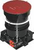
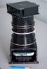

# БОКЗ-МФ
> 2019.05.12 ┊ **🚀 [despace](index.md)** → **[ЗД](sensor.md)**

[TOC]

---

> <small>*Термины:* **БОКЗ‑МФ** — русскоязычный термин, не имеющий аналога в английском языке. **BOKZ‑MF** — дословный перевод с русского на английский.</small>

**Блок определения координат звёзд модифицированный (БОКЗ‑МФ)** — звёздный датчик, предназначенный для определения ориентации [КА](sc.md) относительно звёздного неба.  
*Разработчик:* [ИКИ РАН](03_iki_ras.md), RU. Разработано в 2006 году. Активное использование. Покупное изделие. (по состоянию на 20.06.2017)

<small>

|*•    Характеристика    •*|*[Значение](si.md) <small>(БОКЗ-МФ)</small>*|
|:--|:--|
|[УГТ](trl.md)|9  |
| Время опознавания, с  |10  |
|Вых. информация|  |
| Допуст. угл. скор., °/с  |  |
| Запаздывание, с, ≤  |1 (от середины интервала экспонирования до начала считывания БКУ)  |
|Исполнение| Моноблок, включающий в себя следующие элементы:  1) объектив «Астрар‑7С» (НРДК.202361.006);  2) плата видеотракта (НРДК.468151.120) с фотоприемным устройством (ФПУ);  3) плата процессора (НРДК.467489.008);  4) плата вторичного источника питания (НРДК.436734.029);  5) бленда (НРДК.203421.007);  6) блок крышки (НРДК.323451.010).  |
| Объектив  |  |
| Поле зрения, °  |  |
|Режим готовности| 60 с от подачи питания  |
|Точность| 5″ σx,y  12″ σz  |
|Частота обновл., Гц| 1  |
| Яркость фона, кд/m²  |0.01 для света с солнечным спектром  |
|**Etc:**|• • •|
|[ВБР](rams.md) за САС|   |
|Dimensions, L×W×H, mm| 247 × 179 × 180 без имитатора звёздного неба  |
|Интерфейсы|   |
|Mass, kg| 1.76 без имитатора звёздного неба;  3.25 с имитатором звёздного неба  |
|[Voltage](voltage.md), V| 27 (23 ‑ 34)  |
|Overload, g|   |
|[Rad.resist](ion_rad.md), Gy (rad)|    |
|Resource, h (y)| 20 000 (2.28), не более 10 000 включений  |
|[Lifetime](lifetime.md), h (y)| 41 000 (4 года 9 месяцев)  |
|[Тепловой режим](tcs.md), °C|   |
|Consumption, W| 11  |
||    |

</small>

 

## Примечания
*Предельно допустимая погрешность определения ориентации каждой из осей ПСК относительно второй экваториальной системы координат на момент середины интервала времени экспонирования за весь срок штатной эксплуатации (1 год) составляет:*

|*Параметр*| <small>*Угловая скорость (угл.мин./с)*| <small>*Предельная случайная составляющая погрешности (3σ)*| <small>*Систематическая составляющая погрешности*| <small>*Предельная суммарная погрешность*|
|:--|:--|:--|:--|:--|
|**Направление оси «OZ» ПСК**  |0,00 **⁽¹⁾**  0,25 **⁽²⁾**  60,0 **⁽³⁾**  |1,5–2,0  6,0–8,0  20,0–25,0  |5,0  5,0  5,0  |6,5–7,0  11,0–13,0  25,0–30,0  |
|**Направление осей «OХ», «OY»**  |0,00 **⁽¹⁾**  0,25 **⁽²⁾**  60,0 **⁽³⁾**  |30,0–35,0  45,0–50,0  65,0–70,0  |15,0  15,0  15,0  |45,0–50,0  60,0–65,0  80,0–85,0  |

Примечания:

   - **1)** Подтверждается результатами экспериментов на стенде динамических испытаний.
   - **2)** Подтверждается результатами обработки материалов, полученных при проведении наземных натурных испытаний.
   - **3)** Подтверждается точностными расчётами.
   - Прибор БОКЗ‑МФ без выхода из строя допускает попадание в своё поле зрения Солнца с угловым размером (от 18 до 50) угл. мин на время не более 5 минут;
   - Прибор БОКЗ‑МФ с частотой 1 Гц формирует матрицу направляющих косинусов относительно 2‑ой экваториальной системы координат при движении линии визирования относительно небесной сферы со скоростью от 0 град/сек до 1 град/сек.

## Применяемость
   1. КА [Луна‑27](луна_27.md)

 

## Docs & links (TRANSLATEME ALREADY)
|…°·•¹²³±×÷≤≥≈≠ ‑ −— ⎆✉ ❐“”’«»✔→✘☐☑├┕┆ 1 lb = 0.453592 kg; 1 g = 9.80665 m/s²|
|:--|
|<small>**[FAQ](faq.md)**, **[Cable](cable.md)**·БКС, **[Camera](camera.md)**·Камера, **[Comms](comms.md)**·Радиосв., **[Contact](contact.md)**·Контакт, **[Control](control.md)**·Управ., **[Doc](doc.md)**·Док., **[Doppler](doppler.md)**·ИСР, **[DS](ds.md)**·ЗУ, **[EB](eb.md)**·ХИТ, **[ECO](ecology.md)**·Экол., **[EF](ef.md)**·ВВФ, **[ElC](elc.md)**·ЭКБ, **[EMC](emc.md)**·ЭМС, **[Errors](error.md)**·Ошибки, **[Events](event.md)**·События, **[FS](fs.md)**·ТЭО, **[Fuel](fuel.md)**·Топливо, **[GNC](gnc.md)**·БКУ, **[GS](scs.md)**·НС, **[HF&E](hfe.md)**·Эргоном., **[IMU](imu.md)**·Гироскоп, **[Incubator](incubator.md)**·Инкуб., **[KT](kt.md)**·КТЕХ, **[LAG](lag.md)**·ПУC, **[LES](les.md)**·САСП, **[LS](ls.md)**·СЖО, **[LV](lv.md)**·РН, **[MAG](mag.md)**·Магнитом., **[MCC](mcc.md)**·ЦУП, **[Model](model.md)**·Модель, **[MSC](sc.md)**·ПКА, **[N&B](nnb.md)**·БНО, **[NR](nr.md)**·ЯР, **[OBC](obc.md)**·ЦВМ, **[OE](oe.md)**·БА, **[Patent](патент.md)**·Патент, **[Project](project.md)**·Проект, **[PS](ps.md)**·ДУ, **[QA](quality.md)**·QA, **[R&D](rnd.md)**·НИОКР, **[RAMS](rams.md)**·НиБ, **[Risk](risk.md)**·Риск, **[Robot](robotics.md)**·Робот, **[Rover](rover.md)**·Планетоход, **[RTG](rtg.md)**·РИТЭГ, **[RW](rw.md)**·ДМ, **[SARC](sarc.md)**·ПСК, **[Sensor](sensor.md)**·Датчик, **[SC](sc.md)**·КА, **[SCS](scs.md)**·КК, **[SGM](sgm.md)**·КММ, **[SI](si.md)**·СИ, **[Soft](soft.md)**·ПО, **[SP](sp.md)**·БС, **[Spaceport](spaceport.md)**·Космодром, **[SPS](sps.md)**·СЭС, **[SSS](sss.md)**·ГЗУ, **[TCS](tcs.md)**·СОТР, **[Test](test.md)**·ЭО, **[Timeline](timeline.md)**·Циклограмма, **[TMS](tms.md)**·ТМС, **[TOR](tor.md)**·ТЗ, **[TRL](trl.md)**·УГТ</small>|
|*Sections & pages*|
|**`Звёздный датчик (ЗД):`**  [Видимая звёздная величина](app_mag.md) ┊ [ПЗр](fov.md) • • •  **Европа:** [ASTRO 15](astro_15.md) (6.15) ┊ [Hydra](hydra.md) (4.6) ┊ [ASTRO 10](astro_10.md) (3.8) ┊ [A-STR](a_str.md) (3.55) ┊ [AA-STR](aa_str.md) (2.6) ┊ [HE-5AS](he_5as.md) (2.2) ┊ [ASTRO APS](astro_aps.md) (2) ┊ [Horus](horus.md) (1.6) ┊ [T2](t2.md) (0.8) ┊ [T1](t1.md) (0.6 ‑ 1) ┊ [Auriga](auriga.md) (0.21)  ▮  **РФ:** [348К](348k.md) (3.45) ┊ [360К](360k.md) () ┊ [АД-1](ad_1.md) (3.8) ┊ [БОКЗ-МФ](bokz_mf.md) (2.8) ┊ [мБОКЗ-2](мбокз_2.md) (1.5) ┊ [SX-SR-MicroBOKZ](sx_sr_microbokz.md) (0.5)  ▮  **США:** [HAST](hast.md) (7.7) ┊ [CT-2020](ct_2020.md) (3) ┊ [µSTAR](mustar.md) (2.1) ┊ [MIST](mist.md) (0.55)  |

**Docs:**

   1. [3D‑модель ❐](f/sensor/b/bokz-mf_2011.7z)
   1. [Чертёж ❐](f/sensor/b/bokz-mf_2013.djvu)

**Links:**

   1. Notable interwikies — …
   1. <http://www.iki.rssi.ru/ofo/page_navig.html>
   1. <http://ofo.ikiweb.ru/bokz.php>

