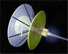

# Двигатель Бассарда
> 2019.05.12 [🚀](../index/index.md) [despace](index.md) → [PS](ps.md)

[TOC]

---

> <small>**Межзвёздный прямоточный двигатель Бассарда** — русскоязычный термин, не имеющий аналога в английском языке. **Bussard ramjet** — дословный перевод с русского на английский.</small>

**Межзвёздный прямоточный двигатель Бассарда (англ. Bussard ramjet)** — концепция ракетного двигателя для межзвёздных полётов, предложенная в 1960 году физиком Робертом Бассардом (Robert W. Bussard).

|Межзвёздный прямоточный двигатель Бассарда (поле коллектора показано видимым) в представлении художника|
|:--|
||

Основой концепции является захват вещества межзвёздной среды (водорода и пыли) идущим на высокой скорости космическим кораблём и использование этого вещества в качестве рабочего тела (либо непосредственно топлива) в термоядерном ракетном двигателе корабля. Захват вещества межзвёздной среды осуществляется мощным электромагнитным полем, в приближении имеющим конфигурацию широкой воронки, направленной вперёд по вектору скорости корабля. Предположительно, диаметр собирающего поля должен составлять тысячи или десятки тысяч километров. Существенной особенностью такой схемы будет являться практически полная топливная автономность корабля: будучи разогнанным имеющимся на борту запасом топлива до некоторой скорости, обеспечивающей достаточный приток межзвёздного водорода во входной коллектор, то есть после входа в «прямоточный режим», корабль сможет двигаться далее с постоянным ускорением, не выключая привода и не переходя на инерционный полёт.

Предложены два основных варианта использования захваченного межзвёздного водорода:

   1. В качестве рабочего тела для термоядерного ракетного двигателя, при собственном запасе термоядерного топлива на борту (RAIR).
   1. Непосредственно в качестве термоядерного топлива.

Основные проблемы:

   1. Ключевая проблема «прямоточника» также в том, что «магнитная воронка» отнюдь не будет выполнять функцию массозаборника так, как предполагалось автором концепции. Скорее, она будет вести себя как «тормоз».
   1. Ещё одним недостатком термоядерного прямоточного двигателя (даже на наиболее эффективном протон‑протонном цикле) является ограниченность скорости, которой может достичь оснащённый им корабль (не более 0.119 c = 35.7 тыс. ㎞/s).

 

## Docs & links (TRANSLATEME ALREADY)
|Navigation|
|:--|
|**[FAQ](faq.md)**, **[Cable](cable.md)**·БКС, **[Camera](cam.md)**·Камера, **[Comms](comms.md)**·Радио, **[Contact](contact.md)**·Контакт, **[Control](control.md)**·Упр., **[Doc](doc.md)**·Док., **[Doppler](doppler.md)**·ИСР, **[DS](ds.md)**·ЗУ, **[EB](eb.md)**·ХИТ, **[ECO](ecology.md)**·Экол., **[EF](ef.md)**·ВВФ, **[ElC](elc.md)**·ЭКБ, **[EMC](emc.md)**·ЭМС, **[Error](error.md)**·Ошибки, **[Event](event.md)**·События, **[FS](fs.md)**·ТЭО, **[Fuel](fuel.md)**·Топливо, **[GNC](gnc.md)**·БКУ, **[GS](scs.md)**·НС, **[HF&E](hfe.md)**·Эрго., **[IU](iu.md)**·Гиро., **[KT](kt.md)**·КТЕХ, **[LAG](lag.md)**·ПУC, **[LES](les.md)**·САСП, **[LS](ls.md)**·СЖО, **[LV](lv.md)**·РН, **[MCC](mcc.md)**·ЦУП, **[Model](model.md)**·Модель, **[MSC](sc.md)**·ПКА, **[N&B](nnb.md)**·БНО, **[NR](nr.md)**·ЯР, **[OBC](obc.md)**·ЦВМ, **[OE](oe.md)**·БА, **[Pat.](патент.md)**·Патент, **[Proj.](project.md)**·Проект, **[PS](ps.md)**·ДУ, **[R&D](rnd.md)**·НИОКР, **[Robot](robotics.md)**·Робот, **[Rover](rover.md)**·Ровер, **[RTG](rtg.md)**·РИТЭГ, **[SARC](sarc.md)**·ПСК, **[Sensor](sensor.md)**·Датчик, **[SC](sc.md)**·КА, **[SCS](scs.md)**·КК, **[SGM](sgm.md)**·КММ, **[SI](si.md)**·СИ, **[Soft](soft.md)**·ПО, **[SP](sp.md)**·БС, **[Spaceport](spaceport.md)**·Космодр., **[SPS](sps.md)**·СЭС, **[SRRQ](srrq.md)**·БКНР, **[SSS](sss.md)**·ГЗУ, **[TCS](tcs.md)**·СОТР, **[Test](test.md)**·ЭО, **[Timeline](timeline.md)**·ЦГМ, **[TMS](tms.md)**·ТМС, **[TOR](tor.md)**·ТЗ, **[TRL](trl.md)**·УГТ|
|*Sections & pages*|
|**`Двигательная установка (ДУ):`**  [HTAE](htae.md) ┊ [TALOS](talos.md) ┊ [Баки топливные](fuel_tank.md) ┊ [Варп‑двигатель](warp_drive.md) ┊ [Газовый двигатель](cgt.md) ┊ [Гибридный двигатель](гбрд.md) ┊ [Двигатель Бассарда](bussard_ramjet.md) ┊ [ЖРД](lpr.md) ┊ [ИПТ](ing.md) ┊ [Ионный двигатель](иод.md) ┊ [Как считать топливо?](si.md) ┊ [КЗУ](cinu.md) ┊ [КХГ](cgs.md) ┊ [Номинал](nominal.md) ┊ [Мятый газ](exhsteam.md) ┊ [РДТТ](spr.md) ┊ [Сильфон](сильфон.md) ┊ [СОЗ](соз.md) ┊ [СОИС](соис.md) ┊ [Солнечный парус](солнечный_парус.md) ┊ [ТНА](turbopump.md) ┊ [Топливные мембраны](топливные_мембраны.md) ┊ [Топливные мешки](топливные_мешки.md) ┊ [Топливо](fuel.md) ┊ [Тяговооружённость](ttwr.md) ┊ [ТЯРД](тярд.md) ┊ [УИ](isp.md) ┊ [Фотонный двигатель](фотонный_двигатель.md) ┊ [ЭРД](epsp.md) ┊ [Эффект Оберта](oberth_eff.md) ┊ [ЯРД](ntr.md)|

   1. Docs: …
   1. Notable interwikies — …
   1. <https://en.wikipedia.org/wiki/Bussard_ramjet>
   1. <https://ru.wikipedia.org/wiki/Межзвёздный_прямоточный_двигатель_Бассарда>

