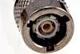
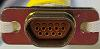

# Cables
> 2019.05.12 [🚀](../index/index.md) [despace](index.md) → [Cable](cable.md), [GNC](gnc.md)

[TOC]

---

> <small>**Cables, Onboard cables (OBC)** — EN term. **Бортовая кабельная сеть (БКС)** — RU analogue.</small>

**Бортовая кабельная сеть (БКС)** предназначена для электрического объединения отдельных приборов в системы и для электрического соединения систем между собой. Includes in common:

   1. Connectors
   1. Mounting elements
   1. Wires

По опыту [резервируются](reserve.md) следующие массы БКС КА от сухой массы КА: на этапе [АП](rnd_ap.md) — 12 ‑ 20 %, на этапе [ЭП](rnd_ep.md) — 7 ‑ 12 %. Среднестатистические массы:

   1. 1 погонного метра силового кабеля: 0.0133 ㎏;
   1. 1 разъёма: 0.015 ㎏.

**Manufacturers:**

| | |
|:--|:--|
|**AE**|…|
|**AU**|…|
|**CA**|・[Calian AT](contact/calian_at.md) — Cable Modulators|
|**CN**|…|
|**EU**|…|
|**IL**|…|
|**IN**|…|
|**JP**|…|
|**KR**|…|
|**RU**|・БКС КА производят все, кто производит КА ([ВНИИЭМ](contact/vniiem.md), [ИСС](contact/iss_r.md), [LAV](contact/lav.md) и т.д.)  ・межблочную БКС производят все, кто производит бортовую аппаратуру|
|**SA**|…|
|**SG**|…|
|**US**|…|
|**VN**|…|

## Connectors

|*Picture*|*Description*|
|:--|:--|
||[CAN](can.md)  (data exchange, only data‑link layer)|
|*No spec.*|[JTAG](jtag.md)  (testing)|
|*No spec.*|[LVDS](lvds.md)  (data exchange, physical layer only)|
||[MIL-STD-1553](mil_std_1553.md) (МКО)  (data exchange)|
||[RS-232](rs_xxx.md) (DB-25)  (data exchange)|
||[RS-422](rs_xxx.md) (DE-9)  (data exchange)|
||[RS-485](rs_xxx.md) (DE-9)  (data exchange)|
||[SpaceWire](spacewire.md)  (data exchange, currently **most perspective**)|

 

## Обжимная технология кабелей
> <small>**Обжимная технология кабелей** — русскоязычный термин. **Crimp technology for cables** — англоязычный эквивалент.</small>

**Обжимная технология кабелей** (обжимная технология бортовой кабельной сети, ОТБКС) — технология, при которой провода соединяются между собой не с помощью разъёмов, а при помощи соединения и сжатия.

Ниже приведены достоинства и недостатки ОТБКС по сравнению с распространёнными методами стыка на основе разъёмов.

**Достоинства:**

   1. простота и скорость сборки кабельной сети;
   1. бо́льшая ремонтопригодность.

**Недостатки:**

   1. меньшая устойчивость к физическим нагрузкам;
   1. как правило, бо́льшая масса;
   1. более жёсткие провода.

 

## Docs & links (TRANSLATEME ALREADY)
|Navigation|
|:--|
|**[FAQ](faq.md)**【**[SCS](scs.md)**·КК, **[SC (OE+SGM)](sc.md)**·КА】**[CON](contact.md)·[Pers](person.md)**·Контакт, **[Ctrl](control.md)**·Упр., **[Doc](doc.md)**·Док., **[EF](ef.md)**·ВВФ, **[Error](error.md)**·Ошибки, **[Event](event.md)**·События, **[FS](fs.md)**·ТЭО, **[HF&E](hfe.md)**·Эрго., **[KT](kt.md)**·КТ, **[Model](model.md)**·Модель, **[N&B](nnb.md)**·БНО, **[Project](project.md)**·Проект, **[QM](qm.md)**·БКНР, **[R&D](rnd.md)**·НИОКР, **[SI](si.md)**·СИ, **[Test](test.md)**·ЭО, **[TRL](trl.md)**·УГТ, **[Way](way.md)**·Пути|
|*Sections & pages*|
|**【[Cable](cable.md)】**  [CAN](can.md)・ [LVDS](lvds.md)・ [MIL‑STD‑1553](mil_std_1553.md)・ [RS‑232, 422, 485](rs_xxx.md)・ [SpaceWire](spacewire.md)・ [ОТБКС](cable.md)|
|**【[Guidance, Navigation & Control (GNC)](gnc.md)】**  [CAN](can.md)・ [LVDS](lvds.md)・ [MIL‑STD‑1553](mil_std_1553.md) (МКО)・ [RS‑232, 422, 485](rs_xxx.md)・ [SpaceWire](spacewire.md)・ [АСН, САН](ans.md)・ [БНО](nnb.md)[MIL‑STD‑1553](mil_std_1553.md) (МКО)[БАППТ](eas.md)・ [БКС](cable.md)・ [БУ](eas.md)・ [БШВ](time.md)・ [Гироскоп](iu.md)・ [Дальномер](doppler.md) (ИСР)・ [ДМ](iu.md)・ [ЗД](sensor.md)・ [Компьютер](obc.md) (ЦВМ, БЦВМ)・ [Магнитометр](sensor.md)・ [МИХ](mic.md)・ [МКО](mil_std_1553.md)・ [ПО](soft.md)・ [ПНА, ПОНА, ПСНА](devd.md)・ [СД](sensor.md)・ [Система координат](coord_sys.md)・ [СОСБ](devd.md)|

   1. Docs: …
