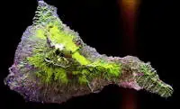

# Camera
> 2019.12.16 [🚀](../index/index.md) [despace](index.md) → [Camera](cam.md)

**Table of contents:**

[TOC]

---

> <small>**Камера** — русскоязычный термин. **Camera** — англоязычный эквивалент.</small>

**Камера** — устройство для регистрации подвижных (получение видео) и неподвижных изображений (получения фотографий). Также камерой является **РСА** — [радар с синтезированной апертурой](cam.md), **SAR** — synthetic-aperture radar.

| |*[Фирма](contact.md)*|*Модели камер (масса, ㎏)*|
|:-|:-|:-|:-|
|**RU**|[ИКИ РАН](contact/iki_ras.md)|[ЛСТК](cam_lst.md) (8)・ [МСУ-100](cam_lst.md) (3.2)・ [МСУ-50](cam_lst.md) (2.5)・ [ВТК-10,15](cam_lst.md) (0.7)  **`Исторические:`** *[ТСНН УТК](cam_lst.md) (2.7)・[ТСНН ШТК](cam_lst.md) (1.7)*|
|•|• • • • • • • •|• • •|
|**US**|[Ball A&T](contact/ball_at.md)|[…](.md) ()・ […](.md) ()|
| |[Space Micro](space_micro.md)|[4K Space Camera](cam_lst.md) (1.75)・ [5MP Space Camera](cam_lst.md) (1)|

【**Table.** Manufacturers】

| | |
|:-|:-|
|**AE**|…|
|**AU**|…|
|**CA**|・[Canadensys](contact/canadensys.md)  ・[GHGSat](contact/ghgsat.md) — imaging interferometers for Cubesats  ・[Macfab](contact/macfab.md)  ・[MDA](contact/mda.md)  ・[Sinclair Interplanetary](contact/sinclair_ip.md)  ・[Thoth Tech.](contact/thoth_tech.md) — cameras, spectrometers|
|**CN**|…|
|**EU**|…|
|**IL**|…|
|**IN**|…|
|**JP**|・[Hamamatsu Photonics](contact/hamamatsu_phot.md)|
|**KR**|…|
|**RU**|…|
|**SA**|…|
|**SG**|…|
|**US**|・**Ball Aerospace**, <http://www.ballaerospace.com>  ・<https://en.wikipedia.org/wiki/Malin_Space_Science_Systems>|
|**VN**|…|

## Радар с синтезированной апертурой
> <small>**Радар с синтезированной апертурой (РСА)** — русскоязычный термин. **Synthetic-aperture radar (SAR)** — англоязычный эквивалент.</small>

**Synthetic-aperture radar (SAR)** is a form of radar that is used to create two‑dimensional images or three‑dimensional reconstructions of objects, such as landscapes.

  
*This radar image acquired by the SIR-C/X-SAR radar on board the Space Shuttle Endeavour shows the Teide volcano. The city of Santa Cruz de Tenerife is visible as the purple & white area on the lower right edge of the island. Lava flows at the summit crater appear in shades of green & brown, while vegetation zones appear as areas of purple, green & yellow on the volcano’s flanks.*

SAR uses the motion of the radar antenna over a target region to provide finer spatial resolution than conventional beam‑scanning radars. SAR is typically mounted on a moving platform, such as an aircraft or spacecraft, & has its origins in an advanced form of side looking airborne radar (SLAR). The distance the SAR device travels over a target in the time taken for the radar pulses to return to the antenna creates the large synthetic antenna aperture (the size of the antenna). Typically, the larger the aperture, the higher the image resolution will be, regardless of whether the aperture is physical (a large antenna) or synthetic (a moving antenna) — this allows SAR to create high‑resolution images with comparatively small physical antennas. Additionally, SAR has the property of having larger apertures for more distant objects, allowing consistent spatial resolution over a range of viewing distances.

To create a SAR image, successive pulses of radio waves are transmitted to «illuminate» a target scene, & the echo of each pulse is received & recorded. The pulses are transmitted & the echoes received using a single beam‑forming antenna, with wavelengths of a meter down to several millimeters. As the SAR device on board the aircraft or spacecraft moves, the antenna location relative to the target changes with time. Signal processing of the successive recorded radar echoes allows the combining of the recordings from these multiple antenna positions. This process forms the synthetic antenna aperture & allows the creation of higher‑resolution images than would otherwise be possible with a given physical antenna.

**Motivation & applications**

SAR is capable of high‑resolution remote sensing, independent of flight altitude, & independent of weather, as SAR can select frequencies to avoid weather‑caused signal attenuation. SAR has day & night imaging capability as illumination is provided by the SAR.

SAR images have wide application in remote sensing & mapping of surfaces of the Earth & other planets. Applications of SAR include topography, oceanography, glaciology, geology (for example, terrain discrimination & subsurface imaging), & forestry, including forest height, biomass, deforestation. Volcano & earthquake monitoring use differential interferometry. SAR can also be applied for monitoring civil infrastructure stability such as bridges. SAR is useful in environment monitoring such as oil spills, flooding, urban growth, global change & military surveillance, including strategic policy & tactical assessment. SAR can be implemented as inverse SAR by observing a moving target over a substantial time with a stationary antenna.

 

## Docs & links (TRANSLATEME ALREADY)
|Navigation|
|:-|
|**[FAQ](faq.md)**, **[Cable](cable.md)**·БКС, **[Camera**·Kамера, **[Comms](comms.md)**·Радио, **[CON](contact.md)·[Pers](person.md)**·Контакт, **[Control](control.md)**·Упр., **[Doc](doc.md)**·Док., **[Doppler](doppler.md)**·ИСР, **[DS](ds.md)**·ЗУ, **[EB](eb.md)**·ХИТ, **[ECO](ecology.md)**·Экол., **[EF](ef.md)**·ВВФ, **[ElC](elc.md)**·ЭКБ, **[EMC](emc.md)**·ЭМС, **[Error](error.md)**·Ошибки, **[Event](event.md)**·События, **[FS](fs.md)**·ТЭО, **[Fuel](ps.md)**·Топливо, **[GNC](gnc.md)**·БКУ, **[GS](scs.md)**·НС, **[HF&E](hfe.md)**·Эрго., **[IU](iu.md)**·Гиро., **[KT](kt.md)**·КТЕХ, **[LAG](lag.md)**·ПУC, **[LES](les.md)**·САСП, **[LS](ls.md)**·СЖО, **[LV](lv.md)**·РН, **[MCC](scs.md)**·ЦУП, **[Model](drawing.md)**·Модель, **[MSC](sc.md)**·ПКА, **[N&B](nnb.md)**·БНО, **[NR](nr.md)**·ЯР, **[OBC](obc.md)**·ЦВМ, **[OE](sc.md)**·БА, **[Pat.](patent.md)**·Патент, **[Proj.](project.md)**·Проект, **[PS](ps.md)**·ДУ, **[QA](qm.md)**·БКНР, **[R&D](rnd.md)**·НИОКР, **[Robot](robot.md)**·Робот, **[Rover](robot.md)**·Ровер, **[RTG](rtg.md)**·РИТЭГ, **[SARC](sarc.md)**·ПСК, **[SE](se.md)**·СЭ, **[Sens.](sensor.md)**·Датч., **[SC](sc.md)**·КА, **[SCS](scs.md)**·КК, **[SGM](sc.md)**·KММ, **[SI](si.md)**·СИ, **[Soft](soft.md)**·ПО, **[SP](sp.md)**·БС, **[Spaceport](spaceport.md)**·Космодр., **[SPS](sps.md)**·СЭС, **[SSS](sss.md)**·ГЗУ, **[TCS](tcs.md)**·СОТР, **[Test](test.md)**·ЭО, **[Timeline](timeline.md)**·ЦГМ, **[TMS](tms.md)**·ТМС, **[TOR](tor.md)**·ТЗ, **[TRL](trl.md)**·УГТ|
|*Sections & pages*|
|**`Камера:`**  [SAR](cam.md)  • • •  **РФ:** … () ┊ … ()  ▮  **США:** … () ┊ … ()|

   1. Docs: …
   1. <https://en.wikipedia.org/wiki/Synthetic-aperture_radar>
