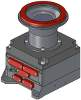
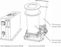
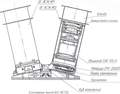
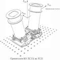
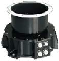
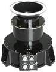
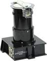
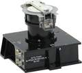
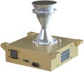
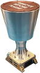

# Камера
> 2019.12.16 [🚀](../index/index.md) [despace](index.md) → **[Камера**

[TOC]

---

> <small>**Камера** — русскоязычный термин. **Camera** — англоязычный эквивалент.</small>

**Камера** — устройство для регистрации подвижных (получение видео) и неподвижных изображений (получения фотографий). Также камерой является **РСА** — [радар с синтезированной апертурой](sar.md), **SAR** — synthetic-aperture radar.

| |*[Фирма](contact.md)*|*Модели камер (масса, ㎏)*|
|:--|:--|:--|:--|
|**RU**|[ИКИ РАН](zz_iki_ras.md)|ЛСТК (8)・ МСУ-100 (3.2)・ МСУ-50 (2.5)・ ВТК-10,15 (0.7)  **`Исторические:`** *ТСНН УТК (2.7)・ТСНН ШТК (1.7)*|
|•|• • • • • • • •|• • •|
|**US**|[Ball A&T](zz_ball_at.md)|[…](.md) ()・ […](.md) ()|
| |[Space Micro](space_micro.md)|4K Space Camera (1.75)・ 5MP Space Camera (1)|

**Manufacturers**

| | |
|:--|:--|
|**Australia**|…|
|**Canada**|・[Canadensys](zz_canadensys.md)  ・[GHGSat](zz_ghgsat.md) — imaging interferometers for Cubesats  ・[Macfab](zz_macfab.md)  ・[MDA](zz_mda.md)  ・[Sinclair Interplanetary](zz_sinclair_ip.md)  ・[Thoth Tech.](zz_thoth_tech.md) — cameras, spectrometers|
|**China**|…|
|**Europe**|…|
|**India**|…|
|**Israel**|…|
|**Japan**|・[Hamamatsu Photonics](zz_hamamatsu_phot.md)|
|**Korea S.**|…|
|**Russia**|…|
|**Saudi Ar.**|…|
|**Singapore**|…|
|**USA**|・**Ball Aerospace**, <http://www.ballaerospace.com>  ・<https://en.wikipedia.org/wiki/Malin_Space_Science_Systems>|
|**UAE**|…|
|**Vietnam**|…|

 

## (RU) IKI RAS

 

### ВТК
> <small>**Внешняя телевизионная камера (ВТК)** — русскоязычный термин, не имеющий аналога в английском языке. **Outer television camera (VTK)** — дословный перевод с русского на английский.</small>

**Внешняя телевизионная камера (ВТК)** — оптическая камера, предназначенная для фото‑видеосъёмки. Разработчик [ИКИ РАН](ики_ран.md). Разработано в <mark>TBD</mark> году.

|*•  Характеристика  •*|*[Значение](si.md) <small>(ВТК-10)</small>*|*[Значение](si.md) <small>(ВТК-50)</small>*|
|:--|:--|:--|
|[TRL](trl.md)|6|6|
|Исполнение| | |
|Объектив|КМОП-матрица|КМОП-матрица|
|Поле зрения, °|17 × 9.6|76 × 47.45|
|Разрешение, пикс|1280 × 720|1280 × 720|
|Режимы съёмки| | |
|Частота, кадр/с|10 ‑ 25|10 ‑ 25|
|Яркость фона, ㏅/m²| | |
|**Etc:**|• • •|• • •|
|Consumption, W|5|5|
|Dimensions, ㎜|117 × 90 × 116|117 × 90 × 113|
|Interfaces|HD-SDI|HD-SDI|
|[Lifetime](lifetime.md), h (y)| | |
|Mass, ㎏|0.7|0.7|
|Overload, g| | |
|[Rad.resist](ion_rad.md), ㏉ (㎭)| | |
|[Reliability](qm.md)/[lifetime](lifetime.md)| | |
|Resource, h (y)| | |
|[Thermal range](tcs.md), ℃| | |
|[Voltage](voltage.md), V|27|27|
| |||

**Примечания:**

   - <http://ofo.ikiweb.ru/razrabotki/VTK.html>
   - <http://ofo.ikiweb.ru/razrabotki/digital-sputnik-cams.html>
   - ВТК ставится на внешнюю поверхность ПТК «Федерация» для контроля сближения с другими КА и для обзора окружающего пространства. Оснащена двумя идентичными независимыми камерами: узкоугольная ВТК‑10 и широкоугольная ВТК‑50. Каждая позволяет получать цифровую видеоинформацию в видимом и ближнем ИК диапазонах с частотой 25 кадров/с. Цифровой поток видеоданных передается в КА с целью отображения на дисплее пилота ПТК или дальнейшей трансляции в системы КА. Конструктивно каждая камера представляет собой негерметичный моноблок, который состоит из видеоэлектронного блока и объектива. В ВТК‑10 используется узкоугольный объектив с фокусным расстоянием 23 мм, в ВТК‑50 — широкоугольный объектив с фокусным расстоянием 4.5 мм. Видеоэлектронный блок содержит источник вторичного питания и модуль электроники. Имеется встроенный процессор, обеспечивающий обработку видеопотока и автоматическую регулировку экспозиции, высокоскоростного интерфейса HD‑SDI по стандарту SMPTE ST 292‑1 и вторичного источника питания, обеспечивающего работу от бортовой сети +27В.
   - **Применяемость:**
      1. ПТК «Федерация»

 

### ЛСТК
> <small>**Лунная стереотопографическая камера (ЛСТК)** — русскоязычный термин, не имеющий аналога в английском языке. **Lunar stereotopographic camera (LSTK)** — дословный перевод с русского на английский.</small>

**Лунная стереотопографическая камера (ЛСТК)** — оптическая камера, предназначенная для фото‑видеосъёмки. Разработчик [ИКИ РАН](zz_iki_ras.md). Разработано в <mark>TBD</mark> году разработка (на основе [ТСНН УТК и [ТСНН ШТК)

|*•  Характеристика  •*|*[Значение](si.md) <small>(ЛСТК)</small>*|
|:--|:--|
|[TRL](trl.md)|4|
|Исполнение| |
|Объектив| |
|Поле зрения, °|14.6 × 11|
|Разрешение, пикс|5120 × 3840 × 2|
|Режимы съёмки|фотосъёмка|
|Частота, кадр/с|0.3|
|Яркость фона, ㏅/m²| |
|**Etc:**|• • •|
|Consumption, W|21|
|Dimensions, ㎜|ОБ 285 × 340 × 166, БЭ 254 × 80 × 150|
|Interfaces| |
|[Lifetime](lifetime.md), h (y)|26 280 (3)|
|Mass, ㎏|8 (6 ОБ, 2 БЭ)|
|Overload, g| |
|[Rad.resist](ion_rad.md), ㏉ (㎭)|200 (20 000)|
|[Reliability](qm.md)/[lifetime](lifetime.md)|0.96|
|Resource, h (y)|10 000 (1.14)|
|[Thermal range](tcs.md), ℃|−20 ‑ +50|
|[Voltage](voltage.md), V|27|
| |   |

 

### МСУ-50
> <small>**Многозональное сканирующее устройство (МСУ-50)** — русскоязычный термин, не имеющий аналога в английском языке. **Multizones scanning device (MSU-50)** — дословный перевод с русского на английский.</small>

**Многозональное сканирующее устройство (МСУ-50)** — оптическая камера, предназначенная для фото‑видеосъёмки. Разработчик [ИКИ РАН](zz_iki_ras.md). Разработано в 2008 году активное применение

|*•  Характеристика  •*|*[Значение](si.md) <small>(МСУ-50)</small>*|
|:--|:--|
|[TRL](trl.md)|9|
|Исполнение| |
|Объектив| |
|Поле зрения, °|58.5|
|Разрешение, пикс|1 × 7926|
|Режимы съёмки| |
|Частота, кадр/с| |
|Яркость фона, ㏅/m²| |
|**Etc:**|• • •|
|Consumption, W|7|
|Dimensions, ㎜| |
|Interfaces|[MIL-STD-1553](mil_std_1553.md)|
|[Lifetime](lifetime.md), h (y)| |
|Mass, ㎏|2.5|
|Overload, g| |
|[Rad.resist](ion_rad.md), ㏉ (㎭)| |
|[Reliability](qm.md)/[lifetime](lifetime.md)| |
|Resource, h (y)| |
|[Thermal range](tcs.md), ℃| |
|[Voltage](voltage.md), V| |
| |  |

**Примечания:**

   - <http://ofo.ikiweb.ru/msu.php>
   - **Применяемость:**
      1. "Метеор‑М" №1

 

### МСУ-100
> <small>**Многозональное сканирующее устройство (МСУ-100)** — русскоязычный термин, не имеющий аналога в английском языке. **Multizones scanning device (MSU-100)** — дословный перевод с русского на английский.</small>

**Многозональное сканирующее устройство (МСУ-100)** — оптическая камера, предназначенная для фото‑видеосъёмки. Разработчик [ИКИ РАН](zz_iki_ras.md). Разработано в 2008 году активное применение

|*•  Характеристика  •*|*[Значение](si.md) <small>(МСУ-100)</small>*|
|:--|:--|
|[TRL](trl.md)|9|
|Исполнение| |
|Объектив| |
|Поле зрения, °|31.3|
|Разрешение, пикс|1 × 7926|
|Режимы съёмки| |
|Частота, кадр/с| |
|Яркость фона, ㏅/m²| |
|**Etc:**|• • •|
|Consumption, W|7|
|Dimensions, ㎜| |
|Interfaces|[MIL-STD-1553](mil_std_1553.md)|
|[Lifetime](lifetime.md), h (y)| |
|Mass, ㎏|3.2|
|Overload, g| |
|[Rad.resist](ion_rad.md), ㏉ (㎭)| |
|[Reliability](qm.md)/[lifetime](lifetime.md)| |
|Resource, h (y)| |
|[Thermal range](tcs.md), ℃| |
|[Voltage](voltage.md), V| |
| |  |

**Примечания:**

   - <http://ofo.ikiweb.ru/msu.php>
   - **Применяемость:**
      1. "Метеор‑М" №1

 

### (Архив) ТСНН УТК
> <small>**Телевизионная система навигации и наблюдения, узкоугольная камера (ТСНН УТК)** — русскоязычный термин, не имеющий аналога в английском языке. **TV system for navigation and observations, small-angle camera (TSNN UTK)** — дословный перевод с русского на английский.</small>

**Телевизионная система навигации и наблюдения, узкоугольная камера (ТСНН УТК)** — оптическая камера, предназначенная для фото‑видеосъёмки. Разработчик [ИКИ РАН](zz_iki_ras.md). Разработано в 2010 году архивное изделие

|*•  Характеристика  •*|*[Значение](si.md) <small>(ТСНН УТК)</small>*|
|:--|:--|
|[TRL](trl.md)|9|
|Исполнение| |
|Объектив| |
|Поле зрения, °|0.85|
|Разрешение, пикс|1000 × 1000, 3.04″, ПЗС|
|Режимы съёмки| |
|Частота, кадр/с| |
|Яркость фона, ㏅/m²| |
|**Etc:**|• • •|
|Consumption, W|8|
|Dimensions, ㎜| |
|Interfaces| |
|[Lifetime](lifetime.md), h (y)| |
|Mass, ㎏|2.7|
|Overload, g| |
|[Rad.resist](ion_rad.md), ㏉ (㎭)| |
|[Reliability](qm.md)/[lifetime](lifetime.md)| |
|Resource, h (y)| |
|[Thermal range](tcs.md), ℃| |
|[Voltage](voltage.md), V| |
| ||

**Примечания:**

   - <http://ofo.ikiweb.ru/tsnn.php>
   - **Применяемость:**
      1. Фобос‑Грунт

 

### (Архив) ТСНН ШТК
> <small>**Телевизионная система навигации и наблюдения, широкоугольная камера (ТСНН ШТК)** — русскоязычный термин, не имеющий аналога в английском языке. **TV system for navigation and observations, wide-angle camera (TSNN SHTK)** — дословный перевод с русского на английский.</small>

**Телевизионная система навигации и наблюдения, широкоугольная камера (ТСНН ШТК)** — оптическая камера, предназначенная для фото‑видеосъёмки. Разработчик [ИКИ РАН](zz_iki_ras.md). Разработано в 2010 году архивное изделие

|*•  Характеристика  •*|*[Значение](si.md) <small>(ТСНН ШТК)</small>*|
|:--|:--|
|[TRL](trl.md)|9|
|Исполнение| |
|Объектив| |
|Поле зрения, °|23.3|
|Разрешение, пикс|1000 × 1000, 84.8″, ПЗС|
|Режимы съёмки| |
|Частота, кадр/с| |
|Яркость фона, ㏅/m²| |
|**Etc:**|• • •|
|Consumption, W|8|
|Dimensions, ㎜| |
|Interfaces| |
|[Lifetime](lifetime.md), h (y)| |
|Mass, ㎏|1.7|
|Overload, g| |
|[Rad.resist](ion_rad.md), ㏉ (㎭)| |
|[Reliability](qm.md)/[lifetime](lifetime.md)| |
|Resource, h (y)| |
|[Thermal range](tcs.md), ℃| |
|[Voltage](voltage.md), V| |
| ||

**Примечания:**

   - <http://ofo.ikiweb.ru/tsnn.php>
   - **Применяемость:**
      1. Фобос‑Грунт

 

## (US) Space Micro

 

### 4K Space Camera
> <small>**4K Space Camera** — англоязычный термин, не имеющий аналога в русском языке. **4К космическая камера** — дословный перевод с английского на русский.</small>

**4K Space Camera** — оптическая камера, предназначенная для фото‑видеосъёмки. Разработчик [Space Micro](space_micro.md). Разработано ранее 2017 года. Активное применение.

|*•  Характеристика  •*|*[Значение](si.md) <small>(4K Space Camera)</small>*|
|:--|:--|
|[TRL](trl.md)|9|
|Исполнение|1 ОБ, 1 БЭ|
|Объектив| |
|Поле зрения, °|80|
|Разрешение, пикс|12МП: 4 096 × 3 076, 12 bit Bayer|
|Режимы съёмки|Still Image Capture, 4K Video|
|Частота, кадр/с|130|
|Яркость фона, ㏅/m²| |
|**Etc:**|• • •|
|Consumption, W|60|
|Dimensions, ㎜|165 × 178 × 153|
|Interfaces|До 100 Гб/с: CAUI, CAN|
|[Lifetime](lifetime.md), h (y)|НОО: 43 800 (5)|
|Mass, ㎏|1.75|
|Overload, gRMS|10|
|[Rad.resist](ion_rad.md), ㏉ (㎭)|300 (30 000)|
|[Reliability](qm.md)/[lifetime](lifetime.md)|0.995, [NASA PSL](nasa_psl.md) Lv.1,2,3|
|Resource, h (y)| |
|[Thermal range](tcs.md), ℃|−10 ‑ +50|
|[Voltage](voltage.md), V|28 (22 ‑ 34)|
| ||

**Примечания:**

   - <https://www.spacemicro.com/products/guidance-and-navigation.html>
   - [4K Space Camera datasheet ❐](f/cam/nmb/4k_space_camera_datasheet.pdf)
   - **Применяемость:**
      1. …

 

### 5MP Space Camera
> <small>**5MP Space Camera** — англоязычный термин, не имеющий аналога в русском языке. **5МП космическая камера** — дословный перевод с английского на русский.</small>

**5MP Space Camera** — оптическая камера, предназначенная для фото‑видеосъёмки. Разработчик [Space Micro](space_micro.md). Разработано ранее 2017 года. Активное применение.

|*•  Характеристика  •*|*[Значение](si.md) <small>(5MP Space Camera)</small>*|
|:--|:--|
|[TRL](trl.md)| 9 |
|Исполнение| |
|Объектив| |
|Поле зрения, °|29, 39, 80 (custom FOV available)|
|Разрешение, пикс|5МП: 2 560 × 2 160, RGB/Monochrome, 22 bits (2 × 11‑bit)|
|Режимы съёмки|Still Image Capture|
|Частота, кадр/с|100 (Rolling Shutter), 50 (Global Shutter)|
|Яркость фона, ㏅/m²| |
|**Etc:**|• • •|
|Consumption, W|4|
|Dimensions, ㎜|107 × 84 × 238|
|Interfaces|SpaceWire 80 Mbps|
|[Lifetime](lifetime.md), h (y)|ГСО: 87 600 (10)|
|Mass, ㎏|1|
|Overload, gRMS|20|
|[Rad.resist](ion_rad.md), ㏉ (㎭)|300 (30 000)|
|[Reliability](qm.md)/[lifetime](lifetime.md)|[NASA PSL](nasa_psl.md) Lv.1,2,3|
|Resource, h (y)| |
|[Thermal range](tcs.md), ℃|−20 ‑ +55|
|[Voltage](voltage.md), V|5|
| ||

**Примечания:**

   - <https://www.spacemicro.com/products/guidance-and-navigation.html>
   - [5MP Space Camera datasheet ❐](f/cam/nmb/5mp_space_camera_datasheet.pdf)
   - **Применяемость:**
      1. …

 

## Docs & links (TRANSLATEME ALREADY)
|Navigation|
|:--|
|**[FAQ](faq.md)**, **[Cable](cable.md)**·БКС, **[Camera**·Камера, **[Comms](comms.md)**·Радио, **[CON](contact.md)·[Pers](person.md)**·Контакт, **[Control](control.md)**·Упр., **[Doc](doc.md)**·Док., **[Doppler](doppler.md)**·ИСР, **[DS](ds.md)**·ЗУ, **[EB](eb.md)**·ХИТ, **[ECO](ecology.md)**·Экол., **[EF](ef.md)**·ВВФ, **[ElC](elc.md)**·ЭКБ, **[EMC](emc.md)**·ЭМС, **[Error](error.md)**·Ошибки, **[Event](event.md)**·События, **[FS](fs.md)**·ТЭО, **[Fuel](fuel.md)**·Топливо, **[GNC](gnc.md)**·БКУ, **[GS](scs.md)**·НС, **[HF&E](hfe.md)**·Эрго., **[IU](iu.md)**·Гиро., **[KT](kt.md)**·КТЕХ, **[LAG](lag.md)**·ПУC, **[LES](les.md)**·САСП, **[LS](ls.md)**·СЖО, **[LV](lv.md)**·РН, **[MCC](mcc.md)**·ЦУП, **[Model](model.md)**·Модель, **[MSC](sc.md)**·ПКА, **[N&B](nnb.md)**·БНО, **[NR](nr.md)**·ЯР, **[OBC](obc.md)**·ЦВМ, **[OE](oe.md)**·БА, **[Pat.](патент.md)**·Патент, **[Proj.](project.md)**·Проект, **[PS](ps.md)**·ДУ, **[QA](qm.md)**·БКНР, **[R&D](rnd.md)**·НИОКР, **[Robot](robotics.md)**·Робот, **[Rover](rover.md)**·Ровер, **[RTG](rtg.md)**·РИТЭГ, **[SARC](sarc.md)**·ПСК, **[SE](se.md)**·СЭ, **[Sens.](sensor.md)**·Датч., **[SC](sc.md)**·КА, **[SCS](scs.md)**·КК, **[SGM](sgm.md)**·КММ, **[SI](si.md)**·СИ, **[Soft](soft.md)**·ПО, **[SP](sp.md)**·БС, **[Spaceport](spaceport.md)**·Космодр., **[SPS](sps.md)**·СЭС, **[SSS](sss.md)**·ГЗУ, **[TCS](tcs.md)**·СОТР, **[Test](test.md)**·ЭО, **[Timeline](timeline.md)**·ЦГМ, **[TMS](tms.md)**·ТМС, **[TOR](tor.md)**·ТЗ, **[TRL](trl.md)**·УГТ|
|*Sections & pages*|
|**`Камера:`**  [SAR](sar.md)  • • •  **РФ:** … () ┊ … ()  ▮  **США:** … () ┊ … ()|

   1. Docs:
      - [Камера, template](template_camera.md)
   1. Notable interwikies — …
   1. <…>
