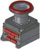
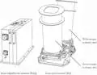
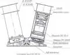
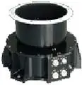
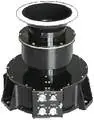
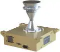
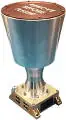
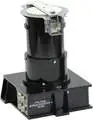
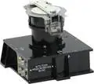

# Camera (a list)
> 2019.12.16 [🚀](../index/index.md) [despace](index.md) → [Camera](cam.md)

[TOC]

---

A list of [Cameras](cam.md).

## Current

 

### ВТК
> <small>**Внешняя телевизионная камера (ВТК)** — русскоязычный термин, не имеющий аналога в английском языке. **Outer television camera (VTK)** — дословный перевод с русского на английский.</small>

**Внешняя телевизионная камера (ВТК)** — оптическая камера, предназначенная для фото‑видеосъёмки. Разработчик [ИКИ РАН](ики_ран.md). Разработано в <mark>TBD</mark> году.

|*Characteristics*|*[Value](si.md)  (ВТК-10)*|*[Value](si.md)  (ВТК-50)*|
|:-|:-|:-|
|Composition| | |
|Consumption, W|5|5|
|Dimensions, ㎜|117 × 90 × 116|117 × 90 × 113|
|[Interfaces](interface.md)|HD-SDI|HD-SDI|
|[Lifetime](lifetime.md)/Resource, h(y)| | |
|Mass, ㎏|0.7|0.7|
|[Overload](vibration.md), Grms| | |
|[Rad.resist](ion_rad.md), ㏉ (㎭)| | |
|[Reliability](qm.md) per [lifetime](lifetime.md)|… / …|… / …|
|[Thermal range](tcs.md), ℃| | |
|[TRL](trl.md)|6|6|
|[Voltage](sps.md), V|27|27|
|**【Specific】**|• • •|• • •|
|Back. brightn., ㏅/m²| | |
|[FOV](fov.md), °|17 × 9.6|76 × 47.45|
|Frequency, frame/s|10 ‑ 25|10 ‑ 25|
|Lens|КМОП-матрица|КМОП-матрица|
|Resolution, px|1280 × 720|1280 × 720|
|Shooting modes| | |
| |||

**Notes:**

   1. <http://ofo.ikiweb.ru/razrabotki/VTK.html>
   1. <http://ofo.ikiweb.ru/razrabotki/digital-sputnik-cams.html>
   1. ВТК ставится на внешнюю поверхность ПТК «Федерация» для контроля сближения с другими КА и для обзора окружающего пространства. Оснащена двумя идентичными независимыми камерами: узкоугольная ВТК‑10 и широкоугольная ВТК‑50. Каждая позволяет получать цифровую видеоинформацию в видимом и ближнем ИК диапазонах с частотой 25 кадров/с. Цифровой поток видеоданных передается в КА с целью отображения на дисплее пилота ПТК или дальнейшей трансляции в системы КА. Конструктивно каждая камера представляет собой негерметичный моноблок, который состоит из видеоэлектронного блока и объектива. В ВТК‑10 используется узкоугольный объектив с фокусным расстоянием 23 ㎜, в ВТК‑50 — широкоугольный объектив с фокусным расстоянием 4.5 ㎜. Видеоэлектронный блок содержит источник вторичного питания и модуль электроники. Имеется встроенный процессор, обеспечивающий обработку видеопотока и автоматическую регулировку экспозиции, высокоскоростного интерфейса HD‑SDI по стандарту SMPTE ST 292‑1 и вторичного источника питания, обеспечивающего работу от бортовой сети +27В.
   1. **Applicability:** ПТК «Федерация»

 

### ЛСТК
> <small>**Лунная стереотопографическая камера (ЛСТК)** — русскоязычный термин, не имеющий аналога в английском языке. **Lunar stereotopographic camera (LSTK)** — дословный перевод с русского на английский.</small>

**Лунная стереотопографическая камера (ЛСТК)** — оптическая камера, предназначенная для фото‑видеосъёмки. Разработчик [ИКИ РАН](contact/iki_ras.md). Разработано в <mark>TBD</mark> году разработка (на основе [ТСНН УТК и [ТСНН ШТК)

|*Characteristics*|*[Value](si.md)  (ЛСТК)*|
|:-|:-|
|Composition| |
|Consumption, W|21|
|Dimensions, ㎜|ОБ 285 × 340 × 166, БЭ 254 × 80 × 150|
|[Interfaces](interface.md)| |
|[Lifetime](lifetime.md)/Resource, h(y)|26 280 (3) / 10 000 (1.14)|
|Mass, ㎏|8 (6 ОБ, 2 БЭ)|
|[Overload](vibration.md), Grms| |
|[Rad.resist](ion_rad.md), ㏉ (㎭)|200 (20 000)|
|[Reliability](qm.md) per [lifetime](lifetime.md)|0.96|
|[Thermal range](tcs.md), ℃|−20 ‑ +50|
|[TRL](trl.md)|4|
|[Voltage](sps.md), V|27|
|**【Specific】**|• • •|
|Back. brightn., ㏅/m²| |
|[FOV](fov.md), °|14.6 × 11|
|Frequency, frame/s|0.3|
|Lens| |
|Resolution, px|5120 × 3840 × 2|
|Shooting modes|фотосъёмка|
| |   |

 

### МСУ-50
> <small>**Многозональное сканирующее устройство (МСУ-50)** — русскоязычный термин, не имеющий аналога в английском языке. **Multizones scanning device (MSU-50)** — дословный перевод с русского на английский.</small>

**Многозональное сканирующее устройство (МСУ-50)** — оптическая камера, предназначенная для фото‑видеосъёмки. Разработчик [ИКИ РАН](contact/iki_ras.md). Разработано в 2008 году активное применение

|*Characteristics*|*[Value](si.md)  (МСУ-50)*|
|:-|:-|
|Composition| |
|Consumption, W|7|
|Dimensions, ㎜| |
|[Interfaces](interface.md)|[MIL-STD-1553](mil_std_1553.md)|
|[Lifetime](lifetime.md)/Resource, h(y)|… / …|
|Mass, ㎏|2.5|
|[Overload](vibration.md), Grms| |
|[Rad.resist](ion_rad.md), ㏉ (㎭)| |
|[Reliability](qm.md) per [lifetime](lifetime.md)| |
|[Thermal range](tcs.md), ℃| |
|[TRL](trl.md)|9|
|[Voltage](sps.md), V| |
|**【Specific】**|• • •|
|Back. brightn., ㏅/m²| |
|[FOV](fov.md), °|58.5|
|Frequency, frame/s| |
|Lens| |
|Resolution, px|1 × 7926|
|Shooting modes| |
| |  |

**Notes:**

   1. <http://ofo.ikiweb.ru/msu.php>
   1. **Applicability:** Метеор‑М №1

 

### МСУ-100
> <small>**Многозональное сканирующее устройство (МСУ-100)** — русскоязычный термин, не имеющий аналога в английском языке. **Multizones scanning device (MSU-100)** — дословный перевод с русского на английский.</small>

**Многозональное сканирующее устройство (МСУ-100)** — оптическая камера, предназначенная для фото‑видеосъёмки. Разработчик [ИКИ РАН](contact/iki_ras.md). Разработано в 2008 году активное применение

|*Characteristics*|*[Value](si.md)  (МСУ-100)*|
|:-|:-|
|Composition| |
|Consumption, W|7|
|Dimensions, ㎜| |
|[Interfaces](interface.md)|[MIL-STD-1553](mil_std_1553.md)|
|[Lifetime](lifetime.md)/Resource, h(y)|… / …|
|Mass, ㎏|3.2|
|[Overload](vibration.md), Grms| |
|[Rad.resist](ion_rad.md), ㏉ (㎭)| |
|[Reliability](qm.md) per [lifetime](lifetime.md)| |
|[Thermal range](tcs.md), ℃| |
|[TRL](trl.md)|9|
|[Voltage](sps.md), V| |
|**【Specific】**|• • •|
|Back. brightn., ㏅/m²| |
|[FOV](fov.md), °|31.3|
|Frequency, frame/s| |
|Lens| |
|Resolution, px|1 × 7926|
|Shooting modes| |
| |  |

**Notes:**

   1. <http://ofo.ikiweb.ru/msu.php>
   1. **Applicability:** Метеор‑М №1

 

### 4K Space Camera
> <small>**4K Space Camera** — англоязычный термин, не имеющий аналога в русском языке. **4К космическая камера** — дословный перевод с английского на русский.</small>

**4K Space Camera** — оптическая камера, предназначенная для фото‑видеосъёмки. Разработчик [Space Micro](space_micro.md). Разработано ранее 2017 года. Активное применение.

|*Characteristics*|*[Value](si.md)  (4K Space Camera)*|
|:-|:-|
|Composition|1 ОБ, 1 БЭ|
|Consumption, W|60|
|Dimensions, ㎜|165 × 178 × 153|
|[Interfaces](interface.md)|До 100 Гб/с: CAUI, CAN|
|[Lifetime](lifetime.md)/Resource, h(y)|НОО: 43 800 (5) / …|
|Mass, ㎏|1.75|
|[Overload](vibration.md), Grms|10|
|[Rad.resist](ion_rad.md), ㏉ (㎭)|300 (30 000)|
|[Reliability](qm.md) per [lifetime](lifetime.md)|0.995, [NASA PSL](nasa_psl.md) Lv.1,2,3|
|[Thermal range](tcs.md), ℃|−10 ‑ +50|
|[TRL](trl.md)|9|
|[Voltage](sps.md), V|28 (22 ‑ 34)|
|**【Specific】**|• • •|
|Back. brightn., ㏅/m²| |
|[FOV](fov.md), °|80|
|Frequency, frame/s|130|
|Lens| |
|Resolution, px|12МП: 4 096 × 3 076, 12 bit Bayer|
|Shooting modes|Still Image Capture, 4K Video|
| ||

**Notes:**

   1. <https://www.spacemicro.com/products/guidance-and-navigation.html>
   1. [4K Space Camera datasheet ❐](f/cam/nmb/4k_space_camera_datasheet.pdf)
   1. **Applicability:** …

 

### 5MP Space Camera
> <small>**5MP Space Camera** — англоязычный термин, не имеющий аналога в русском языке. **5МП космическая камера** — дословный перевод с английского на русский.</small>

**5MP Space Camera** — оптическая камера, предназначенная для фото‑видеосъёмки. Разработчик [Space Micro](space_micro.md). Разработано ранее 2017 года. Активное применение.

|*Characteristics*|*[Value](si.md)  (5MP Space Camera)*|
|:-|:-|
|Composition| |
|Consumption, W|4|
|Dimensions, ㎜|107 × 84 × 238|
|[Interfaces](interface.md)|[SpaceWire](spacewire.md) 80 Mbps|
|[Lifetime](lifetime.md)/Resource, h(y)|ГСО: 87 600 (10) / …|
|Mass, ㎏|1|
|[Overload](vibration.md), Grms|20|
|[Rad.resist](ion_rad.md), ㏉ (㎭)|300 (30 000)|
|[Reliability](qm.md) per [lifetime](lifetime.md)|[NASA PSL](nasa_psl.md) Lv.1,2,3|
|[Thermal range](tcs.md), ℃|−20 ‑ +55|
|[TRL](trl.md)|9|
|[Voltage](sps.md), V|5|
|**【Specific】**|• • •|
|Back. brightn., ㏅/m²| |
|[FOV](fov.md), °|29, 39, 80 (custom FOV available)|
|Frequency, frame/s|100 (Rolling Shutter), 50 (Global Shutter)|
|Lens| |
|Resolution, px|5МП: 2 560 × 2 160, RGB/Monochrome, 22 bits (2 × 11‑bit)|
|Shooting modes|Still Image Capture|
| ||

**Notes:**

   1. <https://www.spacemicro.com/products/guidance-and-navigation.html>
   1. [5MP Space Camera datasheet ❐](f/cam/nmb/5mp_space_camera_datasheet.pdf)
   1. **Applicability:** …

 

## Archive

 

### ТСНН УТК
> <small>**Телевизионная система навигации и наблюдения, узкоугольная камера (ТСНН УТК)** — русскоязычный термин, не имеющий аналога в английском языке. **TV system for navigation and observations, small-angle camera (TSNN UTK)** — дословный перевод с русского на английский.</small>

**Телевизионная система навигации и наблюдения, узкоугольная камера (ТСНН УТК)** — оптическая камера, предназначенная для фото‑видеосъёмки. Разработчик [ИКИ РАН](contact/iki_ras.md). Разработано в 2010 году архивное изделие

|*Characteristics*|*[Value](si.md)  (ТСНН УТК)*|
|:-|:-|
|Composition| |
|Consumption, W|8|
|Dimensions, ㎜| |
|[Interfaces](interface.md)| |
|[Lifetime](lifetime.md)/Resource, h(y)|… / …|
|Mass, ㎏|2.7|
|[Overload](vibration.md), Grms| |
|[Rad.resist](ion_rad.md), ㏉ (㎭)| |
|[Reliability](qm.md) per [lifetime](lifetime.md)| |
|[Thermal range](tcs.md), ℃| |
|[TRL](trl.md)|9|
|[Voltage](sps.md), V| |
|**【Specific】**|• • •|
|Back. brightn., ㏅/m²| |
|[FOV](fov.md), °|0.85|
|Frequency, frame/s| |
|Lens| |
|Resolution, px|1000 × 1000, 3.04″, ПЗС|
|Shooting modes| |
| ||

**Notes:**

   1. <http://ofo.ikiweb.ru/tsnn.php>
   1. **Applicability:** Фобос‑Грунт

 

### ТСНН ШТК
> <small>**Телевизионная система навигации и наблюдения, широкоугольная камера (ТСНН ШТК)** — русскоязычный термин, не имеющий аналога в английском языке. **TV system for navigation and observations, wide-angle camera (TSNN SHTK)** — дословный перевод с русского на английский.</small>

**Телевизионная система навигации и наблюдения, широкоугольная камера (ТСНН ШТК)** — оптическая камера, предназначенная для фото‑видеосъёмки. Разработчик [ИКИ РАН](contact/iki_ras.md). Разработано в 2010 году архивное изделие

|*Characteristics*|*[Value](si.md)  (ТСНН ШТК)*|
|:-|:-|
|Composition| |
|Consumption, W|8|
|Dimensions, ㎜| |
|[Interfaces](interface.md)| |
|[Lifetime](lifetime.md)/Resource, h(y)|… / …|
|Mass, ㎏|1.7|
|[Overload](vibration.md), Grms| |
|[Rad.resist](ion_rad.md), ㏉ (㎭)| |
|[Reliability](qm.md) per [lifetime](lifetime.md)| |
|[Thermal range](tcs.md), ℃| |
|[TRL](trl.md)|9|
|[Voltage](sps.md), V| |
|**【Specific】**|• • •|
|Back. brightn., ㏅/m²| |
|[FOV](fov.md), °|23.3|
|Frequency, frame/s| |
|Lens| |
|Resolution, px|1000 × 1000, 84.8″, ПЗС|
|Shooting modes| |
| ||

**Notes:**

   1. <http://ofo.ikiweb.ru/tsnn.php>
   1. **Applicability:** Фобос‑Грунт

 

## Docs & links (TRANSLATEME ALREADY)
|Navigation|
|:-|
|**[FAQ](faq.md)**【**[SCS](scs.md)**·КК, **[SC (OE+SGM)](sc.md)**·КА】**[CON](contact.md)·[Pers](person.md)**·Контакт, **[Ctrl](control.md)**·Упр., **[Doc](doc.md)**·Док., **[Drawing](drawing.md)**·Чертёж, **[EF](ef.md)**·ВВФ, **[Error](error.md)**·Ошибки, **[Event](event.md)**·События, **[FS](fs.md)**·ТЭО, **[HF&E](hfe.md)**·Эрго., **[KT](kt.md)**·КТ, **[N&B](nnb.md)**·БНО, **[Project](project.md)**·Проект, **[QM](qm.md)**·БКНР, **[R&D](rnd.md)**·НИОКР, **[SI](si.md)**·СИ, **[Test](test.md)**·ЭО, **[TRL](trl.md)**·УГТ, **[Way](way.md)**·Пути|
|*Sections & pages*|
|**【[Camera](cam.md)】**  [SAR](cam.md)  • • •  **РФ:** … () ┊ … ()  ▮  **США:** … () ┊ … ()|

   1. Docs: …
   1. <…>
