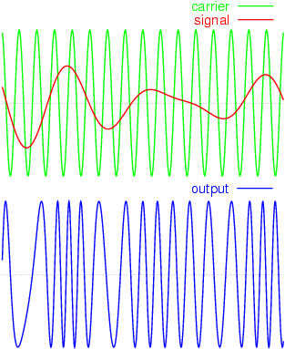
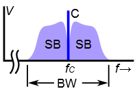

# Несущий сигнал
> 2019.05.12 **[🚀](../index/index.md) [despace](index.md)** → **[Радиосвязь](comms.md)**

[TOC]

---

> <small>*Термины:* **Несущий сигнал** — русскоязычный термин. **Carrier wave /  Carrier signal / Carrier** — англоязычный эквивалент.</small>

**Несу́щий сигна́л** — сигнал, один или несколько параметров которого изменяются в процессе модуляции. Количественное изменение параметра (параметров) определяется мгновенным текущим значением информационного (модулирующего) сигнала.

The purpose of the carrier is usually either to transmit the information through space as an electromagnetic wave (as in radio communication), or to allow several carriers at different frequencies to share a common physical transmission medium by frequency division multiplexing (as, for example, a cable television system).

В качестве несущего может быть использован любой стационарный сигнал. Чаще всего в качестве несущего сигнала используется высокочастотное (относительно высшей частоты в спектре информационного сигнала) гармоническое колебание, что обусловлено простотой демодуляции и относительно узким спектром результирующего модулированного сигнала. Однако, в некоторых случаях используют другие формы несущего сигнала, например, последовательность прямоугольных импульсов.

**Другие названия**  
Несущий сигнал часто называют просто несу́щая (от несущая частота), либо несущее (колебание). Все эти термины означают практически одно и то же. В английской терминологии несущий сигнал называют словом carrier.

| <small>На примере частотной модуляции:  carrier — несущая,  signal — модулирующий сигнал,  output — собственно результат — частотная модуляция. | <small>The frequency spectrum of a typical radio signal from an AM or FM radio transmitter. It consists of a strong signal (C) at the carrier wave frequency fC, with the modulation contained in narrow frequency bands called sidebands (SB) just above and below the carrier.</small>  |
|:--|:--|
|  |  |

 

## Docs & links (TRANSLATEME ALREADY)
|…°·•¹²³±×÷≤≥≈≠ ‑ −— ⎆✉ ❐“”’«»✔→✘☐☑├┕┆ 1 lb = 0.453592 kg; 1 g = 9.80665 m/s²|
|:--|
|<small>**[FAQ](faq.md)**, **[Cable](cable.md)**·БКС, **[Camera](camera.md)**·Камера, **[Comms](comms.md)**·Радио, **[Contact](contact.md)**·Контакт, **[Control](control.md)**·Управ., **[Doc](doc.md)**·Док., **[Doppler](doppler.md)**·ИСР, **[DS](ds.md)**·ЗУ, **[EB](eb.md)**·ХИТ, **[ECO](ecology.md)**·Экол., **[EF](ef.md)**·ВВФ, **[ElC](elc.md)**·ЭКБ, **[EMC](emc.md)**·ЭМС, **[Errors](error.md)**·Ошибки, **[Events](event.md)**·События, **[FS](fs.md)**·ТЭО, **[Fuel](fuel.md)**·Топливо, **[GNC](gnc.md)**·БКУ, **[GS](scs.md)**·НС, **[HF&E](hfe.md)**·Эрго., **[IU](iu.md)**·Гиро., **[KT](kt.md)**·КТЕХ, **[LAG](lag.md)**·ПУC, **[LES](les.md)**·САСП, **[LS](ls.md)**·СЖО, **[LV](lv.md)**·РН, **[MCC](mcc.md)**·ЦУП, **[Model](model.md)**·Модель, **[MSC](sc.md)**·ПКА, **[N&B](nnb.md)**·БНО, **[NR](nr.md)**·ЯР, **[OBC](obc.md)**·ЦВМ, **[OE](oe.md)**·БА, **[Pat.](патент.md)**·Патент, **[Project](project.md)**·Проект, **[PS](ps.md)**·ДУ, **[QA](quality.md)**·QA, **[R&D](rnd.md)**·НИОКР, **[RAMS](rams.md)**·НиБ, **[Risk](risk.md)**·Риск, **[Robot](robotics.md)**·Робот, **[Rover](rover.md)**·Планетоход, **[RTG](rtg.md)**·РИТЭГ, **[SARC](sarc.md)**·ПСК, **[Sensor](sensor.md)**·Датчик, **[SC](sc.md)**·КА, **[SCS](scs.md)**·КК, **[SGM](sgm.md)**·КММ, **[SI](si.md)**·СИ, **[Soft](soft.md)**·ПО, **[SP](sp.md)**·БС, **[Spaceport](spaceport.md)**·Космодром, **[SPS](sps.md)**·СЭС, **[SSS](sss.md)**·ГЗУ, **[TCS](tcs.md)**·СОТР, **[Test](test.md)**·ЭО, **[Timeline](timeline.md)**·Циклограмма, **[TMS](tms.md)**·ТМС, **[TOR](tor.md)**·ТЗ, **[TRL](trl.md)**·УГТ</small>|
|*Sections & pages*|
|**`Радиосвязь:`**  [CCSDS](ccsds.md) ┊ [Антенна](antenna.md) ┊ [АФУ](afdev.md) ┊ [Битрейт](bitrate.md) ┊ [ВОЛП](ofts.md) ┊ [ДНА](дна.md) ┊ [Диапазоны частот](rf.md) ┊ [Зрение](view.md) ┊ [Интерферометр](interferometer.md) ┊ [Информация](info.md) ┊ [КНД](directivity.md) ┊ [Код Рида‑Соломона](rsco.md) ┊ [КПДА](antenna_ap.md) ┊ [КСВ](swr.md) ┊ [КУ](ку.md) ┊ [ЛКС, АОЛС, FSO](fso.md) ┊ [Несущий сигнал](carrwave.md) ┊ [ПНА, ПОНА, ПСНА](aiad.md) ┊ [Помехи](emi.md) (EMI, RFI) ┊ [Последняя миля](last_mile.md) ┊ [Регламент радиосвязи](rr.md) ┊ [СИТ](etedp.md) ┊ [Фидер](feeder.md)  • • •  **РФ:** [БА КИС](ба_кис.md) (21) ┊ [БРК](brk_lav.md) (12) ┊ [РУ ПНИ](ру_пни.md) () ┊ [HSXBDT](hsxbdt.md) (1.8) ┊ [CSXBT](csxbt.md) (0.38) ┊ [ПРИЗЫВ-3](prizyv_3.md) (0.17) *([ПРИЗЫВ-1](prizyv_1.md) (0.075))*|

   1. Docs: …
   1. Notable interwikies — …
   1. <https://en.wikipedia.org/wiki/Carrier_wave>
   1. <https://ru.wikipedia.org/wiki/Несущий_сигнал>

