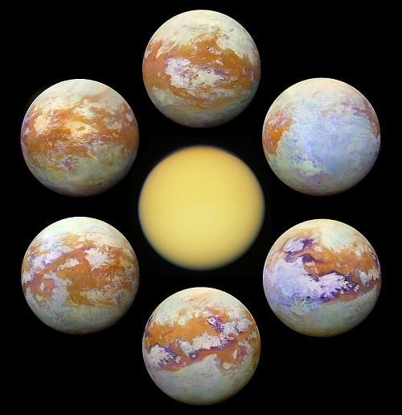
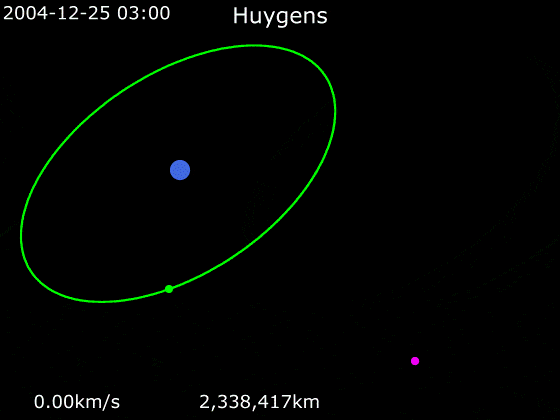
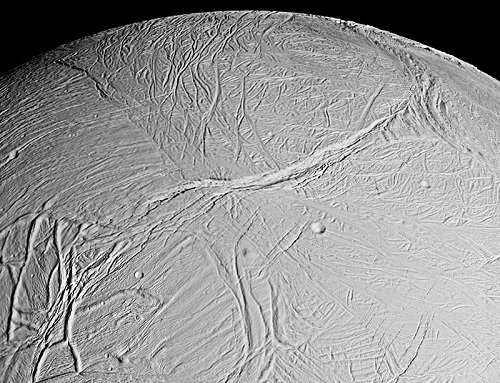
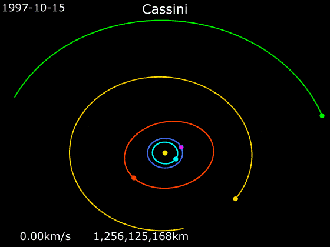
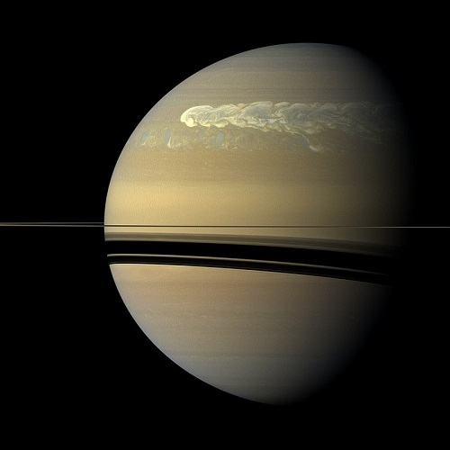
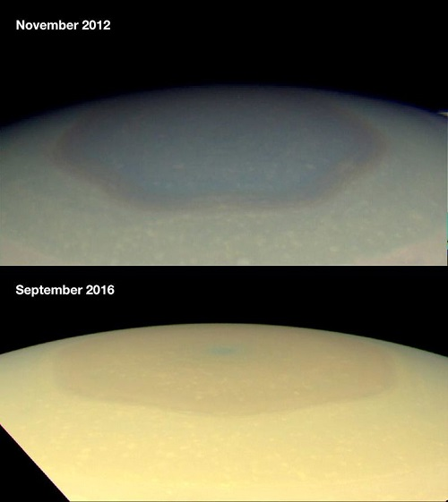
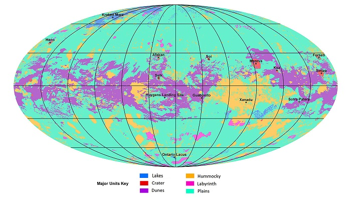
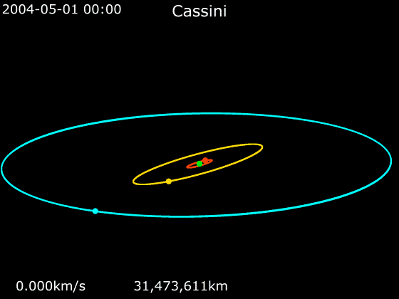

# Cassini-Huygens
> Ver. . [🚀](../index/index.md) [despace](index.md) → **** <mark>NOCAT</mark>

[TOC]

---

> <small>**Cassini–Huygens (Cassini)** — EN term. **Кассини‑Гюйгенс** — rough RU analogue.</small>

The **Cassini–Huygens** is a joint mission of the space‑research mission, involved a collaboration between NASA, the European Space Agency (ESA), and the Italian Space Agency (ASI) to send a spacecraft to study the planet Saturn and its system, including its rings and natural satellites. The Flagship-class robotic spacecraft comprised both NASA’s Cassini spacecraft and ESA’s Huygens Lander, which landed on Saturn’s largest moon, Titan. Cassini was the fourth spacecraft to visit Saturn and the first to enter its orbit.

 

|*Type*|*[Param.](si.md)*|
|:--|:--|
|**Mission:**|• • •|
|Cost|US$3.26 billion or 306 305 ㎏ of [gold](sc_price.md) in 1997 prices|
|Development|1992 ‑ 1997|
|Duration|19 years, 335 days; 13 years, 76 days at Saturn|
|Launch|October 15, 1997, 08:43:00 UTC, Rocket: Titan IV(401)B B-33|
|Operator|**Cassini**: NASA / JPL **Huygens**: ESA / ASI|
|Programme|Cassini–Huygens|
|Similar to|• Proposed: …  • Current: [Galileo](galileo.md)   • ㎩st: …|
|Target|Study of the planet Saturn and the system of the Saturnian system (rings, moons and asteroids). One of the main goals is to study Saturn’s moon-Titan|
|[Type](sc.md)|Orbiter spacecraft|
|**Spacecraft:**|• • •|
|Composition|Cassini Orbiter; Huygens Lander|
|Contractor|Aérospatiale|
|Manufacturer|Cassini: Jet Propulsion Laboratory   Huygens: Thales Alenia Space|
||**`…`**|
|Comms|S-, X- and Ka‑band, diameter=4 m (high‑gain radio antenna)|
|[ID](spaceid.md)|NSSDC ID (COSPAR ID): 1997-061A, SCN: 25008|
|Mass|2 523 ㎏ ([Large satellite](спутник.md), [EVN‑073](venus.md))|
|Orbit / Site|Kronocentric|
|Payload|**Cassini** Optical Remote Sensing, Fields, Particles and Waves (mostly in situ), Microwave Remote Sensing   **Huygens** total 6 instruments, inc. suite of sensors to determine the parameters of the atmosphere and soil of Titan; spectometers|
|Power|~ 885 W (BOL) ~663 W (EOM/2017).|

Targets & investigations:

   - **T** — technical; **C** — contact research; **D** — distant research; **F** — fly‑by; **H** — manned; **S** — soil sample return; **X** — technology demonstration
   - **Sections of measurement and observation:**
      - Atmospheric/climate — **Ac** composition, **Ai** imaging, **Am** mapping, **Ap** pressure, **As** samples, **At** temperature, **Aw** wind speed/direction.
      - General — **Gi** planet’s interactions with outer space.
      - Soil/surface — **Sc** composition, **Si** imaging, **Sm** mapping, **Ss** samples.

<small>

|*EVN‑XXX*|*T*|*EN*|*Section of m&o*|*D*|*C*|*F*|*H*|*S*|
|:--|:--|:--|:--|:--|:--|:--|:--|:--|
|EVN‑073|T|Exploration with [satellites](sc.md): large satellites.||D||F|||

</small>

 

## Mission
Launched aboard a Titan IVB/Centaur on October 15, 1997, Cassini was active in space for nearly 20 years, with 13 years spent orbiting Saturn and studying the planet and its system after entering orbit on July 1, 2004. The mission was managed by NASA’s Jet Propulsion Laboratory in the United States, where the Orbiter was assembled. Huygens was developed by the European Space Research and Technology Centre. The spacecraft operation was organized around a series of missions. Each is structured according to a certain amount of funding, goals, etc. At least 260 scientists from 17 countries have worked on the Cassini–Huygens mission; in addition thousands of people overall worked to design, manufacture, and launch the mission.

The Cassini spacecraft performed two **gravitational-assist fly‑bys** of Venus on April 26, 1998, and June 24, 1999. These fly‑bys provided the spacecraft with enough momentum to travel all the way out to the asteroid belt. At that point, the Sun’s gravity pulled the spacecraft back into the inner Solar System. On August 18, 1999, at 03:28 UTC, the craft made a gravitational-assist fly‑by of the Earth. One hour and 20 min before closest approach, Cassini made its closest approach to the Earth’s Moon at 377 000 ㎞, and it took a series of calibration photos. On January 23, 2000, Cassini performed a fly‑by of the asteroid 2685 Masursky at around 10:00 UTC. It took photos in the period five to seven hours before the fly‑by at a distance of 1.6 million ㎞, and a diameter of 15 to 20 ㎞ was estimated for the asteroid.

Cassini made its closest approach to Jupiter on December 30, 2000, and made many scientific measurements in collaboration with NASA’s [Galileo](galileo.md) spacecraft to study the Jovian system. About 26 000 images of Jupiter, its faint rings, and its moons were taken during the six-month fly‑by. It produced the most detailed global color portrait of the planet.

A major finding of the fly‑by, announced on March 6, 2003, was of Jupiter’s atmospheric circulation. Dark «belts» alternate with light «zones» in the atmosphere.

Other atmospheric observations included a swirling dark oval of high atmospheric haze, about the size of the Great Red Spot, near Jupiter’s north pole. Infrared imagery revealed aspects of circulation near the poles, with bands of globe-encircling winds, with adjacent bands moving in opposite directions.

On October 10, 2003, the mission’s science team announced the results of **tests of Albert Einstein’s general theory of relativity**, performed by using radio waves transmitted from the Cassini spacecraft. The radio scientists measured a frequency shift in the radio waves to and from the spacecraft, as those passed close to the Sun. According to the general theory of relativity, a massive object like the Sun causes space-time to curve, causing a beam of radiowaves (or light, or any form of electromagnetic radiation) that passes by the Sun to travel farther (known as the Shapiro time delay).

Although some measurable deviations from the values calculated using the general theory of relativity are predicted by some unusual cosmological models, no such deviations were found by this experiment. Previous tests using radiowaves transmitted by the Viking and Voyager spacecraft were in agreement with the calculated values from general relativity to within an accuracy of one part in one thousand. The more refined measurements from the Cassini spacecraft experiment improved this accuracy to about one part in 51 000. The data firmly support Einstein’s general theory of relativity.

In an announcement on June 28, 2004, Cassini program scientists described the measurement of the rotational period of Saturn. Because there are no fixed features on the surface that can be used to obtain this period, the repetition of radio emissions was used. This new data agreed with the latest values measured from Earth, and constituted a puzzle to the scientists. It turns out that the radio rotational period had changed since it was first measured in 1980 by Voyager 1, and it was now 6 minutes longer. This, however, does not indicate a change in the overall spin of the planet. It is thought to be due to variations in the upper atmosphere and ionosphere at the latitudes which are magnetically connected to the radio source region.

On June 30, 2004, Cassini arrives at Saturn. On July 1, 2004, the spacecraft flew through the gap between the F and G rings and achieved orbit, after a seven-year voyage. It was the first spacecraft to ever orbit Saturn. The  Cassini’s **primary mission** began.

In total, the Cassini mission discovered seven new moons orbiting Saturn. Using images taken by Cassini, researchers discovered Methone, Pallene and Polydeuces in 2004, Daphnis in the Keeler gap in 2005, Anthe in 2007, Aegaeon within the G-ring and S/2009 S 1 within the B-ring in 2009. On June 11, 2004, Cassini flew by the moon Phoebe. This was the first opportunity for close-up studies of this moon. It also was Cassini’s only possible fly‑by for Phoebe due to the mechanics of the available orbits around Saturn.

Cassini had its first fly‑by of Saturn’s largest moon, **Titan**, on July 2, 2004, a day after orbit insertion, when it approached to within 339 000 ㎞ of Titan. The fly‑by provided a remarkable increase in imaging resolution over previous coverage. Images with up to 100 times better resolution were taken and are typical of resolutions planned for subsequent Titan fly‑bys. Cassini collected pictures of Titan and the lakes of methane were similar to the lakes of Earth.

|*Titan – infrared views (2004 – 2017)*|
|:--|
||

**The Huygens** Lander traveled with Cassini until its separation from the spacecraft. Cassini released the Huygens Lander on December 24, 2004, by means of a spring and spiral rails intended to rotate the Lander for greater stability. It entered the atmosphere of Titan on January 14, 2005, and after a 2.5 h descent by parachute landed on solid ground. It returned data to Earth for around 90 min, using the Orbiter as a relay. This was the first landing ever accomplished in the outer Solar System and the first landing on a moon other than Earth’s Moon. The Huygens Lander investigated the chemical composition and surface properties of the Saturnian moon.

|**Animation of Cassini’s trajectory from 15 October 1997 to 4 May 2008**||
|:--|:--|
||**Pink — Huygens    Blue — Saturn    Green — Titan**|

In May 2005, Cassini began a series of **radio occultation experiments**, to measure the size-distribution of particles in Saturn’s rings, and measure the atmosphere of Saturn itself. For over four months, the craft completed orbits designed for this purpose. During these experiments, it flew behind the ring plane of Saturn, as seen from Earth, and transmitted radio waves through the particles. The radio signals received on Earth were analyzed, for frequency, phase, and power shift of the signal to determine the structure of the rings.

In the study of the moon **Enceladus** in 2005, Cassini discovered a deflection in the local magnetic field that is characteristic for the existence of a thin but significant atmosphere. Other measurements obtained at that time point to ionized water vapor as its main constituent. Cassini also observed water ice geysers erupting from the south pole of Enceladus, which gives more credibility to the idea that Enceladus is supplying the particles of Saturn’s E ring. Mission scientists began to suspect that there may be pockets of liquid water near the surface of the moon that fuel the eruptions.

Radar images obtained on July 21, 2006 appear to show lakes of liquid hydrocarbon (such as methane and ethane) in Titan’s northern latitudes. This is the first discovery of currently existing lakes anywhere besides on Earth. The lakes range in size from one to one-hundred kilometers across.

In November 2006, scientists discovered a storm at the south pole of Saturn with a distinct eyewall. This is characteristic of a hurricane on Earth and had never been seen on another planet before. Unlike a terrestrial hurricane, the storm appears to be stationary at the pole. The storm is 8 000 ㎞ across, and 70 ㎞ high, with winds blowing at 560 ㎞/h.

On March 13, 2007, the Jet Propulsion Laboratory announced that it had found strong evidence of seas of methane and ethane in the northern hemisphere of Titan. At least one of these is larger than any of the Great Lakes in North America.

On September 10, 2007, Cassini completed its fly‑by of the strange, two-toned, walnut‑shaped moon, Iapetus. Images were taken from 1 600 ㎞ above the surface. As it was sending the images back to Earth, it was hit by a cosmic ray that forced it to temporarily enter safe mode. All of the data from the fly‑by were recovered.

On March 12, 2008, Cassini made a close fly-by of Enceladus, passing within 50 ㎞ of the moon’s surface. The spacecraft passed through the plumes extending from its southern geysers, detecting water, carbon dioxide and various hydrocarbons with its mass spectrometer, while also mapping surface features that are at much higher temperature than their surroundings with the infrared spectrometer. Cassini was unable to collect data with its cosmic dust analyzer due to an unknown software malfunction.

   - On April 3, 2014, nearly ten years after Cassini entered Saturn’s orbit, NASA reported evidence of a large salty internal ocean of liquid water in Enceladus. The presence of an internal salty ocean in contact with the moon’s rocky core, places Enceladus «among the most likely places in the Solar System to host alien microbial life». In September 2015, NASA announced that gravitational and imaging data from Cassini were used to analyze the librations of Enceladus' orbit and determined that the moon’s surface is not rigidly joined to its core, concluding that the underground ocean must therefore be global in extent.

On April 15, 2008, Cassini received funding for a 27 month extended mission. The  Cassini’s primary mission was completed in June 2008. The **extended mission** began on July 1, 2008, and was renamed the **Cassini Equinox Mission** as the mission coincided with Saturn’s equinox, which happened in August 2009. It mission consisted of 60 more orbits of Saturn, with 21 more close Titan fly‑bys, seven of Enceladus, six of Mimas, eight of Tethys, and one targeted fly‑by each of Dione, Rhea, and Helene.

|**Animation of Cassini’s trajectory from 15 October 1997 to 4 May 2008**||
|:--|:--|
||**Pink — Cassini–Huygens    Blue — Earth    Turquoise — Venus    Yellow ellipce — Jupiter    Green — Saturn    Red — 2685 Masursky    Yellow dot — Sun**|

On February 3, 2010, NASA announced another extension for Cassini, lasting 7 years until September 15, 2017, ending at the time of summer solstice in Saturn’s northern hemisphere — **Cassini Solstice Mission**. Mission ran from October 2010 through April 2017. (Also known as the XXM mission.). The extension enabled another 155 revolutions around the planet, 54 fly‑bys of Titan and 11 fly‑bys of Enceladus. In 2017, an encounter with Titan changed its orbit in such a way that, at closest approach to Saturn, it was only 3 000 ㎞ above the planet’s cloudtops, below the inner edge of the D ring.

On October 25, 2012, Cassini witnessed the aftermath of the massive **Great White Spot storm** that recurs roughly every 30 years on Saturn. Data from the composite infrared spectrometer (CIRS) instrument indicated a powerful discharge from the storm that caused a temperature spike in the stratosphere of Saturn 83 K above normal. Simultaneously, a huge increase in ethylene gas was detected by NASA researchers at Goddard Research Center in Greenbelt, Maryland. Ethylene is a colorless gas that is highly uncommon on Saturn and is produced both naturally and through man-made sources on Earth. The storm that produced this discharge was first observed by the spacecraft on December 5, 2010 in Saturn’s northern hemisphere. The storm is the first of its kind to be observed by a spacecraft in orbit around Saturn as well as the first to be observed at thermal infrared wavelengths, allowing scientists to observe the temperature of Saturn’s atmosphere and track phenomena that are invisible to the naked eye. The spike of ethylene gas that was produced by the storm reached levels that were 100 times more than those thought possible for Saturn. Scientists have also determined that the storm witnessed was the largest, hottest stratospheric vortex ever detected in the Solar System, initially being larger than Jupiter’s Great Red Spot.

On December 21, 2012, Cassini observed a transit of Venus across the Sun. The VIMS instrument analyzed sunlight passing through the Venusian atmosphere. VIMS previously observed the transit of exoplanet HD 189733 b.

In March 2013 Cassini made its last fly‑by of Saturn’s moon Rhea, probing the internal structure of the moon by measuring the gravitational pull of Rhea against the spacecraft’s steady radio link to NASA’s Deep Space Network on Earth. Cassini performed its latest fly‑by of Saturn’s moon Hyperion on May 31, 2015, at a distance of about 34 000 ㎞, Dione on August 17, 2015, at a distance of about 475 ㎞. A previous fly‑by was performed on June 16.

Between 2012 and 2016, the persistent **hexagonal cloud pattern** at Saturn’s north pole changed from a mostly blue color to more of a golden color. One theory for this is a seasonal change: extended exposure to sunlight may be creating haze as the pole swivels toward the sun. It was previously noted that there was less blue color overall on Saturn between 2004 and 2008.

The first map showing the global geology of Saturn’s largest moon, Titan, has been completed and fully reveals a dynamic world of dunes, lakes, plains, craters and other terrains.

|***The first global geologic map of Titan is based on radar and visible-light images from NASA’s Cassini mission, which orbited Saturn from 2004 to 2017. Labels point to several of the named surface features.***|
|:--|
||

At the end of its mission, the Cassini spacecraft executed its «Grand Finale»: a number of risky passes through the gaps between Saturn and Saturn’s inner rings. This phase aimed to maximize Cassini’s scientific outcome before the spacecraft was disposed. The mission ended on September 15, 2017, when Cassini’s trajectory took it into Saturn’s upper atmosphere and it burned up. This method was chosen because it is imperative to ensure protection and prevent biological contamination to any of the moons of Saturn thought to offer potential habitability. The atmospheric entry of Cassini ended the mission, but analyses of the returned data will continue for many years.

|***Animation of Cassini’s trajectory around Saturn from 1 May 2004 to 15 September 2017***||
|:--|:--|
||**Pink — Cassini    Turquoise — Iapetus    Yellow — Titan    Green — Saturn    Red — Enceladus**|

In January 2019, new research using data collected during Cassini’s Grand Finale phase was published:

   - The final close passes by the rings and planet enabled scientists to measure the length of a day on Saturn: 10 h, 33 min and 38 s.
   - Saturn’s rings are relatively new, 10 to 100 million years old. They may have formed during the age of dinosaurs on Earth.

 

## Science goals & payload
Cassini had several objectives, including:

   - Determining the three-dimensional structure and dynamic behavior of the rings of Saturn.
   - Determining the composition of the satellite surfaces and the geological history of each object.
   - Determining the nature and origin of the dark material on Iapetus’s leading hemisphere.
   - Measuring the three-dimensional structure and dynamic behavior of the magnetosphere.
   - Studying the dynamic behavior of Saturn’s atmosphere at cloud level.
   - Studying the time variability of Titan’s clouds and hazes.
   - Characterizing Titan’s surface on a regional scale.

### Cassini
Cassini’s instrumentation consisted of: a synthetic aperture radar mapper, a charge-coupled device imaging system, a visible/infrared mapping spectrometer, a composite infrared spectrometer, a cosmic dust analyzer, a radio and plasma wave experiment, a plasma spectrometer, an ultraviolet imaging spectrograph, a magnetospheric imaging instrument, a magnetometer and an ion/neutral mass spectrometer. Telemetry from the communications antenna and other special transmitters (an S‑band transmitter and a dual-frequency Ka‑band system) was also used to make observations of the atmospheres of Titan and Saturn and to measure the gravity fields of the planet and its satellites.

|*Instrument*|*Description*|
|:--|:--|
|**Cassini Plasma Spectrometer (CAPS)**|CAPS was an in situ instrument that measured the flux of charged particles at the location of the spacecraft, as a function of direction and energy. The ion composition was also measured using a time-of-flight mass spectrometer. CAPS measured particles produced by ionisation of molecules originating from Saturn’s and Titan’s ionosphere, as well as the plumes of Enceladus. CAPS also investigated plasma in these areas, along with the solar wind and its interaction with Saturn’s magnetosphere.|
|**Cosmic Dust Analyzer (CDA)**|The CDA was an in situ instrument that measured the size, speed, and direction of tiny dust grains near Saturn. It could also measure the grains' chemical elements. Some of these particles orbited Saturn, while others came from other star systems.|
|**Composite Infrared Spectrometer (CIRS)**|The CIRS was a remote sensing instrument that measured the infrared radiation coming from objects to learn about their temperatures, thermal properties, and compositions. Throughout the Cassini–Huygens mission, the CIRS measured infrared emissions from atmospheres, rings and surfaces in the vast Saturn system. It mapped the atmosphere of Saturn in three dimensions to determine temperature and pressure profiles with altitude, gas composition, and the distribution of aerosols and clouds. It also measured thermal characteristics and the composition of satellite surfaces and rings.|
|**Ion and Neutral Mass Spectrometer (INMS)**|The INMS was an in situ instrument that measured the composition of charged particles (protons and heavier ions) and neutral particles (atoms and molecules) near Titan and Saturn to learn more about their atmospheres. The instrument used a quadrupole mass spectrometer. INMS was also intended to measure the positive ion and neutral environments of Saturn’s icy satellites and rings.|
|**Imaging Science Subsystem (ISS)**|The ISS was a remote sensing instrument that captured most images in visible light, and also some infrared images and ultraviolet images. The ISS had both a wide-angle camera (WAC) and a narrow-angle camera (NAC). Each of these cameras used a sensitive charge-coupled device (CCD) as its electromagnetic wave detector. Each CCD had a 1 024 square array of pixels, 12 μm on a side. Both cameras allowed for many data collection modes, including on-chip data compression, and were fitted with spectral filters that rotated on a wheel to view different bands within the electromagnetic spectrum ranging from 0.2 to 1.1 μm.|
|**Dual Technique Magnetometer (MAG)**|The MAG was an in situ instrument that measured the strength and direction of the magnetic field around Saturn. The magnetic fields are generated partly by the molten core at Saturn’s center. Measuring the magnetic field is one of the ways to probe the core. MAG aimed to develop a three-dimensional model of Saturn’s magnetosphere, and determine the magnetic state of Titan and its atmosphere, and the icy satellites and their role in the magnetosphere of Saturn.|
|**Magnetospheric Imaging Instrument (MIMI)**|The MIMI was both an in situ and remote sensing instrument that produces images and other data about the particles trapped in Saturn’s huge magnetic field, or magnetosphere. The in situ component measured energetic ions and electrons while the remote sensing component (the Ion And Neutral Camera, INCA) was an energetic neutral atom imager. This information was used to study the overall configuration and dynamics of the magnetosphere and its interactions with the solar wind, Saturn’s atmosphere, Titan, rings, and icy satellites.|
|**Radar**|The on-board radar was an active and passive sensing instrument that produced maps of Titan’s surface. Radar waves were powerful enough to penetrate the thick veil of haze surrounding Titan. By measuring the send and return time of the signals it is possible to determine the height of large surface features, such as mountains and canyons. The passive radar listened for radio waves that Saturn or its moons may emit.|
|**Radio and Plasma Wave Science instrument (RPWS)**|The RPWS was an in situ instrument and remote sensing instrument that receives and measures radio signals coming from Saturn, including the radio waves given off by the interaction of the solar wind with Saturn and Titan. RPWS measured the electric and magnetic wave fields in the interplanetary medium and planetary magnetospheres. It also determined the electron density and temperature near Titan and in some regions of Saturn’s magnetosphere using either plasma waves at characteristic frequencies (e.g. the upper hybrid line) or a Langmuir probe. RPWS studied the configuration of Saturn’s magnetic field and its relationship to Saturn Kilometric Radiation (SKR), as well as monitoring and mapping Saturn’s ionosphere, plasma, and lightning from Saturn’s (and possibly Titan’s) atmosphere.|
|**Radio Science Subsystem (RSS)**|The RSS was a remote-sensing instrument that used radio antennas on Earth to observe the way radio signals from the spacecraft changed as they were sent through objects, such as Titan’s atmosphere or Saturn’s rings, or even behind the Sun. The RSS also studied the compositions, pressures and temperatures of atmospheres and ionospheres, radial structure and particle size distribution within rings, body and system masses and the gravitational field. The instrument used the spacecraft X‑band communication link as well as S‑band downlink and Ka‑band uplink and downlink.|
|**Ultraviolet Imaging Spectrograph (UVIS)**|The UVIS was a remote-sensing instrument that captured images of the ultraviolet light reflected off an object, such as the clouds of Saturn and/or its rings, to learn more about their structure and composition. Designed to measure ultraviolet light over wavelengths from 55.8 to 190 nm, this instrument was also a tool to help determine the composition, distribution, aerosol particle content and temperatures of their atmospheres. Unlike other types of spectrometer, this sensitive instrument could take both spectral and spatial readings. It was particularly adept at determining the composition of gases. Spatial observations took a wide-by-narrow view, only one pixel tall and 64 pixels across. The spectral dimension was 1 024 pixels per spatial pixel. It could also take many images that create movies of the ways in which this material is moved around by other forces.|
|**Visible and Infrared Mapping Spectrometer (VIMS)**|The VIMS was a remote sensing instrument that captured images using visible and infrared light to learn more about the composition of moon surfaces, the rings, and the atmospheres of Saturn and Titan. It consisted of two cameras — one used to measure visible light, the other infrared. VIMS measured reflected and emitted radiation from atmospheres, rings and surfaces over wavelengths from 350 to 5 100 nm, to help determine their compositions, temperatures and structures. It also observed the sunlight and starlight that passes through the rings to learn more about their structure. Scientists used VIMS for long-term studies of cloud movement and morphology in the Saturn system, to determine Saturn’s weather patterns.|

### Huygens
Huygens had six instruments aboard that took in a wide range of scientific data as the Lander descended through Titan’s atmosphere.

|*Instrument*|*Description*|
|:--|:--|
|**Huygens Atmospheric Structure Instrument (HASI)**|This instrument contains a suite of sensors that measured the physical and electrical properties of Titan’s atmosphere. Accelerometers measured forces in all three axes as the probe descended through the atmosphere. It was possible to determine the density of Titan’s atmosphere and to detect wind gusts. Temperature and pressure sensors measured the thermal properties of the atmosphere. The Permittivity and Electromagnetic Wave Analyzer component measured the electron and ion conductivities of the atmosphere and searched for electromagnetic wave activity. On the surface of Titan, the electrical conductivity and permittivity of the surface material was measured. The HASI subsystem also contains a microphone, which was used to record any acoustic events during Lander’s descent and landing.|
|**Doppler Wind Experiment (DWE)**|This experiment used an ultra‑stable oscillator to improve communication with the spacecraft by giving it a very stable carrier frequency. This instrument was also used to measure the wind speed in Titan’s atmosphere by measuring the Doppler shift in the carrier signal. Between 60 and 80 ㎞, Huygens was buffeted by rapidly fluctuating winds, which are thought to be vertical wind shear. At ground level, the Earth-based doppler shift and VLBI measurements show gentle winds of a few m/s, roughly in line with expectations.|
|**Descent Imager/Spectral Radiometer (DISR)**|As Huygens was primarily an atmospheric mission, the DISR instrument was optimized to study the radiation balance inside Titan’s atmosphere. Its visible and infrared spectrometers and violet photometers measured the up- and downward radiant flux from an altitude of 145 ㎞ down to the surface. Solar aureole cameras measured how scattering by aerosols varies the intensity directly around the Sun. Three imagers, sharing the same CCD, periodically imaged a swath of around 30 degrees wide, ranging from almost nadir to just above the horizon. Aided by the slowly spinning Lander they would build up a full mosaic of the landing site, which, surprisingly, became clearly visible only below 25 ㎞ altitude. All measurements were timed by aid of a shadow bar, which would tell DISR when the Sun had passed through the field of view.|
|**Gas Chromatograph Mass Spectrometer (GC/MS)**|This instrument is a gas chemical analyzer that was designed to identify and measure chemicals in Titan’s atmosphere. It was equipped with samplers that were filled at high altitude for analysis. The mass spectrometer, a high‑voltage quadrupole, collected data to build a model of the molecular masses of each gas, and a more powerful separation of molecular and isotopic species was accomplished by the gas chromatograph. During descent, the GC/MS also analyzed pyrolysis products (i.e., samples altered by heating) passed to it from the Aerosol Collector Pyrolyser. Finally, the GC/MS measured the composition of Titan’s surface. This investigation was made possible by heating the GC/MS instrument just prior to impact in order to vaporize the surface material upon contact.|
|**Aerosol Collector and Pyrolyser (ACP)**|The ACP experiment drew in aerosol particles from the atmosphere through filters, then heated the trapped samples in ovens (using the process of pyrolysis) to vaporize volatiles and decompose the complex organic materials. The products were flushed along a pipe to the GC/MS instrument for analysis. Two filters were provided to collect samples at different altitudes.|
|**Surface Science Package (SSP)**|The SSP contained a number of sensors designed to determine the physical properties of Titan’s surface at the point of impact, whether the surface was solid or liquid. An acoustic sounder, activated during the last 100 m of the descent, continuously determined the distance to the surface, measuring the rate of descent and the surface roughness (e.g., due to waves). The instrument was designed so that if the surface were liquid, the sounder would measure the speed of sound in the «ocean» and possibly also the subsurface structure (depth). During descent, measurements of the speed of sound gave information on atmospheric composition and temperature, and an accelerometer recorded the deceleration profile at impact, indicating the hardness and structure of the surface.|

 

## Spacecraft

The mission consisted of two main elements: the ASI/NASA Cassini Orbiter; and the ESA-developed Huygens Lander.

The spacecraft was planned to be the second three‑axis stabilized, RTG-powered Mariner Mark II, a class of spacecraft developed for missions beyond the orbit of Mars.

The combined Orbiter and Lander is the third-largest unmanned interplanetary spacecraft ever successfully launched, behind the Phobos 1 and 2 Mars spacecraft, as well as being among the most complex. The Orbiter had a mass of 2 150 ㎏, the Lander 350 ㎏. With the launch vehicle adapter and 3 132 ㎏ of propellants at launch, the spacecraft had a mass of 5 600 ㎏.

The Cassini spacecraft was 6.8 m high and 4 m wide. Spacecraft complexity was increased by its trajectory to Saturn, and by the ambitious science at its destination. Cassini had 1 630 interconnected electronic components, 22 000 wire connections, and 14 ㎞ of cabling. The core control computer CPU was a redundant MIL-STD-1750A system. The main propulsion system consisted of one prime and one backup R-4D bipropellant rocket engine. The thrust of each engine was 490 N and the total spacecraft delta-V was about 2 040 ㎧. Smaller monopropellant rockets provided attitude control.

To generate enough power, such arrays would have been too large and too heavy. Instead, the Cassini Orbiter was powered by three radioisotope thermoelectric generators (RTGs), which use heat from the decay of about 33 ㎏ of plutonium-238 (in the form of plutonium dioxide) to generate direct current electricity via thermoelectrics. The RTGs on the Cassini mission have the same design as those used on the New Horizons, Galileo, and Ulysses spacecraft, and they were designed to have very long operational lifetimes. At the end of the nominal 11-year Cassini mission, they were still able to produce 600 to 700 W of electrical power. Huygens was supported by Cassini during cruise, but used chemical batteries when independent.

The Lander system consisted of the Lander itself which descended to Titan, and the probe support equipment (PSE) which remained attached to the orbiting spacecraft. The PSE includes electronics that track the Lander, recover the data gathered during its descent, and process and deliver the data to the Orbiter that transmits it to Earth. The core control computer CPU was a redundant MIL-STD-1750A control system.

 

## Community, library, links

**PEOPLE:**

JPL:

   1. Earl Maize — the Cassini program manager;
   1. Linda J. Spilker — the Cassini project scientist;
   1. Scott Edgington — the deputy project scientist.

NASA Headquarters:

   1. Bill Knopf — Cassini program executive;
   1. Curt Niebur — Cassini program scientist.

ESA:

   1. Nicolas Altobelli — the project scientist.

ASI:

   1. Enrico Flamini — the project manager for Cassini’s radio antenna and other contributions to the spacecraft.

**COMMUNITY:**

<mark>TBD</mark>

 

## Docs & links (TRANSLATEME ALREADY)
|Navigation|
|:--|
|**[FAQ](faq.md)**, **[Cable](cable.md)**·БКС, **[Camera](cam.md)**·Камера, **[Comms](comms.md)**·Радио, **[Contact](contact.md)**·Контакт, **[Control](control.md)**·Упр., **[Doc](doc.md)**·Док., **[Doppler](doppler.md)**·ИСР, **[DS](ds.md)**·ЗУ, **[EB](eb.md)**·ХИТ, **[ECO](ecology.md)**·Экол., **[EF](ef.md)**·ВВФ, **[ElC](elc.md)**·ЭКБ, **[EMC](emc.md)**·ЭМС, **[Error](error.md)**·Ошибки, **[Event](event.md)**·События, **[FS](fs.md)**·ТЭО, **[Fuel](fuel.md)**·Топливо, **[GNC](gnc.md)**·БКУ, **[GS](scs.md)**·НС, **[HF&E](hfe.md)**·Эрго., **[IU](iu.md)**·Гиро., **[KT](kt.md)**·КТЕХ, **[LAG](lag.md)**·ПУC, **[LES](les.md)**·САСП, **[LS](ls.md)**·СЖО, **[LV](lv.md)**·РН, **[MCC](mcc.md)**·ЦУП, **[Model](model.md)**·Модель, **[MSC](sc.md)**·ПКА, **[N&B](nnb.md)**·БНО, **[NR](nr.md)**·ЯР, **[OBC](obc.md)**·ЦВМ, **[OE](oe.md)**·БА, **[Pat.](патент.md)**·Патент, **[Proj.](project.md)**·Проект, **[PS](ps.md)**·ДУ, **[R&D](rnd.md)**·НИОКР, **[Robot](robotics.md)**·Робот, **[Rover](rover.md)**·Ровер, **[RTG](rtg.md)**·РИТЭГ, **[SARC](sarc.md)**·ПСК, **[Sensor](sensor.md)**·Датчик, **[SC](sc.md)**·КА, **[SCS](scs.md)**·КК, **[SGM](sgm.md)**·КММ, **[SI](si.md)**·СИ, **[Soft](soft.md)**·ПО, **[SP](sp.md)**·БС, **[Spaceport](spaceport.md)**·Космодр., **[SPS](sps.md)**·СЭС, **[SRRQ](srrq.md)**·БКНР, **[SSS](sss.md)**·ГЗУ, **[TCS](tcs.md)**·СОТР, **[Test](test.md)**·ЭО, **[Timeline](timeline.md)**·ЦГМ, **[TMS](tms.md)**·ТМС, **[TOR](tor.md)**·ТЗ, **[TRL](trl.md)**·УГТ|
|*Sections & pages*|
|**··•  •··**  <mark>NOCAT</mark>|

**Documents:**

   1. …

**Links:**

   1. Notable interwikies — …
   1. <https://en.wikipedia.org/wiki/Cassini%E2 %80 %93Huygens>
   1. <https://ru.wikipedia.org/wiki/Кассини-Гюйгенс>
   1. <https://www.nasa.gov/mission_pages/cassini/main/index.html>
   1. <https://www.jpl.nasa.gov/missions/cassini-huygens/>
   1. <https://www.nasa.gov/feature/jpl/the-first-global-geologic-map-of-titan-completed>
   
