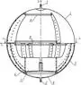
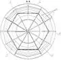

# Капиллярно‑заборное устройство
> 2019.05.12 [🚀](../index/index.md) [despace](index.md) → [ДУ](ps.md), [SGM](sc.md)

**Table of contents:**

[TOC]

---

> <small>**Капиллярно‑заборное устройство (КЗУ) / Внутрибаковое устройство капиллярного типа (ВКУ КТ)** — русскоязычный термин, не имеющий аналога в английском языке. **Capillar intake unit (CINU)** — дословный перевод с русского на английский.</small>

**Капиллярно‑заборное устройство (КЗУ)**, также **внутрибаковое устройство капиллярного типа (ВКУ КТ)** — система забора и фильтрации топлива от газовой фракции. Также включает в себя технические средства по доставке топлива к топливозаборнику.

*Не является системой удержания топлива.*

Конструктивно представляет из себя надетую на топливозаборник стальную сетку с капиллярами, которые пропускают к топливозаборнику жидкую фазу топлива и не пропускают газовую.

Также для работы КЗУ модифицируют внутреннюю часть баков, прокладывая там определённым образом желоба, по которым топливо в невесомости передвигается к топливозаборнику. Желоба не обеспечивают удержания топлива, но позволяют попавшему в них топливу стечь (быстро или медленно) в конкретном направлении — к топливозаборнику.

**Некоторые характеристики:**

   - КЗУ обеспечивает степень выработки топлива из баков не менее 99 % от полной вместимости бака.
   - ВБР КЗУ в течении САС 3 лет составляет не менее 0.9999.
   - По отношению к [мешкам](топливные_мешки.md) и [мембранам](топливные_мембраны.md) гораздо меньше изнашивается и имеет срок работы сравнимый со сроком работы топливных баков, так как делается обычно из материалов лучших, чем баки.

|*Схема*|*Описание*|
|:-|:-|
||**Топливный бак с КЗУ,   вид сбоку**    1 — корпус бака;  2 — заправочно‑сливной штуцер;  3 — наддувный штуцер;  4 — капиллярный фильтр‑сепаратор;  5 — демпфирующие и подводящие ребра;  6 — секторные капиллярные элементы;  7 — плоские капиллярные удерживающие перегородки;  8 — конструктивные рамы.|
||**Топливный бак с КЗУ,   вид сверху**    1 — корпус бака;  4 — капиллярный фильтр‑сепаратор;  5 — демпфирующие и подводящие ребра;  6 — секторные капиллярные элементы;  7 — плоские капиллярные удерживающие перегородки;  8 — конструктивные рамы.|
||**Капиллярный фильтр‑сепаратор**    1 — капиллярный экран КПСМ О‑13‑1;  2 — капиллярный экран КПСМ О‑2‑1;  3 — меридиональная капиллярная перегородка;  4 — кольцевая проставка соединения экранов;  5 — крышка;  6 — фланец с рассекателем.|

 

## Docs & links (TRANSLATEME ALREADY)
|Navigation|
|:-|
|**[FAQ](faq.md)**【**[SCS](scs.md)**·КК, **[SC (OE+SGM)](sc.md)**·КА】**[CON](contact.md)·[Pers](person.md)**·Контакт, **[Ctrl](control.md)**·Упр., **[Doc](doc.md)**·Док., **[Drawing](drawing.md)**·Чертёж, **[EF](ef.md)**·ВВФ, **[Error](error.md)**·Ошибки, **[Event](event.md)**·Событ., **[FS](fs.md)**·ТЭО, **[HF&E](hfe.md)**·Эрго., **[KT](kt.md)**·КТ, **[N&B](nnb.md)**·БНО, **[Project](project.md)**·Проект, **[QM](qm.md)**·БКНР, **[R&D](rnd.md)**·НИОКР, **[SI](si.md)**·СИ, **[Test](test.md)**·ЭО, **[TRL](trl.md)**·УГТ|
|*Sections & pages*|
|**`Двигательная установка (ДУ):`**  [HTAE](htae.md)・ [TALOS](talos.md)・ [Баки топливные](fuel_tank.md)・ [Варп‑двигатель](ps.md)・ [Газовый двигатель](ps.md)・ [Гибридный двигатель](гбрд.md)・ [Двигатель Бассарда](ps.md)・ [ЖРД](ps.md)・ [ИПТ](ing.md)・ [Ионный двигатель](иод.md)・ [Как считать топливо?](si.md)・ [КЗУ](cinu.md)・ [КХГ](cgs.md)・ [Номинал](nominal.md)・ [Мятый газ](exhsteam.md)・ [РДТТ](ps.md)・ [Сильфон](сильфон.md)・ [СОЗ](соз.md)・ [СОИС](соис.md)・ [Солнечный парус](солнечный_парус.md)・ [ТНА](turbopump.md)・ [Топливные мембраны](топливные_мембраны.md)・ [Топливные мешки](топливные_мешки.md)・ [Топливо](ps.md)・ [Тяговооружённость](ttwr.md)・ [ТЯРД](тярд.md)・ [УИ](ps.md)・ [Фотонный двигатель](фотонный_двигатель.md)・ [ЭРД](ps.md)・ [Эффект Оберта](oberth_eff.md)・ [ЯРД](ps.md)|
|**【[Structures, gears, materials (SGM)](sc.md)】**  [Гермоконтейнер](гермоконтейнер.md)・ [Датчик](sensor.md)・ [Задел](margin.md)・ [Изделие](unit.md)・ [Испарение материалов](matc.md)・ [Кавитация](cavitation.md)・ [КЗУ](cinu.md) (ВБУ КТ)・ [КХГ](cgs.md)・ [Контейнеры для транспортировки](ship_contain.md)・ [Крейцкопф](crosshead.md)・ [Номинал](nominal.md)・ [ПУС](lag.md)・ [ПНА, ПОНА, ПСНА](devd.md)・ [Резерв](reserve.md)・ [Слайс](слайс.md)・ [ТСП](tsp.md)・ [Типичные формы КА](sc.md)・ [Толкатель](толкатель.md)・ [Унификация](commonality.md)|

   1. Docs: …
   1. <…>
