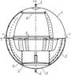
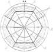
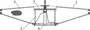

# Капиллярно‑заборное устройство
> 2019.05.12 [🚀](../index/index.md) [despace](index.md) → [ДУ](ps.md), [SGM](sgm.md)

[TOC]

---

> <small>**Капиллярно‑заборное устройство (КЗУ) / Внутрибаковое устройство капиллярного типа (ВКУ КТ)** — русскоязычный термин, не имеющий аналога в английском языке. **Capillar intake unit (CINU)** — дословный перевод с русского на английский.</small>

**Капиллярно‑заборное устройство (КЗУ)**, также **внутрибаковое устройство капиллярного типа (ВКУ КТ)** — система забора и фильтрации топлива от газовой фракции. Также включает в себя технические средства по доставке топлива к топливозаборнику.

*Не является системой удержания топлива.*

Конструктивно представляет из себя надетую на топливозаборник стальную сетку с капиллярами, которые пропускают к топливозаборнику жидкую фазу топлива и не пропускают газовую.

Также для работы КЗУ модифицируют внутреннюю часть баков, прокладывая там определённым образом желоба, по которым топливо в невесомости передвигается к топливозаборнику. Желоба не обеспечивают удержания топлива, но позволяют попавшему в них топливу стечь (быстро или медленно) в конкретном направлении — к топливозаборнику.

**Некоторые характеристики:**

   - КЗУ обеспечивает степень выработки топлива из баков не менее 99 % от полной вместимости бака.
   - ВБР КЗУ в течении САС 3 лет составляет не менее 0.9999.
   - По отношению к [мешкам](топливные_мешки.md) и [мембранам](топливные_мембраны.md) гораздо меньше изнашивается и имеет срок работы сравнимый со сроком работы топливных баков, так как делается обычно из материалов лучших, чем баки.

## Картинки
|*Схема*|*Описание*|
|:--|:--|
||**Топливный бак с КЗУ,   вид сбоку**    1 — корпус бака;  2 — заправочно‑сливной штуцер;  3 — наддувный штуцер;  4 — капиллярный фильтр‑сепаратор;  5 — демпфирующие и подводящие ребра;  6 — секторные капиллярные элементы;  7 — плоские капиллярные удерживающие перегородки;  8 — конструктивные рамы.|
||**Топливный бак с КЗУ,   вид сверху**    1 — корпус бака;  4 — капиллярный фильтр‑сепаратор;  5 — демпфирующие и подводящие ребра;  6 — секторные капиллярные элементы;  7 — плоские капиллярные удерживающие перегородки;  8 — конструктивные рамы.|
||**Капиллярный фильтр‑сепаратор**    1 — капиллярный экран КПСМ О‑13‑1;  2 — капиллярный экран КПСМ О‑2‑1;  3 — меридиональная капиллярная перегородка;  4 — кольцевая проставка соединения экранов;  5 — крышка;  6 — фланец с рассекателем.|

 

## Docs & links (TRANSLATEME ALREADY)
|Navigation|
|:--|
|**[FAQ](faq.md)**, **[Cable](cable.md)**·БКС, **[Camera](cam.md)**·Камера, **[Comms](comms.md)**·Радио, **[CON](contact.md)·[Pers](person.md)**·Контакт, **[Control](control.md)**·Упр., **[Doc](doc.md)**·Док., **[Doppler](doppler.md)**·ИСР, **[DS](ds.md)**·ЗУ, **[EB](eb.md)**·ХИТ, **[ECO](ecology.md)**·Экол., **[EF](ef.md)**·ВВФ, **[ElC](elc.md)**·ЭКБ, **[EMC](emc.md)**·ЭМС, **[Error](error.md)**·Ошибки, **[Event](event.md)**·События, **[FS](fs.md)**·ТЭО, **[Fuel](fuel.md)**·Топливо, **[GNC](gnc.md)**·БКУ, **[GS](scs.md)**·НС, **[HF&E](hfe.md)**·Эрго., **[IU](iu.md)**·Гиро., **[KT](kt.md)**·КТЕХ, **[LAG](lag.md)**·ПУC, **[LES](les.md)**·САСП, **[LS](ls.md)**·СЖО, **[LV](lv.md)**·РН, **[MCC](mcc.md)**·ЦУП, **[Model](model.md)**·Модель, **[MSC](sc.md)**·ПКА, **[N&B](nnb.md)**·БНО, **[NR](nr.md)**·ЯР, **[OBC](obc.md)**·ЦВМ, **[OE](oe.md)**·БА, **[Pat.](патент.md)**·Патент, **[Proj.](project.md)**·Проект, **[PS](ps.md)**·ДУ, **[QA](qa.md)**·БКНР, **[R&D](rnd.md)**·НИОКР, **[Robot](robotics.md)**·Робот, **[Rover](rover.md)**·Ровер, **[RTG](rtg.md)**·РИТЭГ, **[SARC](sarc.md)**·ПСК, **[SE](se.md)**·СЭ, **[Sens.](sensor.md)**·Датч., **[SC](sc.md)**·КА, **[SCS](scs.md)**·КК, **[SGM](sgm.md)**·КММ, **[SI](si.md)**·СИ, **[Soft](soft.md)**·ПО, **[SP](sp.md)**·БС, **[Spaceport](spaceport.md)**·Космодр., **[SPS](sps.md)**·СЭС, **[SSS](sss.md)**·ГЗУ, **[TCS](tcs.md)**·СОТР, **[Test](test.md)**·ЭО, **[Timeline](timeline.md)**·ЦГМ, **[TMS](tms.md)**·ТМС, **[TOR](tor.md)**·ТЗ, **[TRL](trl.md)**·УГТ|
|*Sections & pages*|
|**`Двигательная установка (ДУ):`**  [HTAE](htae.md)┊ [TALOS](talos.md)┊ [Баки топливные](fuel_tank.md)┊ [Варп‑двигатель](warp_drive.md)┊ [Газовый двигатель](cgt.md)┊ [Гибридный двигатель](гбрд.md)┊ [Двигатель Бассарда](bussard_ramjet.md)┊ [ЖРД](lpr.md)┊ [ИПТ](ing.md)┊ [Ионный двигатель](иод.md)┊ [Как считать топливо?](si.md)┊ [КЗУ](cinu.md)┊ [КХГ](cgs.md)┊ [Номинал](nominal.md)┊ [Мятый газ](exhsteam.md)┊ [РДТТ](spr.md)┊ [Сильфон](сильфон.md)┊ [СОЗ](соз.md)┊ [СОИС](соис.md)┊ [Солнечный парус](солнечный_парус.md)┊ [ТНА](turbopump.md)┊ [Топливные мембраны](топливные_мембраны.md)┊ [Топливные мешки](топливные_мешки.md)┊ [Топливо](fuel.md)┊ [Тяговооружённость](ttwr.md)┊ [ТЯРД](тярд.md)┊ [УИ](isp.md)┊ [Фотонный двигатель](фотонный_двигатель.md)┊ [ЭРД](epsp.md)┊ [Эффект Оберта](oberth_eff.md)┊ [ЯРД](ntr.md)|
|**`Конструктивные элементы, механизмы, материалы (КММ):`**  [Гермоконтейнер](гермоконтейнер.md)┊ [Датчик](sensor.md)┊ [Задел](margin.md)┊ [Изделие](unit.md)┊ [Испарение материалов](mat_sublime.md)┊ [Кавитация](cavitation.md)┊ [КЗУ](cinu.md) (ВБУ КТ)┊ [КХГ](cgs.md)┊ [Контейнеры для транспортировки](ship_contain.md)┊ [Крейцкопф](crosshead.md)┊ [Номинал](nominal.md)┊ [ПУС](lag.md)┊ [ПНА, ПОНА, ПСНА](aiad.md)┊ [Резерв](reserve.md)┊ [Слайс](слайс.md)┊ [ТСП](tsp.md)┊ [Типичные формы КА](sc_ts.md)┊ [Толкатель](толкатель.md)┊ [Унификация](commonality.md)|

   1. Docs: …
   1. Notable interwikies — …
   1. <…>
