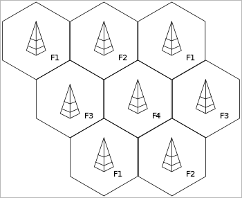

# Communications
> 2019.05.12 [🚀](../index/index.md) [despace](index.md) → [Comms](comms.md), [OE](oe.md)

[TOC]

---

> <small>**Communications, Radiolink** — EN term. **Радиосвязь** — RU analogue.</small>

**Radio communication** — a type of telecommunication, wireless communication, in which the carrier of the signal is radio waves, i.e. electromagnetic waves freely propagating in space:

   - **Antenna-feeder system (AFS)** — see AFS.
   - **Antenna-feeder device (AFD)** — a set of technical means designed to receive & emit radio waves in a given direction.
   - **Onboard radio complex (ORC)** — a set of technical means intended for the implementation of radio communications. Includes receiving & transmitting equipment & AFD.

## Receiver noise temperature

| |*Temp.*|*Station*|
|:--|:--|:--|
|**On Earth**|50|Green Bank Telescope (GBT), Latitude: 38.433°N, Longitude: 79.84°W, ESA|
| |60|Sardinia Radio Telescope (SRT), Latitude: 39.493°N, Longitude: 9.245°E, ESA|
|**In space**|200|Space, Venus & Mars (average)|
| |300|Near the Earth (average)|
| |400|Surface of Venus (average)|
| |450|Space, min.|
| |500|Space, max.|

## Varieties
*Radio communication (DBK & AFS).* Included in the [spacecraft](sc.md).

| |*Company*|*Transmitters/receivers (mass, ㎏)*|
|:--|:--|:--|
|**RU**|[MOKB Mars](zz_mars_mokb.md)| |
| |[NPO IT](zz_npoit.md)|[PRIZYV-3](prizyv_3.md) (0.17)・ [PRIZYV-1](prizyv_1.md) (0.075)|
| |[LAV](zz_lav.md)|[BRK](brk_lav.md) (12)|
| |[NPP Sait](zz_sait_ltd.md)|[RU PNI](ру_пни.md) ()・ [HSXBDT](hsxbdt.md) (1.8)・ [CSXBT](csxbt.md) (0.38)|
| |[RKS](zz_rss.md)|[BA KIS](ба_кис.md) (21)|
|•|• • • • • • • • •|• • •|
|**US**|[Space Micro](space_micro.md)| |

**Manufacturers**

| | |
|:--|:--|
|**Australia**|…|
|**Canada**|・[C-CORE](zz_c_core.md) — from radio beacons & ice measurement radars to sat transponders & space‑qualified hardware  ・[Calian AT](zz_calian_at.md) — frequency planning, sat resource management, satellite modulators  ・[MDA](zz_mda.md) — manufacturing & testing antennas & electronics  ・[SpaceBridge Inc.](zz_spacebridge.md) — broadcast modems for GEO & NGSO satellite constellations  ・[Telesat](zz_telesat.md) — satellite communications & integration services, satellite operator|
|**China**|…|
|**Europe**|…|
|**India**|…|
|**Israel**|…|
|**Japan**|・[Meisei](zz_meisei.md) — transmitters  ・[Mitsubishi](zz_mitsubishi.md) — telemetry & beacon transmitters, power & low noise amplifiers, receiver & ↑↓ converters  ・[NEC](zz_nec.md) — low noise & solid state power amplifiers (LNA, SSPA), converters (CONV), receivers (RCVR), & modulators (MOD), command receivers (CMDRX), telemetry & beacon transmitters (TLMTX, BCNTX), GPS receivers (GPSR), & multiuse interface modules (MIM), antennas/spaceborne radars, transponders|
|**Korea S.**|・[Satrec Initiative](zz_satreci.md)|
|**Russia**|・[AvantSpace](zz_avantspace.md)  ・[IRZ](zz_irz.md), [NII Guskova](нии_гуськова.md) — LNA, PE  ・[RADIS](zz_radis.md)|
|**Saudi Ar.**|…|
|**Singapore**|…|
|**USA**|…|
|**UAE**|…|
|**Vietnam**|…|

TMP:

   1. <http://www.spacemicro.com/products/rf-and-microwave.html>
   1. Микроволновые системы <http://Mwsystems.ru>
   1. Глобальные системы <http://global-s.world/>

## Radiolink

[General radiolink calculation ❐](f/comms/radiolink_calc_full.zip)

### Frequency Reuse

**Frequency reuse (FR)** — technique for using a specified range of frequencies more than once in the same radio system so that the total capacity of the system is increased without increasing its allocated bandwidth. Frequency reuse schemes require sufficient isolation among the signals that use the same frequencies so that mutual interference among them is controlled at an acceptable level. For satellites, frequency reuse can be achieved by using **orthogonal polarization** states for transmission and/or by using satellite antenna **(spot) beams** that serve separate, non-overlapping geographic regions.

  
*This image shows an example of frequency reuse in cellular networks (in this case 4 frequencies are used). The image is an idealised representation with perfectly hexagonal cells. Eight separate cells are shown packed one next to the other. The first cell on the top left uses frequency 1. The cells which are next to it then use frequency 2 & 3. Beyond those cells, another cell again uses frequency 1. This pattern with the same frequency never being reused by direct neighbours repeats across the diagram. The frequency reuse pattern shown is typical example for a digital cellular system (i.e. GSM). For earlier analog systems a higher reuse pattern (7 or greater) is more usual.*

 

## Docs & links
|Navigation|
|:--|
|**[FAQ](faq.md)**【**[SCS](scs.md)**·КК, **[SC](sc.md)**·КА, **[OE](oe.md)**·БА, **[SGM](sgm.md)**·КММ】**[CON](contact.md)·[Pers](person.md)**·Контакт, **[Ctrl](control.md)**·Упр., **[Doc](doc.md)**·Док., **[EF](ef.md)**·ВВФ, **[Error](error.md)**·Ошибки, **[Event](event.md)**·События, **[FS](fs.md)**·ТЭО, **[HF&E](hfe.md)**·Эрго., **[KT](kt.md)**·КТ, **[Model](model.md)**·Модель, **[N&B](nnb.md)**·БНО, **[Patent](патент.md)**·Патент, **[Project](project.md)**·Проект, **[QM](qm.md)**·БКНР, **[R&D](rnd.md)**·НИОКР, **[SI](si.md)**·СИ, **[Test](test.md)**·ЭО, **[Timeline](timeline.md)**·ЦГМ, **[TRL](trl.md)**·УГТ|
|*Sections & pages*|
|**`Бортовая аппаратура (БА):`**  [PDD](pdd.md)・ [Антенна](antenna.md)・ [АПС](hns.md)・ [БУ](eas.md)・ [ЗУ](ds.md)・ [Изделие](unit.md)・ [КЛЧ](clean_lvl.md)・ [ПЗР](fov.md)・ [ПО](soft.md)・ [Прототип](prototype.md)・ [Радиосвязь](comms.md)・ [СКЭ](elmsys.md)・ [ССИТД](tsdcs.md)・ [СИТ](etedp.md)・ [УГТ](trl.md)・ [ЭКБ](elc.md)・ [EMC](emc.md)|
|**【[Communications](comms.md)】**  [CCSDS](ccsds.md)・ [Антенна](antenna.md)・ [АФУ](afdev.md)・ [Битрейт](bitrate.md)・ [ВОЛП](ofts.md)・ [ДНА](дна.md)・ [Диапазоны частот](rf.md)・ [Зрение](view.md)・ [Интерферометр](interferometer.md)・ [Информация](info.md)・ [КНД](directivity.md)・ [Код Рида‑Соломона](rsco.md)・ [КПДА](antenna_ap.md)・ [КСВ](swr.md)・ [КУ](ку.md)・ [ЛКС, АОЛС, FSO](fso.md)・ [Несущий сигнал](carrwave.md)・ [ПНА, ПОНА, ПСНА](devd.md)・ [Помехи](emi.md) (EMI, RFI)・ [Последняя миля](last_mile.md)・ [Регламент радиосвязи](rf.md)・ [СИТ](etedp.md)・ [Фидер](feeder.md)  • • •  **РФ:** [БА КИС](ба_кис.md) (21)・ [БРК](brk_lav.md) (12)・ [РУ ПНИ](ру_пни.md) ()・ [HSXBDT](hsxbdt.md) (1.8)・ [CSXBT](csxbt.md) (0.38)・ [ПРИЗЫВ-3](prizyv_3.md) (0.17) *([ПРИЗЫВ-1](prizyv_1.md) (0.075))*|

   1. Docs:
      - [General radiolink calculation ❐](f/comms/radiolink_calc_full.zip)
   1. Notable interwikies — …
   1. <https://ru.wikipedia.org/wiki/Система_передачи_информации_космического_аппарата>
   1. <https://ru.wikipedia.org/wiki/Радиосвязь>
   1. <http://www.radioscanner.ru/>
   1. <https://www.gartner.com/en/information-technology/glossary/frequency-reuse>
   1. <https://en.wikipedia.org/wiki/Cellular_network>
