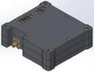
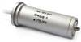

# Comms (a list)
> 2019.07.31 [🚀](../index/index.md) [despace](index.md) → [Sensor](sensor.md)

[TOC]

---

A list of [Communication systems](comms.md).

## Current

 

### Tr. — CSXBT (US)
> <small>**SAIT Cubesat X‑band Transmitter (CSXBT)** — англоязычный термин, не имеющий аналога в русском языке. **Радиопередатчик для кубсатов X-диапазона НПП Саит (CSXBT)** — дословный перевод с английского на русский.</small>

**SAIT Cubesat X‑band Transmitter (CSXBT)** — радиопередатчик.  
Разработчик [НПП Саит](contact/sait_ltd.md). Разработано ранее 2016 года, активное применение.

|*Characteristics*|*[Value](si.md)  (CSXBT)*|
|:--|:--|
|Composition| |
|Consumption, W|16|
|Dimensions, ㎜|87 × 93 × 28|
|[Interfaces](interface.md)|Customizable [LVDS](lvds.md) or CMOS. 5 pairs for serial data (clock input/output, data, optional enable). RS-485 or I2C or CAN-2B. Micro-D (MIL-DTL-83513) female (9-pin power, 21-pin data/control). SMA female 50 Ω RF output|
|[Lifetime](lifetime.md)/Resource, h(y)|26 280 (3) / …|
|Mass, ㎏|0.38|
|[Overload](vibration.md), Grms| |
|[Rad.resist](ion_rad.md), ㏉ (㎭)|60 (6 000) при Al 1.5 g/㎝², ≥40 МэВ·㎝²/㎎|
|[Reliability](qm.md) per [lifetime](lifetime.md)|0.9392|
|[Thermal range](tcs.md), ℃|–20 ‑ +50, 1 датчик температуры DS18S20|
|[TRL](trl.md)|9|
|[Voltage](sps.md), V|12 (11 ‑ 16)|
|**【Specific】**|• • •|
|[Bitrate](bitrate.md), bit/s|(внутр. до 1 Гбит/с)|
|Continuous work, h| |
|Frequency instability|±10 ppm|
|[Frequency range](rf.md), ㎐|X: 8 200 000 000 (настройка 8.1 ‑ 8.5 ㎓)|
|Distance, ㎞| |
|Out. power, W|2.5|
|Modulation type|QPSK, 8PSK, 16APSK, 32APSK|
|Signal structure| |
| ||

**Notes:**

   1. [CSXBT Datasheet ❐](f/comms/c/csxbt_datasheet.pdf)
   1. **Applicability:** Аист‑2Д

 

### Tr. — HSXBDT (US)
> <small>**SAIT High‑speed X‑band Downlink Transmitter (HSXBDT)** — англоязычный термин, не имеющий аналога в русском языке. **Высокоскоростной радиопередатчик X-диапазона НПП Саит (HSXBDT)** — дословный перевод с английского на русский.</small>

**SAIT High‑speed X‑band Downlink Transmitter (HSXBDT)** — радиопередатчик.  
Разработчик [НПП Саит](contact/sait_ltd.md). Разработано ранее 2016 года, активное применение.

|*Characteristics*|*[Value](si.md)  (HSXBDT)*|
|:--|:--|
|Composition| |
|Consumption, W|70|
|Dimensions, ㎜|230 × 154 × 45|
|[Interfaces](interface.md)|Customizable [LVDS](lvds.md). Two ports with 4 pairs each (clock input/output, data, optional enable). [RS-422](rs_xxx.md) or [MIL-STD-1553](mil_std_1553.md)|
|[Lifetime](lifetime.md)/Resource, h(y)|61 320 (7) / …|
|Mass, ㎏|1.8|
|[Overload](vibration.md), Grms| |
|[Rad.resist](ion_rad.md), ㏉ (㎭)|60 (6 000) при Al 1.5 g/㎝², ≥40 МэВ·㎝²/㎎|
|[Reliability](qm.md) per [lifetime](lifetime.md)|0.9392|
|[Thermal range](tcs.md), ℃|–20 ‑ +50, 2 датчика температуры|
|[TRL](trl.md)|9|
|[Voltage](sps.md), V|27 (23 ‑ 34)|
|**【Specific】**|• • •|
|[Bitrate](bitrate.md), bit/s|до 520 Мб/с (CCSDS), до 880 Мб/с (DVB-S2)|
|Continuous work, h| |
|Distance, ㎞| |
|Frequency instability|±4 ppm|
|[Frequency range](rf.md), ㎐|X: 8 225 000 000 (настройка 8.1 ‑ 8.5 ㎓)|
|Modulation type|QPSK, 8PSK, 16APSK и 32APSK|
|Out. power, W|8|
|Signal structure| |
| ||

**Notes:**

   1. [HSXBDT Datasheet ❐](f/comms/h/hsxbdt_datasheet.pdf)
   1. **Applicability:** Аист‑2Д

 

### Tr./Res. — PRIZYV‑1 (RU)
> <small>**ПРИЗЫВ‑1** — русскоязычный термин, не имеющий аналога в английском языке. **PRIZYV‑1** — дословный перевод с русского на английский.</small>

**ПРИЗЫВ‑1** — приёмо‑передающая радиоаппаратура, радиомаяк коротковолнового диапазона. Предназначен для радиопеленгации подвижных и стационарных объектов. Приём сигнала, излучаемого радиомаяком, может вестись радиопоисковыми самолётными (вертолётными) системами АРК‑УД, ЮР‑46 и другими подобными системами.  
Разработчик [НПО ИТ](contact/npoit.md). Разработано  Покупное изделие (на 2018.03.19)

|*Characteristics*|*[Value](si.md)  <small>(ПРИЗЫВ-1)</small>*|
|:--|:--|
|Composition|Single unit|
|Consumption, W|0.765 для 9 В; 2.3 для 27 В|
|Dimensions, ㎜|70 × 34 × 24|
|[Interfaces](interface.md)| |
|[Lifetime](lifetime.md)/Resource, h(y)|… / 105 120 (12)|
|Mass, ㎏|0.075|
|[Overload](vibration.md), Grms| |
|[Rad.resist](ion_rad.md), ㏉ (㎭)| |
|[Reliability](qm.md) per [lifetime](lifetime.md)|0.99 за 2 000 часов|
|[Thermal range](tcs.md), ℃|–50 ‑ +65|
|[TRL](trl.md)|9|
|[Voltage](sps.md), V|9 или 27|
|**【Specific】**|• • •|
|[Bitrate](bitrate.md), bit/s| |
|Continuous work, h|определяется ресурсом батареи питания|
|Distance, ㎞| |
|Frequency instability|± 0.00005|
|[Frequency range](rf.md), ㎐|100 ‑ 250|
|Modulation type| |
|Out. power, W|0.3 (при [КСВ](swr.md) ≤ 2)|
|Signal structure|посылка непрерывной несущей в течение 0.5 ± 0.3 s и посылка АИМ сигнала с частотой следования импульсов 1 500 Гц в течение 0.8 ± 0.2 с|
| ||

**Notes:**

   1. <http://www.npoit.ru/products/telemetricheskie-sistemy/radiomayak-metrovogo-diapazona-prizyv-1>
   1. **Applicability:** …

 

### Tr./Res. — PRIZYV‑3 (RU)
> <small>**ПРИЗЫВ‑3** — русскоязычный термин, не имеющий аналога в английском языке. **PRIZYV‑3** — дословный перевод с русского на английский.</small>

**ПРИЗЫВ‑3** — приёмо‑передающая радиоаппаратура, радиомаяк коротковолнового диапазона. Предназначен для радиопеленгации подвижных и стационарных объектов. Приём излучаемого радиомаяком ПРИЗЫВ‑3 сигнала может вестись радиопоисковыми самолётными (вертолётными) системами ЮР‑26, ЮР‑46 и другими подобными системами.  
Разработчик [НПО ИТ](contact/npoit.md). Разработано  Покупное изделие (на 2018.03.19)

|*Characteristics*|*[Value](si.md)  <small>(ПРИЗЫВ-3)</small>*|
|:--|:--|
|Composition|Single unit|
|Consumption, W|1.8 для 9 В; 5.4 для 27 В|
|Dimensions, ㎜|36 × 84 × 40|
|[Interfaces](interface.md)| |
|[Lifetime](lifetime.md)/Resource, h(y)|… / …|
|Mass, ㎏|0.17|
|[Overload](vibration.md), Grms| |
|[Rad.resist](ion_rad.md), ㏉ (㎭)| |
|[Reliability](qm.md) per [lifetime](lifetime.md)| |
|[Thermal range](tcs.md), ℃|–50 ‑ +65|
|[TRL](trl.md)|9|
|[Voltage](sps.md), V|9 или 27|
|**【Specific】**|• • •|
|[Bitrate](bitrate.md), bit/s| |
|Continuous work, h|определяется ресурсом батареи питания|
|Distance, ㎞|180|
|Frequency instability| |
|[Frequency range](rf.md), ㎐|10 000 000 (10 ㎒)|
|Modulation type| |
|Out. power, W|2 (при [КСВ](swr.md) ≤ 2)|
|Signal structure|посылка АИМ сигнала с частотой следования импульсов 1 500 Гц в течении 0.5 ± 0.2 s с паузами между посылками 1.5 с|
| ||

**Notes:**

   1. [Чертёж ❐](f/comms/p/prizyv-3_sketch1.jpg)
   1. <http://www.npoit.ru/products/telemetricheskie-sistemy/radiomayak-korotkovolnovogo-diapazona-prizyv-3>
   1. **Applicability:** …

 

## Archive

 

## Docs & links (TRANSLATEME ALREADY)
|Navigation|
|:--|
|**[FAQ](faq.md)**【**[SCS](scs.md)**·КК, **[SC (OE+SGM)](sc.md)**·КА】**[CON](contact.md)·[Pers](person.md)**·Контакт, **[Ctrl](control.md)**·Упр., **[Doc](doc.md)**·Док., **[EF](ef.md)**·ВВФ, **[Error](error.md)**·Ошибки, **[Event](event.md)**·События, **[FS](fs.md)**·ТЭО, **[HF&E](hfe.md)**·Эрго., **[KT](kt.md)**·КТ, **[Model](model.md)**·Модель, **[N&B](nnb.md)**·БНО, **[Project](project.md)**·Проект, **[QM](qm.md)**·БКНР, **[R&D](rnd.md)**·НИОКР, **[SI](si.md)**·СИ, **[Test](test.md)**·ЭО, **[TRL](trl.md)**·УГТ, **[Way](way.md)**·Пути|
|*Sections & pages*|
|**【[Communications](comms.md)】**  [CCSDS](ccsds.md)・ [Антенна](antenna.md)・ [АФУ](afdev.md)・ [Битрейт](bitrate.md)・ [ВОЛП](ofts.md)・ [ДНА](дна.md)・ [Диапазоны частот](rf.md)・ [Зрение](view.md)・ [Интерферометр](interferometer.md)・ [Информация](info.md)・ [КНД](directivity.md)・ [Код Рида‑Соломона](rsco.md)・ [КПДА](antenna.md)・ [КСВ](swr.md)・ [КУ](ку.md)・ [ЛКС, АОЛС, FSO](fso.md)・ [Несущий сигнал](carrwave.md)・ [ПНА, ПОНА, ПСНА](devd.md)・ [Помехи](emi.md) (EMI, RFI)・ [Последняя миля](last_mile.md)・ [Регламент радиосвязи](rf.md)・ [СИТ](etedp.md)・ [Фидер](feeder.md)  • • •  **РФ:** [БА КИС](ба_кис.md) (21)・ [БРК](brk_lav.md) (12)・ [РУ ПНИ](ру_пни.md) ()・ [HSXBDT](comms_lst.md) (1.8)・ [CSXBT](comms_lst.md) (0.38)・ [ПРИЗЫВ-3](comms_lst.md) (0.17) *([ПРИЗЫВ-1](comms_lst.md) (0.075))*|

   1. Docs: …
   1. <…>
